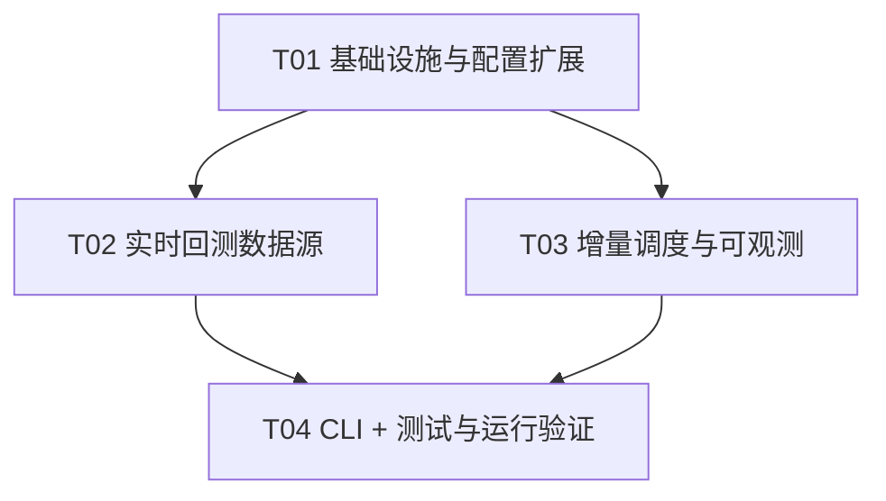

# Kuantix 增量设计 v1.4：实时回测数据源 + 数据湖自动增量更新

> **作者**：software-architect（架构）
> **日期**：2026-08-03
> **上游输入**：team-lead 增量需求（2 项）+ 已核实的实现锚点（基线 571 passed）
> **性质**：**契约增量草案**——独立文件，**不动契约正本**（`docs/api-contract.md`）、
> **不改代码、不碰 easy_tdx-main**；待主理人裁决后由工程师落地、QA 验证。
> **红线约束**：R2（easy_tdx 只在 adapters）/ R4（禁 except:pass、禁双参 .get）/
> R6（无硬编码 A 股常量，交易日历经 MarketProfile）/ NF-26（fail-loud 不静默降级）/
> NF-9（统一信封）/ NF-12（数值 JSON 安全）。

---

## 0. 背景与需求映射

| 需求 | 用户原话要点 | 本文档落点 |
|---|---|---|
| 需求 1 | 单标的临时回测改造为实时拉取（替代"必须本地数据湖"），实时获取最新行情；**核心回测逻辑不变** | 设计一：`data_source` 参数 + 数据源抽象 + B5 对齐 |
| 需求 2 | 搭建运行验证 + 数据湖自动增量更新机制（定时/事件/流式），避免每次重建湖，固定周期或实时自动增量更新 | 设计二：APScheduler 盘后 cron + 启动检查 + D1 可观测 + 运行验证方案 |

**已核实的现状锚点（全部读码确认）**：

- 回测数据读取点：`Kuantix/backtest/service.py::BacktestService._load_frame`（方法）读
  `L1Reader.read_daily_frame`（本地 `~/.Kuantix/vipdoc`，零网络）；B5
  `get_kline_with_signals` 走 `Kuantix/backtest/portfolio_service.py` 的**模块级** `_load_frame`。
- 实时拉取能力已就绪：`Kuantix/adapters/quotation.py::QuotationFetcher.fetch_kline`
  （A 股 7709 链路，`vol` 股→手 ÷lot_size 已处理 RD-8，`adjust` 默认 `Adjust.NONE` =
  未复权，与 L1 口径 RD-5 一致；CN 链路 `get_stock_kline` 内部自动翻页）——**只需接入，不新写拉取**。
- 增量同步逻辑已存在：`Kuantix/data/datalake.py::DataLake.sync_incremental`（按已有文件最后日期续拉，
  无文件则全量）——**缺的是自动触发机制**。
- 调度依赖：APScheduler **未引入**（`pyproject.toml` 无；`.venv` 未安装）——**需主理人批准新增依赖**。
- 服务启动入口：`Kuantix/main.py::create_app`（**当前无 lifespan**，需新增）；
  `Kuantix/api/server.py::create_app` 复用 main 的基础设施。
- 交易日历：`Kuantix/core/market.py::CNMarketProfile`（`is_trading_day` / `is_open_now` /
  `session_now`，可判定"盘后"）。
- 配置：`config.toml` 与 `Kuantix/resources/config.default.toml` **当前逐字节一致**（diff 验证），
  改动必须两处同步；`Kuantix/config.py` 的 `SyncConfig` 需扩展。
- 单例/幂等先例：`SyncEngine` 断点 checkpoint（原子写 tmp+rename）可复用同模式。
- D1 现状：`DataLake.status()` 返回 `{market, data_date, coverage, quarantine_count, in_sync_window}`，
  路由层合并 `latest_job`；**未暴露 last_sync**（需补，向后兼容只增）。

---

# Part A：系统设计

---

# 设计一：单标的实时回测数据源（需求 1）

## A1.1 实现方案

在**不改动 `BacktestService.run` 主流程、不改 `BacktestBridge`、不改上游引擎**的前提下，
把"读数据"这一步抽成**数据源优先级选择**：

```
BacktestRunRequest.data_source ∈ {auto, local, live}（默认 auto）
        │
        ▼
BacktestService._read_frame(profile, code, start, end, data_source)
        ├─ local  ────────────────► L1Reader.read_daily_frame（现状行为）
        ├─ live  ─────────────────► QuotationFetcher.fetch_kline → bars_to_frame → 日期过滤
        └─ auto  ─► local_has_data？─是─► L1Reader（同 local，损坏即显式报错，不降级）
                            └否（文件不存在，合法）─► live（同 live）
```

- `fetch_kline` 已就绪，**不新写拉取逻辑**；只新增"条数换算 + Bar→DataFrame + 日期过滤"薄工具。
- 实时返回的 `list[Bar]` 转 DataFrame 复用 `L1Reader._bars_to_frame` 的列格式
  （`datetime/open/high/low/close/vol/amount`），**喂同一 `BacktestBridge.run_strategy_backtest`**，
  核心回测逻辑与绩效计算零改动。
- B5 K 线端点同步支持 `data_source`，保证下钻图与回测口径一致。

## A1.2 决策点裁决（含理由）

### D1.1 `data_source` 取值语义与默认值

| 取值 | 语义 | 无数据时 |
|---|---|---|
| `local` | 只读本地数据湖（现状行为） | 显式报错（现状 404/422 语义不变） |
| `live` | 强制实时拉取（**仅单标的**，多标的 422 拦截） | 显式报错（422/404），不静默回退 |
| `auto` | 本地有数据用本地；**本地无此标的**才实时拉取 | 见 D1.2 裁决 |

**默认值 = `auto`**。理由：
- `auto` 对既有调用方完全兼容（本地有数据 → 行为与今天一致），满足"替代必须本地数据湖"：
  本地没数据的新标的也能跑，无需先建湖。
- `local` 作为显式"只读本地"逃生口保留；`live` 作为强制实时验证口。
- 默认 `auto` 不改变现有 571 测试语义：测试注入的假 reader 有数据 → 走本地分支，零网络。

### D1.2 `auto` 语义的 NF-26 裁决：是"数据源优先级"，不是"错误兜底"

**裁决：`auto` 是数据源优先级选择器，不是错误降级。** 必须区分两种情形：

| 情形 | 判定 | 处理 |
|---|---|---|
| **本地无此标的**（文件不存在） | `reader.day_path(exchange, code).is_file() == False` | **合法** → 转实时拉取 |
| **本地文件存在但损坏/为空/缺列** | `read_daily_frame` 抛 `DataIntegrityError` | **错误** → 显式抛出，**绝不静默降级到 live** |

理由：
- "文件不存在"是正常业务态（新标的/未回补标的），转 live 是**功能**，不是掩盖错误；
- "文件存在但读失败"是数据完整性事故（NF-27 该由 `data verify` 暴露），若静默转 live 会
  让损坏永久不可见，违反 NF-26。实现上**先探测存在性，再读**：存在 → 读（异常原样传播）；不存在 → live。

### D1.3 `live` 是否限单标的

**裁决：`live` 仅允许单标的（`len(codes) == 1`），多标的在路由层 422 显式拒绝。**
理由：
- live 是"下钻/临时验证"路径：单标的单次网络请求，失败语义单一（整批失败）；
- 多标的 live = N 次网络请求，部分失败时"整批失败 vs 部分跳过"语义模糊，与 NF-26 fail-loud
  一致性冲突；且组合/多策略回测（portfolio/multi）保持本地语义，改动面最小；
- 组合回测/多策略/参数寻优（O1 单标的）本期**不改**，仍走本地湖（O1 如需 live 属二期）。

### D1.4 实时与本地口径一致性（回测可比性）

| 口径 | 本地 L1 | 实时 fetch_kline | 一致性 |
|---|---|---|---|
| 复权 | 原始未复权（RD-5） | `adjust=Adjust.NONE`（默认，**不传 adjust**） | ✅ 一致 |
| vol 单位 | 手 | 股→手 ÷lot_size（RD-8 已在 `_frame_to_bars` 完成） | ✅ 一致 |
| 列格式 | `datetime/open/high/low/close/vol/amount` | 复用 `bars_to_frame` 同一函数 | ✅ 一致 |
| 交易所推断 | `profile.exchange_for_code` | 显式传 `exchange=` 同源推断 | ✅ 一致 |
| 条数 | 文件全量 | `years = (end.year - start.year + 1) + 1`，内部 `trading_days_per_year + 20` 缓冲 | 近似覆盖区间，**随后按 [start,end] 过滤** |

**关键结论**：live 拉取数据与本地 L1 为同一口径（未复权、vol=手、列同构），
同一标的同一区间回测结果**可比**。差异仅来源：live 含最新交易日（这正是需求目的）。

### D1.5 失败处理（fail-loud）

- **live 拉取失败**（网络/超时/无此标的/上游协议异常）：`fetch_kline` 可能抛
  `UpstreamContractError` / `DataIntegrityError` / 原始网络异常（easy_tdx 未统一包装）。
  设计在 `data_source.fetch_live_frame` **统一捕获**并转 `DataIntegrityError`（消息含 code 与
  原因），保证 Job 以 **422 + 明确原因**失败，而不是裸 500。
- **live 拉取返回空**（无此标的/退市/区间无数据）：显式 `DataIntegrityError("实时拉取返回空")`。
- **live 多标的**：路由层 422（见 D1.3），不存在"部分失败"歧义。
- 单标的 live 失败 → 该 code 进 `skipped` → 全池失败 → Job failed 422（与现有 `run()` 语义一致）。

### D1.6 B5 K 线端点同步支持

**裁决：支持。** `GET /api/v1/backtest/kline/{code}?data_source=auto|local|live`（默认 `auto`），
`get_kline_with_signals` 内部改走与 B2 同一 `_read_frame` 分支，保证下钻图与回测数据源一致。
非法 `data_source` → 400（fail-loud）。

## A1.3 文件级改动清单（需求 1）

| 文件 | 改动 | 说明 |
|---|---|---|
| `Kuantix/adapters/factor_bridge.py` | **修改** | 提取模块级公开函数 `bars_to_frame(bars) -> pd.DataFrame`（逻辑 = 现 `L1Reader._bars_to_frame`，不复制）；`L1Reader._bars_to_frame` 委托之 |
| `Kuantix/backtest/data_source.py` | **新增** | `local_has_data(reader, profile, code) -> bool`；`fetch_live_frame(fetcher, profile, code, start, end) -> DataFrame`；`_live_years_for`；统一异常包装 |
| `Kuantix/backtest/service.py` | **修改** | `BacktestRunRequest` + `data_source: str = "auto"`；`__init__` + `fetcher: QuotationFetcher | None = None`（**惰性构造**，`shared_connection=False`）；新增 `_read_frame(profile, code, start, end, data_source)`；`_load_frame` 委托之；`get_kline_with_signals` + `data_source` 参数 |
| `Kuantix/api/schemas.py` | **修改** | `BacktestRunRequest` + `data_source: Literal["auto","local","live"] = "auto"` |
| `Kuantix/api/routers/backtest.py` | **修改** | B2：`live` 且 `len(codes)>1` → 422；透传 `data_source` 到 domain req 与 job params；B5：+ `data_source` query（非法 → 400） |
| `tests/unit/api/test_api_backtest.py` | **修改** | + live/auto/local 三模式用例（假 fetcher，不发网络） |

## A1.4 契约增量（v1.4，只增不改）

- **B2** `POST /api/v1/backtest/run` 请求体 + 可选字段 `data_source: "auto"|"local"|"live"`（默认 `"auto"`）。
  - `"local"`：现状语义；`"live"`：仅 `codes` 长度 1 可用（否则 422）；`"auto"`：本地优先、缺失转实时。
- **B5** `GET /api/v1/backtest/kline/{code}` + 可选 query `data_source`（默认 `"auto"`）。
- Job `params` 中新增 `data_source` 回显（可观测）。
- 无响应结构变更、无新端点。

## A1.5 测试建议（需求 1）

1. 单测 `data_source.py`：`local_has_data`（文件存在/不存在/鸭子类型 reader 无 day_path → True）；
   `fetch_live_frame` 列格式与 `bars_to_frame` 一致；`_live_years_for` 边界（同年→1 年、跨年→N+1）。
2. 单测 `BacktestService._read_frame` 四分支：local 有数据；local 空文件 → 显式抛（不降级）；
   live 返回数据（假 fetcher）；live 返回空/抛异常 → DataIntegrityError。
3. API：B2 `data_source=live` 单标的 → Job done；`live` 多标的 → 422；`auto` 默认兼容现状；
   B5 `data_source=live` → kline 正常。
4. 回归：现有 571 全绿（`auto` 默认 + 假 reader 有数据 → 走本地，零网络）。

---

# 设计二：数据湖自动增量更新机制（需求 2）

## A2.1 实现方案（调度选型）

**推荐组合：APScheduler `BackgroundScheduler` 盘后 cron（交易日 16:30）+ 服务启动时自动增量检查
（幂等，若上次同步 < 今日且湖非空则触发）。** 事件触发/流式接入对日线数据湖**不必要**
（日线一天一更，盘后一次足够；分钟线/实时流才需要事件触发，属 P2）。

选型理由：

| 方案 | 结论 | 理由 |
|---|---|---|
| APScheduler cron（盘后） | ✅ 推荐 | 成熟 cron 语义（day_of_week/时区/misfire_grace/coalesce/max_instances=1），防重入开箱即用；轻量、纯线程、无外部依赖服务 |
| 自研 daemon 线程轮询 | ⚠️ 备选 | 需手写 cron 与 misfire，易错、难测；仅当主理人否决新依赖时采用（§决策清单 D-1） |
| 启动检查（startup） | ✅ 搭配 | 覆盖"服务长期未跑、错过盘后 cron"场景；幂等（last_sync 日期守卫） |
| 事件触发（行情到达） | ❌ P2 | 日线无实时事件源；属分钟线/流式二期 |
| 流式接入 | ❌ P2 | 同上 |

**盘后判定**：cron 设 `day_of_week=mon-fri, hour=16, minute=30`（Asia/Shanghai），
job 体内再用 `MarketProfile` 双重守卫（`is_trading_day` + `is_open_now`），节假日/周末/盘中不触发。
启动检查同样走 `_should_run` 守卫。

## A2.2 决策点裁决（含理由）

### D2.1 调度触发组合与"空湖引导"策略

- 组合：**cron（盘后）+ startup（幂等检查）**，两者共用同一 `_dispatch` 判定逻辑。
- **空湖跳过**：startup 检查时若 `~/.Kuantix/vipdoc` 无任何 `.day` 文件（首次安装），
  **跳过并记 `skipped`（reason="数据湖为空，请先全量回补"）**，不自动触发全市场全量。
  理由：启动检查是"让已有湖保鲜"，首次建湖是显式动作（D2/CLI `data sync` 全量），
  自动全量会在空机启动时造成全市场网络风暴，且与 NF-28（交易时段禁全量）冲突。
  这是**文档化的策略**（状态文件可见），非静默。
- 默认 `schedule_enabled = true`（产品默认开），用空湖守卫 + config 门控保证测试环境零网络。

### D2.2 交易日历判定

- 全部经 `get_market_profile("CN")`（`is_trading_day(now.date())` + `is_open_now(now)`），
  不硬编码节假日（R6/NF-5）。cron 只承担"大概时间点"，精确判定在 job 体内。

### D2.3 调度器集成与生命周期

- 新增 `Kuantix/scheduler.py::IncrementalSyncScheduler`；在 `Kuantix/main.py::create_app`
  **新增 FastAPI lifespan**：`start()` 时（config 门控）创建 APScheduler + 起 startup 检查线程
  （daemon、非阻塞），shutdown 时 `stop()`。
- 组合根注入：lifespan 内用 `config` 构造 `DataLake` 与 `SyncStateStore`（与 `build_container`
  同一服务层；调度器独立装配，不依赖组合根，避免测试 TestClient 触发网络）。
- **测试安全**：TestClient 会跑 lifespan——startup 检查在测试环境因"tmp 湖为空 → skip"不触网；
  另建议 `conftest.make_config` 注入 `schedule_enabled=false`（T04，二选一，推荐两者都做）。
- 单例保护（多进程/多实例）：`~/.Kuantix/db/sync_scheduler.lock` + `fcntl.flock(LOCK_EX|LOCK_NB)`；
  抢锁失败 → 记 skip（"另一实例正在同步"）。进程内防重入由 `max_instances=1` + `coalesce=True` 兜底。

### D2.4 幂等与并发

- `sync_incremental` 本身按已有文件最后日期续拉，**天然幂等**（重跑不重复造数据）。
- 调度器防重入：APScheduler `max_instances=1`（同进程不重叠）+ flock 文件锁（跨进程单例）。
- startup 幂等：`last_sync_at` 日期 >= 今日 → skip（"今日已同步"）。

### D2.5 失败重试

- job 体捕获异常 → 记 `sync_state`（status=failed + error）→ **不阻塞服务**；
- 下次 cron / 下次启动 / 手动 `run-once` 自然重试（`sync_incremental` 断点续传兜底）；
- APScheduler `misfire_grace_time=1800`：错过触发点 30 分钟内补跑。

### D2.6 可观测（D1 补 `last_sync` / `schedule`）

- 新增 `Kuantix/data/sync_state.py::SyncStateStore`：`~/.Kuantix/db/sync_state.json`（原子写 tmp+rename），
  记录 `{last_sync_at, last_sync_status(done|failed|skipped), last_sync_trigger(cron|startup|manual),
  last_sync_error, last_result{total,done,failed,quarantined,skipped_resumed,elapsed_ms}, updated_at}`。
- `DataLake.status()` 合并 `last_sync`（读 SyncStateStore）与 `schedule`（config 派生
  `{enabled, time, startup_check}`）——D1 响应**只增两个可空字段**，向后兼容。
- D2 手动同步成功后路由层也写 `sync_state`（trigger=manual），保证 `last_sync` 是"任意来源最后一次同步"。

### D2.7 CLI

- **确认现状**：`Kuantix data sync` 目前**只做全量**（`sync_full`），**没有 `--incremental`**；
  增量仅 D2 REST 支持（`mode=incremental`）。→ 需补 CLI `--incremental`。
- 新增 `Kuantix data schedule` 子命令组：`run-once`（手动触发一次调度判定+同步，等价测试钩子）、
  `status`（enabled/running/next_run/last_sync）。`serve` 内置调度器（lifespan），CLI 不重复常驻。

## A2.3 文件级改动清单（需求 2）

| 文件 | 改动 | 说明 |
|---|---|---|
| `pyproject.toml` | **修改** | + `apscheduler>=3.10,<4`（**需主理人批准**，备选见 D-1） |
| `config.toml` | **修改** | `[sync]` + `schedule_enabled=true` / `schedule_time="16:30"` / `schedule_startup_check=true` |
| `Kuantix/resources/config.default.toml` | **修改** | 与根 config.toml **逐字节同步**（当前 diff 一致） |
| `Kuantix/config.py` | **修改** | `SyncConfig` + 3 字段（bool/str/bool）+ `load_config` 解析（`schedule_time` 校验 HH:MM）+ `to_dict` +3 键 |
| `Kuantix/data/sync_state.py` | **新增** | `SyncStateStore`（load/update/原子写/last_sync_date；损坏 → DataIntegrityError） |
| `Kuantix/scheduler.py` | **新增** | `IncrementalSyncScheduler`（start/stop/run_once/status + `_dispatch`/`_should_run`/`_acquire_lock`） |
| `Kuantix/main.py` | **修改** | `create_app` + lifespan（config 门控 start/stop；startup 检查异步 daemon；空湖 skip） |
| `Kuantix/data/datalake.py` | **修改** | `status()` 合并 `last_sync` / `schedule` |
| `Kuantix/api/schemas.py` | **修改** | `DataLakeStatusModel` + `last_sync: dict\|None = None`、`schedule: dict\|None = None` |
| `Kuantix/api/routers/data.py` | **修改** | `_sync_runner` 完成后写 `sync_state`（trigger=manual） |
| `Kuantix/cli.py` | **修改** | `data sync --incremental`；新增 `data schedule` 组（run-once/status） |

## A2.4 契约增量（v1.4，只增不改）

- **D1** `GET /api/v1/data/status` 响应 + 两个可空字段：
  ```jsonc
  {
    "...": "...",
    "last_sync": {                          // 可空：最近一次同步事件（任意来源）
      "at": "2026-08-03T16:30:12+08:00",
      "status": "done",                     // done | failed | skipped
      "trigger": "cron",                    // cron | startup | manual
      "error": null,
      "result": {"total": 5400, "done": 5398, "failed": 2, "quarantined": 0,
                 "skipped_resumed": 0, "elapsed_ms": 12345}
    },
    "schedule": {                           // 可空：调度配置视图
      "enabled": true, "time": "16:30", "startup_check": true
    }
  }
  ```
- **CLI**：`Kuantix data sync --incremental`（新增 flag）；`Kuantix data schedule run-once|status`（新命令）。
- 无新 REST 端点、无字段删除/语义变更。

## A2.5 测试建议（需求 2）

1. 单测 `SyncStateStore`：写/读/原子写/损坏文件 fail-loud/`last_sync_date`。
2. 单测 `IncrementalSyncScheduler._should_run`：注入假 profile/时钟 → 非交易日 skip、
   交易时段 skip、startup 且湖空 skip、startup 且今日已同步 skip、条件满足 → None。
3. 单测 `run_once`：假 lake（FakeHandle）→ done 后 sync_state 更新；假失败 → failed 记录。
4. API：D1 含 `last_sync`/`schedule` 字段（FakeLake 不返回时路由不炸——字段只增，断言存在即可）。
5. CLI：`data sync --incremental` 调 `sync_incremental`；`data schedule status` 输出 enabled/next_run。
6. 回归：571 全绿；TestClient lifespan 启动不触网（空湖 skip 或 conftest 关调度）。

---

# 运行验证方案（需求 2 前半：搭建运行验证）

工程师在 T04 落地后按以下顺序验证（网络类步骤打 `network` mark，可手动执行）：

| 步骤 | 命令 | 预期 |
|---|---|---|
| 1 依赖与基线 | `cd /Users/kongbiao/Downloads/开源量化/Kuantix && .venv/bin/pip install -e ".[dev]"` | apscheduler 装入 |
| 2 全量单测 | `.venv/bin/python -m pytest -q` | **571 + 新增 ≥ 全绿** |
| 3 启动自检 | `.venv/bin/Kuantix serve --dry-run` | 路由清单完整 |
| 4 服务启动 | `.venv/bin/Kuantix serve`（后台） | banner + `/health` 200 |
| 5 D1 可观测 | `curl -s localhost:8899/api/v1/data/status` | 含 `last_sync`/`schedule` |
| 6 手动增量 | `curl -X POST localhost:8899/api/v1/data/sync -H 'Content-Type: application/json' -d '{"mode":"incremental"}'` → D3 轮询 | Job done（network） |
| 7 live 回测 | `curl -X POST localhost:8899/api/v1/backtest/run -H 'Content-Type: application/json' -d '{"codes":["600519"],"data_source":"live","start":"2024-01-01","end":"2025-12-31"}'` → B3 → B4 | Job done、结果含 2025 最新数据（network） |
| 8 调度钩子 | `.venv/bin/Kuantix data schedule run-once` → `status` | 状态更新；D1 `last_sync` 刷新 |

---

# 红线遵循说明

- **R2**：`data_source.py` / `BacktestService` / `scheduler.py` 只 import
  `QuotationFetcher`/`L1Reader`（adapters）与 `DataLake`（业务层），**不直接 import easy_tdx**；
  `fetch_kline` 默认 `adjust=NONE`，`data_source.py` 无需引入 `Adjust` 枚举。
- **R4**：全部新代码用 `require_key`/显式异常/`logging`，禁止 `except: pass`、禁止双参 `.get`。
- **R6**：交易日历/时段判定全经 `MarketProfile`；`schedule_time="16:30"` 是**配置默认值**非代码常量。
- **NF-26**：`auto` 语义裁决（D1.2）；live 失败显式报错（D1.5）；SyncStateStore 损坏文件 fail-loud。
- **NF-9/NF-12**：D1/B2/B5 响应结构只增字段；数值经 `Envelope.to_json` 清洗。

---

# Part B：任务分解

## B1 所需包

```
- apscheduler>=3.10,<4: 盘后 cron 调度（若主理人批准；否则自研 daemon 线程，见决策清单 D-1）
```

## B2 任务清单（按依赖排序，≤5 任务）

### T01 项目基础设施与配置扩展 —— P0（依赖：无）

- **文件**：`pyproject.toml`、`config.toml`、`Kuantix/resources/config.default.toml`、`Kuantix/config.py`
- **内容**：pyproject + apscheduler；两个 config.toml 同步 + `[sync].schedule_enabled/schedule_time/schedule_startup_check`；
  `SyncConfig` 3 字段 + loader（`schedule_time` 校验 HH:MM）+ `to_dict`。
- **验收**：`Kuantix config show` 含新键；基线 pytest 全绿。

### T02 实时回测数据源（需求 1）—— P0（依赖：T01）

- **文件**：`Kuantix/adapters/factor_bridge.py`、`Kuantix/backtest/data_source.py`（新）、
  `Kuantix/backtest/service.py`、`Kuantix/api/schemas.py`、`Kuantix/api/routers/backtest.py`
- **内容**：`bars_to_frame` 提取；`data_source` 三模式 + `_read_frame` 分支 + 惰性 fetcher；
  B2 live 单标的 422 门禁；B5 `data_source` query。
- **验收**：单测三模式 + live 多标的 422 + B5 live；现有 backtest 用例全绿。

### T03 数据湖增量调度与可观测（需求 2 机制）—— P0（依赖：T01）

- **文件**：`Kuantix/data/sync_state.py`（新）、`Kuantix/scheduler.py`（新）、`Kuantix/main.py`、
  `Kuantix/data/datalake.py`、`Kuantix/api/schemas.py`、`Kuantix/api/routers/data.py`
- **内容**：SyncStateStore；IncrementalSyncScheduler（cron + startup + flock + 交易日守卫）；
  main.py lifespan；D1 `last_sync`/`schedule`；D2 runner 写 manual 状态。
- **验收**：调度判定单测（假 profile/时钟）；D1 字段存在；TestClient lifespan 不触网。

### T04 CLI + 测试与运行验证（需求 2 前半）—— P0（依赖：T02、T03）

- **文件**：`Kuantix/cli.py`、`tests/unit/test_unit_data_source.py`（新）、
  `tests/unit/test_unit_scheduler.py`（新）、`tests/unit/api/test_api_backtest.py`、
  `tests/unit/api/test_api_data.py`、`tests/unit/api/conftest.py`（`make_config` 注入
  `schedule_enabled=false` 保证测试环境确定性）
- **内容**：`data sync --incremental`；`data schedule run-once|status`；三份测试扩展；
  执行 §运行验证方案 全部步骤（network 用例手动/标记）。
- **验收**：全部单测绿；CLI 命令可用；`serve` 启动正常；live 回测与增量同步端到端可用。

## B3 Shared Knowledge

- 所有 REST 响应走统一信封 `{code, message, data, meta}`（NF-9）；错误码 400/404/422/501。
- 比例字段一律小数（`0.05`=5%）；日期 `YYYY-MM-DD`；时间戳 ISO8601 带时区。
- `data_source` 只影响"读数据"，不影响策略/绩效/存储链路。
- `sync_incremental` 幂等（按文件最后日期续拉）；调度防重入 = `max_instances=1` + flock 文件锁。
- `last_sync` 状态文件 `~/.Kuantix/db/sync_state.json`，原子写（tmp+rename），损坏即 fail-loud。
- 两处 config（根 `config.toml` 与 `Kuantix/resources/config.default.toml`）必须同步修改。
- easy_tdx 仅在 `Kuantix/adapters/` 内 import；新代码禁止直接引用。

## B4 任务依赖图



---

# 给主理人的决策清单（需裁决项）

| 编号 | 决策点 | 建议 | 备选/说明 |
|---|---|---|---|
| D-1 | **引入 APScheduler**（新依赖 `apscheduler>=3.10,<4`） | ✅ 引入 | 若否决：`Kuantix/scheduler.py` 改自研 daemon 线程（手写 cron 判定，仅按 `schedule_time` 每日触发），功能等价但 misfire/时区语义弱 |
| D-2 | `data_source` 默认值 | `auto` | 备选 `local`（保守，不满足"替代必须本地湖"的诉求） |
| D-3 | `live` 是否限单标的 | 限单标的（多标的 422） | 备选：允许多标的（部分失败语义需再裁决） |
| D-4 | 调度默认时间与默认开关 | `16:30` + `schedule_enabled=true` | 若担心 serve 副作用可改 `false`，但需求"自动更新"建议开 |
| D-5 | D1 增字段 `last_sync`/`schedule` | 只增可空字段（向后兼容） | 契约 v1 规则允许新增响应字段 |
| D-6 | 启动检查对空湖跳过（不自动全量引导） | 采纳（文档化 skip） | 备选：空湖自动全量（有网络风暴风险，不推荐） |
| D-7 | CLI 增 `data sync --incremental` 与 `data schedule` | 采纳 | 仅增命令/flag，不改变既有命令语义 |
| D-8 | 组合/多策略/寻优是否本期支持 live | 不支持（保持本地） | 二期评估 |

---

# Anything UNCLEAR（假设与待确认）

1. **`fetch_kline` 对超长 count 的上限**：CN 链路 `get_stock_kline` 注释"内部自动翻页"，
   未见显式上限；假设 years ≤ 40 均可用。若实测有上限，需在 `data_source._live_years_for` 加分页或截断。
2. **easy_tdx 网络异常类型未统一**：假设 `fetch_kline` 会抛 socket/超时异常，
   `data_source` 统一捕获转 `DataIntegrityError`；若上游有自定义异常类型，包装逻辑需相应扩展。
3. **16:30 是否足够晚**：假设 TDX 服务器 15:00 收盘后日线数据在 16:30 前已就绪；若实际更晚，
   调 `[sync].schedule_time` 即可，无需改代码。
4. **北交所（bj）代码 live 不可用**：`_cn_market_int` 不识别 bj 前缀会 `DataIntegrityError`，
   与现状一致（live 对 bj 显式失败），非本设计引入。
5. **测试环境确定性**：建议 conftest `make_config` 注入 `schedule_enabled=false`（T04）；
   若团队希望测试覆盖 lifespan 调度路径，可另建显式启用用例（假 lake）。
6. **`Kuantix serve --reload` 与 lifespan**：reload 模式下每次 reload 会重建 scheduler
   （幂等 start/stop），无状态泄漏；已按此设计。
