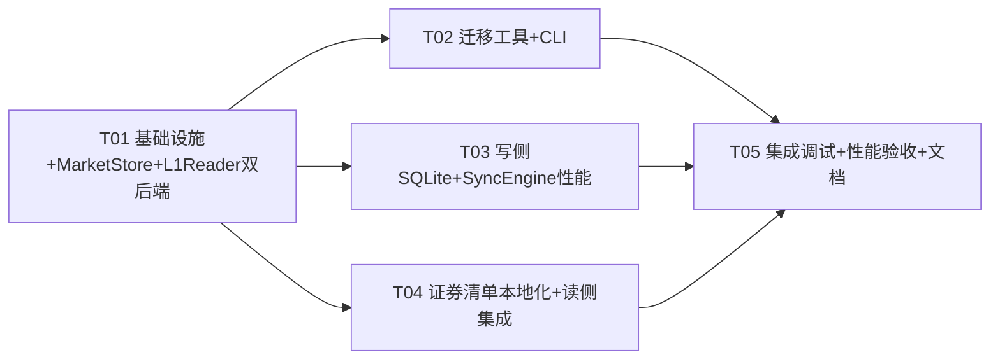
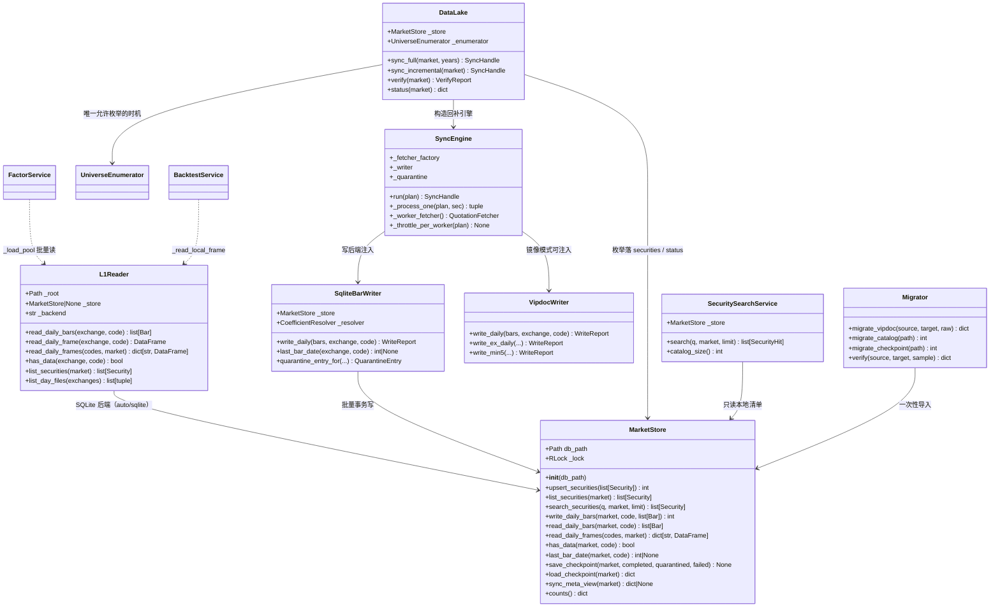
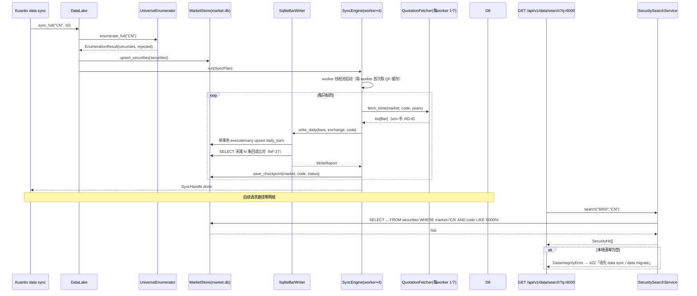

# Kuantix 数据解耦与 SQLite 迁移设计（08）

> 范围：三个架构级验收问题 —— **问题 2**（行情数据湖整体迁移 SQLite）、**问题 1**（证券清单本地化解耦）、**问题 3**（17798 只 × 10 年性能优化）。
> 约束：不改代码、不改契约正本（`docs/api-contract.md`）、不碰 `easy_tdx-main`（只读复用）；改动全部落在 `Kuantix/` 与 `tests/`、`docs/`。
> 基线：650 passed（R1–R6 启用）；本项目设计**只增不删**现有公共 API 语义，现有测试签名保持兼容。

---

## 0. 现状锚点复核（本次勘察结论）

| # | 锚点 | 核实结果 |
|---|------|----------|
| A1 | vipdoc 体量 | 508M，`sh/lday` 4730 文件 + `sz/lday` 5555 文件 + `ds` 1 文件 ≈ **10286 个 .day** |
| A2 | db 目录 | 8 个 SQLite（backtest_results/factor_meta/jobs/models/monitor/quarantine/screen_results/strategies）+ 2 个 JSON（sync_checkpoint_CN.json / sync_state.json）；**quarantine.db 已 13MB**（枚举 UNKNOWN 大量入隔离区） |
| A3 | factors 目录 | **当前为空**；因子值实际只存在于 Parquet 分区（尚未 compute），factor_meta.db 只存元数据（factor/computed_until/rows/updated_at） |
| A4 | 读侧 | `L1Reader` 包 `easy_tdx.offline.read_daily_bars` 读 .day → `list[Bar]`/同构 DataFrame；调用点：factor/service、backtest/service、optimize/portfolio/screen、verify、acceptance 测试，全部 `L1Reader(config.paths.vipdoc)`（**签名可向后兼容扩展**） |
| A5 | 写侧 | `VipdocWriter` 四道闸门（NF-25 系数判定 / RD-8 vol÷100 / RD-9 uint32 预检 / NF-27 fsync+回读）；`SyncEngine` 注入单例 writer |
| A6 | 枚举 | `UniverseEnumerator` 仅在 `datalake.py`（sync 时机，合法）与 `security_search.py::_default_provider`（**请求路径，非法**）被调用；`_default_provider` 内引用 `UniverseEnumerator` **缺 import（NameError）**——即问题 1 的既有 bug 之一 |
| A7 | SyncEngine 性能缺陷 | `_process_one` **每只标的**调用一次 `_fetcher_factory()` → 每只 `new_mac_client()` 新建连接；S2 实测每只新建 0.53s vs 复用 0.06s → 全 A 5209 只浪费 ≈ 0.47s×5209/4workers ≈ **10 分钟级瓶颈**；另有 `min_request_interval=0.05` 全局锁把并发串行化（5209×0.05≈260s） |
| A8 | 上游扫描器 | `SignalScanner`/`StrengthRanker` 构造入参为 `vipdoc_path`，**直接 glob/读 .day 文件系统**，不消费 DataFrame → 二进制镜像是否保留直接决定这两条链路能否零改动 |
| A9 | 读 DataFrame 契约 | 上游引擎（FactorEngine/BacktestEngine/Chanlun/SignalScanner 单标的）全部消费 `datetime/open/high/low/close/vol/amount` DataFrame 或 `list[Bar]` → **SQLite 后端返回同构结构即可上游零改动** |

---

# 1. 问题 2：行情数据湖整体迁移到 SQLite

## 1.1 目录纳入判定表（逐目录结论 + 理由）

| 目录 | 结论 | 判定 | 理由 |
|------|------|------|------|
| `~/.Kuantix`（根） | **否** | 保留文件系统 | 它是编排/挂载根，只放 `config.toml` 与未来容器 volume 挂载点；无结构化数据可入 SQLite |
| `vipdoc`（508M .day） | **部分** | **K 线数据必须入 SQLite（核心）**；二进制目录保留为**可选镜像**（默认保留） | K 线是结构化高频读数据，SQLite 索引 (market,code,date) 查询/批量读远优于逐文件 IO；但上游 `SignalScanner`/`StrengthRanker`/`read_daily_bars(vipdoc_path)` 只认文件系统，镜像保留可保证上游零改动（见 1.4 取舍） |
| `factors`（Parquet 分区 + factor_meta.db） | **部分** | Parquet **保留文件系统**（列存/压缩/按年分区对截面读取最优），元数据已入 SQLite，**不迁移** | 因子值是「按年分区 + 全截面扫」访问模式，Parquet 是正确工具；SQLite 只管 `factor_meta.db` 元数据。整体迁移为 P2 可选，不阻塞 |
| `db`（8 库 + 2 JSON） | **是** | 已是 SQLite；**新增行情主库 `market.db`，业务库保留多库**（推荐，见决策清单 D2） | 行情湖（daily_bars/securities/sync_meta/sync_checkpoint）体量大、写放大高，独立库避免与 jobs/models/strategies 高频小事务互相锁竞争；单库合并为 P2 可选 |
| `logs` | **否** | 保留文件系统 | 追加式日志流，SQLite 会引入写锁竞争与 WAL 无限膨胀，无收益 |
| `reports` | **否** | 保留文件系统 | 产物文件（PDF/JSON/CSV），一次性消费，无查询需求 |
| `exports` | **否** | 保留文件系统 | 同上，导出产物 |

**一句话结论**：`db/` 全部 SQLite（新增 market.db 承载行情湖）；`vipdoc/` K 线迁入 market.db、目录降级为可选镜像；`factors/` Parquet 保留；`logs/reports/exports` 与根目录保留文件系统。**SQLite 是行情数据主存储，不是全部目录。**

## 1.2 表设计（`~/.Kuantix/db/market.db`）

```sql
-- 证券清单（问题 1 的本地化落点；枚举唯一时机 = data sync）
CREATE TABLE IF NOT EXISTS securities (
    market        TEXT NOT NULL,           -- CN / HK / US
    code          TEXT NOT NULL,           -- 6 位代码（不含前缀）
    exchange      TEXT NOT NULL,           -- sh / sz / hk / us
    security_type TEXT NOT NULL,           -- 上游系数表类型（SH_A_STOCK…），禁 UNKNOWN
    name          TEXT NOT NULL DEFAULT '',
    updated_at    TEXT NOT NULL,
    PRIMARY KEY (market, code)
);
CREATE INDEX IF NOT EXISTS idx_securities_market_name ON securities(market, name COLLATE NOCASE);

-- 日线（主存储；vol 单位=手 RD-8，价格未复权 RD-5）
CREATE TABLE IF NOT EXISTS daily_bars (
    market TEXT NOT NULL,
    code   TEXT NOT NULL,
    date   INTEGER NOT NULL,               -- YYYYMMDD
    open   REAL NOT NULL,
    high   REAL NOT NULL,
    low    REAL NOT NULL,
    close  REAL NOT NULL,
    vol    REAL NOT NULL,                  -- 手
    amount REAL NOT NULL,                  -- 元
    PRIMARY KEY (market, code, date)
) WITHOUT ROWID;

-- 同步元数据（取代 sync_state.json 的行情部分）
CREATE TABLE IF NOT EXISTS sync_meta (
    market               TEXT PRIMARY KEY,
    last_full_sync       TEXT,             -- ISO8601
    last_incremental_sync TEXT,
    bars_count           INTEGER NOT NULL DEFAULT 0,
    securities_count     INTEGER NOT NULL DEFAULT 0,
    updated_at           TEXT NOT NULL
);

-- 断点续传（取代 sync_checkpoint_{market}.json；迁移工具一次性导入旧 JSON）
CREATE TABLE IF NOT EXISTS sync_checkpoint (
    market     TEXT NOT NULL,
    code       TEXT NOT NULL,
    status     TEXT NOT NULL,              -- completed / quarantined / failed
    updated_at TEXT NOT NULL,
    PRIMARY KEY (market, code)
);
```

**原始编码值取舍**：默认**只存解码值**（open/high/low/close/vol/amount REAL），不存 .day 原始编码整数。重建 .day 时用 `securities.security_type` → 上游 `_SECURITY_COEFFICIENTS`（NF-25 import 引用非复制）推导系数回编码，可满足业务级重建；位级无损可逆需 `--with-raw` 追加 6 个 INT 列（决策清单 D4）。

## 1.3 读写侧适配

### 读侧：`L1Reader` 双后端（上游引擎零改动）

```python
class L1Reader:
    def __init__(self, vipdoc_root, *, db_path=None, backend="auto"):
        # backend: "auto"(SQLite 优先, 镜像 fallback) | "sqlite" | "vipdoc"
        # 旧签名 L1Reader(vipdoc_root) 完全兼容；db_path=None → 仅 vipdoc 后端
    def read_daily_bars(self, exchange, code) -> list[Bar]        # 同构不变
    def read_daily_frame(self, exchange, code) -> pd.DataFrame    # 同构不变（datetime 列）
    def has_data(self, exchange, code) -> bool                    # 新增：local_has_data 用
    def list_securities(self, market="CN") -> list[Security]      # 新增：替代 list_day_files
    def list_day_files(self, exchanges=("sh","sz")) -> list[...]  # 保留：镜像模式可用
```

- SQLite 后端 `read_daily_bars`：`SELECT open,high,low,close,vol,amount,date FROM daily_bars WHERE market=? AND code=? ORDER BY date` → 逐行构造 `Bar`（复用 `Bar.__post_init__` 校验，fail-loud 语义不变）；无数据 → `DataIntegrityError("不存在")` 与现状同口径（NF-26）。
- `read_daily_frame` 返回列 `datetime/open/high/low/close/vol/amount`，与 `bars_to_frame` 逐列一致 → **FactorEngine/BacktestEngine/Chanlun 全部零改动**。
- 损坏语义：SQLite 无「文件损坏」概念；行级校验交给 `Bar.__post_init__`，违反即 `DataIntegrityError`（与现状归一行为一致）。

### 写侧：`SqliteBarWriter`（保留四道闸门语义）

在 `vipdoc_writer.py` 内新增 `SqliteBarWriter`（或 `VipdocWriter(backend="sqlite")`，推荐前者独立类，职责清晰）：

| 闸门 | 二进制现状 | SQLite 实现 |
|------|-----------|-------------|
| 1 系数判定（NF-25） | `resolve(target.name)` | `securities.security_type`（枚举时已判定），UNKNOWN 仍显式拒绝 |
| 2 vol 单位（RD-8） | 校验 ÷100 后落 uint32 | 校验 vol 为正、按 `vol_coeff` 编码值 ≤ UINT32_MAX（防止未来重建 .day 溢出，保持 RD-9 精神） |
| 3 uint32 预检（RD-9） | 写入前逐条 | 同上编码预检（写 REAL 不需截断，但预检保留） |
| 4 持久性（NF-27） | fsync + 读回 5 条 | **事务原子提交 + 写后 `SELECT` 回读末尾 N 条比对**（价格容差 0.001，vol 相对容差） |

- 批量写：单标的 `executemany` + 单事务；`INSERT ... ON CONFLICT(market,code,date) DO UPDATE`（幂等 upsert，增量重跑不炸）。
- 连接：`PRAGMA journal_mode=WAL; PRAGMA busy_timeout=5000; PRAGMA synchronous=NORMAL`（日常）／`synchronous=OFF`（仅迁移期，由迁移工具设置）。

### DataLake / SyncEngine 改造

- `DataLake.__init__`：构造 `MarketStore(config.paths.db / "market.db")`；`writer` 默认改 `SqliteBarWriter`（保留 `VipdocWriter` 供镜像/测试注入）。
- `sync_full/sync_incremental`：枚举结果 `securities` 先 `store.upsert_securities(...)` 落表；`SyncPlan` 增加 `store` 引用（或 engine 注入）。
- `verify`：默认改 `verify_market_store`（SQLite 统计 bars/首末日/缺失日/隔离区）；镜像保留时仍可 `verify_vipdoc`。
- `status`：`coverage.disk_bytes` 改为 market.db 文件大小；payload 只增 `storage_backend` / `vipdoc_mirror` 两个字段（D1 契约只增不改）。

## 1.4 迁移工具（`Kuantix data migrate`）

```text
Kuantix data migrate [--source <vipdoc根>] [--target <market.db>] [--verify] [--raw] [--catalog <security_catalog.json>] [--checkpoint <sync_checkpoint_*.json>]
```

- 一次性导入：遍历 `sh|sz/lday/*.day` → 上游 `read_daily_bars`（读回已解码值，天然与读侧同口径）→ `executemany` 批量写 `daily_bars`；同时导入 `security_catalog.json → securities`、`sync_checkpoint_*.json → sync_checkpoint`。
- `--verify`：迁移后抽样（默认 5%）读回与源 .day 比对（价格容差 0.001，日期全等）→ 报告 `{imported_bars, imported_securities, mismatch, elapsed_ms}`；**迁移失败即整体回滚事务，不产生半截湖**。
- 启动检测：`[storage].migrate_on_startup=false` 时 serve 启动只**警告**「vipdoc 非空但 market.db 为空，请执行 Kuantix data migrate」，不自动迁移（避免 serve 卡 20 分钟，决策清单 D3）。
- 系数/复权口径：迁移用上游 `read_daily_bars` 读回值（已按 NF-25/RD-5 解码为未复权、vol=手），口径零变化。

## 1.5 文件锁 / 并发

- 所有 market.db 访问收敛到 `MarketStore`（单例注入）：**单连接 + `threading.RLock()`**（复用 QuarantineStore 模式），写事务内串行。
- `journal_mode=WAL`：读者不阻塞写者；`busy_timeout=5000` 吸收写锁竞争。
- SyncEngine 4 worker 并发写 → SQLite 单写者串行，但写入量只占回补总耗时的小头（网络拉取为主）；写侧每标的单事务毫秒级，无性能回退（见问题 3）。
- 断点续传：`sync_checkpoint` 表读写同样走 RLock；兼容读旧 JSON（迁移工具已导入，读侧 `_load_checkpoint` 先查表、表空再回退 JSON）。

## 1.6 Docker 角色评估

**SQLite 方案不需要 Docker**：SQLite 是嵌入式文件数据库，直接落盘 `~/.Kuantix/db/market.db`，无独立进程/服务。
用户「本机已装 Docker」的诉求按以下口径答复：

- **不阻塞**：迁移与运行完全在裸机/venv 完成，Docker 不是前置条件。
- **可选加分项（P2，不排期）**：提供 `Dockerfile` + `docker-compose.yml`，把 `~/.Kuantix` 挂载为 volume，`market.db` 持久化在宿主；serve 容器化部署。仅当需要隔离 Python 环境或团队共享时启用。
- 设计**不建议**把 SQLite 跑在容器内卷层之上做生产化（写放大与 fsync 语义弱化），生产化路径仍是裸机 + WAL。

## 1.7 问题 2 文件级改动清单

**新增**
- `Kuantix/data/market_store.py` — `MarketStore`：market.db 连接管理（WAL/busy_timeout/RLock）+ securities/daily_bars/sync_meta/sync_checkpoint 的 schema/CRUD/批量写/批量读/断点表。
- `Kuantix/data/migrate.py` — `Migrator`：vipdoc→market.db、catalog→securities、checkpoint→sync_checkpoint、`--verify` 抽样比对。
- `tests/unit/test_unit_market_store.py` — MarketStore 单测（upsert/批量/并发/事务回滚/索引生效）。
- `tests/unit/test_unit_migrate.py` — 迁移工具单测（小样本 .day、往返比对、回滚）。
- `tests/acceptance/test_acc_sqlite_lake.py` — 端到端：写 SQLite → L1Reader 读同构 → verify SQLite。

**修改**
- `Kuantix/adapters/factor_bridge.py` — L1Reader 双后端 + `has_data` + `list_securities`（旧签名兼容）。
- `Kuantix/adapters/vipdoc_writer.py` — 新增 `SqliteBarWriter`（四道闸门语义迁移到事务+回读）。
- `Kuantix/data/datalake.py` — DataLake 装配 MarketStore/SqliteBarWriter；sync 落 securities；status/verify 读 SQLite。
- `Kuantix/data/sync_engine.py` — 写后端切换（writer 接口不变，注入 SqliteBarWriter）；checkpoint 表读写（兼容旧 JSON）。
- `Kuantix/data/verify.py` — 新增 `verify_market_store`（保留 `verify_vipdoc`）。
- `Kuantix/config.py` + `config.toml` + `Kuantix/resources/config.default.toml` — 新增 `[storage]` 节：`market_db="market.db"`、`vipdoc_mirror=true`、`migrate_on_startup=false`、`write_batch_size=2000`。
- `Kuantix/cli.py` — 新增 `Kuantix data migrate` 子命令（envelope 输出，NF-10）。
- `Kuantix/main.py` — 启动检查：market.db 空 & vipdoc 非空 → 警告（不自动迁移）。

**契约增量（只增）**
- D1 `status.coverage` 只增 `storage_backend:"sqlite"`、`vipdoc_mirror:bool`。
- CLI 新增 `Kuantix data migrate`；`Kuantix data status` 增加 `storage` 摘要。
- config 新增 `[storage]` 节（模板 + `Kuantix__STORAGE__*` 环境变量天然支持）。

**测试建议**
- L1Reader SQLite 后端：同构 DataFrame 列/类型/升序；无数据 → `DataIntegrityError("不存在")`；`backend="auto"` 时 SQLite 无数据 fallback 镜像（镜像存在则读镜像）。
- SqliteBarWriter：UNKNOWN 拒绝、uint32 预检越界拒绝、事务回滚、回读不一致报错。
- 迁移：小样本往返一致；`--verify` mismatch 报告；中途失败回滚后 market.db 无半截数据。
- 并发：4 线程写 500 标的（每标的 250 行）无 `database is locked`（busy_timeout 生效）。

---

# 2. 问题 1：数据依赖解耦（证券清单本地化）

## 2.1 方案

**铁律：请求路径（API/CLI 查询面）绝不发起网络枚举；网络枚举是 `data sync` 的专属动作。**

1. **首次枚举只在 data sync 时发生**：`DataLake.sync_full/sync_incremental` 枚举后把 `result.securities` 写入 `market.db.securities`（upsert），此后证券清单完全本地化。
2. **D8 搜索 / 选股池 / 回测标的输入只读本地**：`SecuritySearchService` 数据源改为 `MarketStore.securities`（或注入的只读清单 provider），默认 provider 不再是 `UniverseEnumerator`。
3. **本地清单缺失/为空 → 显式 422**：错误消息「证券清单为空，请先执行 `Kuantix data sync` 或 `Kuantix data migrate`」（现状已是 `DataIntegrityError→422`，只改消息文案，契约不变）。
4. **删除请求路径网络枚举**：`SecuritySearchService._default_provider` 整段移除（同时消掉缺 import 的 `UniverseEnumerator` NameError bug）；`_enumerate_and_persist` 在无本地清单时不再触发网络，直接 fail-loud。
5. **data sync 仍是唯一允许枚举的时机**：`UniverseEnumerator` 调用点收敛到 `datalake.py`（现状已满足）。

## 2.2 调用点排查表（枚举/节点清单依赖）

| 调用点 | 位置 | 现状 | 处置 |
|--------|------|------|------|
| `UniverseEnumerator.enumerate_full` | `Kuantix/data/datalake.py`（sync_full/sync_incremental） | 网络枚举，**时机合法** | 保留；枚举结果落 `securities` 表 |
| `UniverseEnumerator`（`_default_provider`） | `Kuantix/data/security_search.py` | 请求路径网络枚举 + **缺 import NameError** | **删除**；改读 MarketStore |
| `get_security_list` | `Kuantix/adapters/universe.py`（枚举器内部） | 网络 | 保留（仅被 data sync 触发） |
| `security_catalog.json` | `security_search.py` 缓存读写 | 本地 JSON | `data migrate` 一次性导入 securities 表后**废弃写入**；读侧兼容保留一个版本（决策清单 D9） |
| `list_day_files`（证券池来源） | `factor/service.py::_load_pool` | 文件 glob | 改 `reader.list_securities()`（SQLite）；镜像模式保留 glob |
| 回测/选股 pool 输入 | `api/deps.parse_pool` | 用户显式代码 | 不变（用户输入即本地）；「全市场」由 `list_securities` 提供 |

## 2.3 与 security_catalog.json 的关系

- **合并进 SQLite**：`Kuantix data migrate --catalog` 把现有 `security_catalog.json` 导入 `securities` 表（去重 upsert）。
- 迁移后 `SecuritySearchService` **不再写 JSON**（`_write_cache` 移除）；旧文件保留为只读兼容源，清单表为空且 JSON 存在时读 JSON 兜底（一个版本），之后删除（决策清单 D9）。

## 2.4 问题 1 文件级改动清单

**新增**
- `tests/unit/test_unit_security_local.py` — 本地化搜索单测：无清单 → 422（monkeypatch 断言零网络调用）；有 SQLite 清单 → 精确/前缀/名称命中；catalog JSON 导入兼容。

**修改**
- `Kuantix/data/security_search.py` — 移除 `_default_provider`/`_enumerate_and_persist`/`_write_cache`；构造参数改为 `store: MarketStore | None`（替代 `provider`，保留 `provider` 仅为测试注入的向后兼容别名）；`_load_catalog` 改为查 SQLite → 空则显式 422。
- `Kuantix/api/server.py` — `build_container` 装配 `SecuritySearchService(config, store=MarketStore(...))`。
- `Kuantix/api/routers/data.py` — D8 无清单错误消息增强（契约字段不变）。
- `Kuantix/backtest/data_source.py` — `local_has_data` 优先 `reader.has_data(exchange, code)`，无该方法才回退 `day_path(...).is_file()`（鸭子类型向后兼容）。
- `Kuantix/factor/service.py` — `_load_pool` 用 `reader.list_securities()` + 批量读（见问题 3）。

**契约增量（只增）**
- D8 422 消息从「缓存缺失且枚举失败」改为「证券清单为空，请先执行 data sync / data migrate」。
- CLI 新增 `Kuantix data securities list|status`（查看本地清单数量/更新时间），`Kuantix data securities update` 显式触发一次网络枚举（等价 `data sync` 的清单部分，唯一允许枚举的另一显式入口）。

**测试建议**
- 断言 `SecuritySearchService` 构造后**任何路径不 import UniverseEnumerator / TdxClientFactory**（静态 grep + 运行时 monkeypatch 网络函数抛错）。
- D8 在空清单下返回 422；在 `data sync` 填充后返回命中；`market=HK` 清单隔离。
- 现有 `test_unit_security_search.py` 中 provider 注入用例保留（provider 作为测试别名仍可用）；`test_search_provider_failure_fail_loud` 语义改为「无本地清单 → DataIntegrityError」。

---

# 3. 问题 3：性能优化（17798 只 × 10 年）

## 3.1 瓶颈定位（读 SyncEngine 现状确认）

| # | 瓶颈 | 现状代码 | 量级估算（全 A 5209 只 / 4 workers） |
|---|------|----------|-------------------------------------|
| B1 | **每标的新建连接** | `sync_engine._process_one` 每只调用 `_fetcher_factory()` → `new_mac_client()` 非池化 | S2 实测新建 0.53s/只 vs 复用 0.06s/只 → 浪费 ≈ 0.47s×5209/4 ≈ **610s ≈ 10 分钟**（最大瓶颈） |
| B2 | **全局限速串行化** | `_throttle` 用全局锁，`min_request_interval=0.05` | 5209×0.05 ≈ **260s** 纯等待 |
| B3 | 写盘逐文件 fsync + 目录 fsync + 读回 5 条 | `VipdocWriter.write_daily` 四道闸门 | 5209 次 fsync/读回 ≈ 5–20s（迁移 SQLite 后消失） |
| B4 | 因子 `_load_pool` 逐标的 `read_daily_frame` | `factor/service.py` 循环 | 每标的 1 次 SQL/文件读 + 1 个 DataFrame；11M 行级可向量化批量读 |
| B5 | 搜索 | `security_search.py` 全表内存扫 | 17798 行内存扫描毫秒级，非瓶颈（SQLite 化后保持） |
| B6 | 因子引擎 | 上游 `FactorEngine.compute_cross_section` 已 pandas 向量化 | **确认已向量化，非瓶颈**；瓶颈在喂数据（B4）与内存（B7） |
| B7 | 内存全载 | `compute_cross_section(pool, ...)` 一次载全池 | 5209×10 年 ≈ 11M 行 DataFrame 约 500MB–1GB，需分批 |

## 3.2 可量化优化点表

| 优化 | 归属 | 预期收益（全 A 5209 只建湖） | 优先级 |
|------|------|------------------------------|--------|
| worker 级 fetcher 缓存（每 worker 建 1 次连接，线程局部复用） | 问题 3 | ~3min → **<1min**（省 ~10min 建连） | **P0** |
| 限速改 per-worker（或 `min_request_interval` 降到 0.01） | 问题 3 | 再省 ~60–240s（决策清单 D10） | **P0** |
| 写侧 SQLite 批量事务 + WAL（去逐文件 fsync/读回） | 问题 2 | 省 5–20s + 增量写入秒级 | P1 |
| 因子 `_load_pool` 批量读（`WHERE code IN (...)` 或按 market 全读建 dict） | 问题 3 | 因子计算喂数据阶段数倍提速 | P1 |
| 因子按年分块 compute（分批内存） | 问题 3 | 峰值内存 1GB → ~200MB | P1 |
| 搜索 SQL 索引 + 启动内存缓存 | 问题 1 | 17798 行查询 <10ms | P2 |
| 可选：迁移期 `PRAGMA synchronous=OFF` + `write_batch_size` | 问题 2 | 508M 导入 20min → 4–8min | P1 |

**验收指标**：全 A（5209 只）建湖 `Kuantix data sync --years 10` **≤ 90s**（现状 ~3min）；17798 只全类型建湖 ≤ 5min（主要受上游枚举/网络限制）；增量（5209 只 × 1 日）≤ 15s；因子 10 年截面计算峰值内存 ≤ 300MB。

## 3.3 优化方案细节

1. **SyncEngine worker 级 fetcher 缓存**：`ThreadPoolExecutor(initializer=...)` 或 `threading.local` 缓存 `fetcher`，`_process_one` 改为 `fetcher = self._thread_local_fetcher()`；每 worker 首次调用 `_fetcher_factory()` 一次，后续复用（连接非线程安全 → 每 worker 独立，符合 NF-28）。**这是现状代码明确的性能缺陷修复，不改上游、不改契约。**
2. **per-worker 限速**：`_throttle` 的 `_rate_lock` 改 `threading.local` 每 worker 一把锁（NF-24 语义不变：相邻请求最小间隔仍生效，只是不再跨 worker 全局串行）。
3. **SQLite 批量写**：`SqliteBarWriter.write_daily` 单事务 + `executemany`；`write_batch_size` 控制事务内批大小。
4. **因子批量读**：`L1Reader.read_daily_frames(codes)` 新增批量接口（`WHERE market=? AND code IN (...)` 一次取回 → 按 code 分组建 DataFrame dict），`_load_pool` 改用；内存分批由 `FactorStore.compute` 按年切片（现状已按年分分区写，读侧补分批）。
5. **搜索**：`securities` 表 `(market, code)` 主键 + `idx_securities_market_name` 名称索引；`SecuritySearchService` 启动时载入内存 dict（17798 行 <10MB），查询毫秒级。

## 3.4 文件级改动清单（问题 3 专属）

**修改**
- `Kuantix/data/sync_engine.py` — worker 级 fetcher 缓存 + per-worker 限速（B1/B2）。
- `Kuantix/config.py` + `config.toml` + `config.default.toml` — `[sync]` 增加 `per_worker_throttle=true`、`min_request_interval` 默认 0.05 保持（决策 D10 后调整）。
- `Kuantix/adapters/factor_bridge.py` — 新增 `read_daily_frames(codes, market)` 批量读。
- `Kuantix/factor/service.py` — `_load_pool` 走批量读；`FactorStore.compute` 内存分批。
- `tests/unit/test_unit_sync_engine_perf.py` — 断点/性能单测：fetcher 工厂调用次数 == worker 数（断言连接数不再 == 标的数）；限速 per-worker 语义。
- `tests/acceptance/test_acc_sync_perf.py` — 离线假 fetcher 下 1000 标的建湖耗时上界断言（CI 可用）。

---

# 4. 给主理人的决策清单（需裁决）

| # | 决策点 | 推荐 | 备选 | 影响 |
|---|--------|------|------|------|
| D1 | **vipdoc 二进制保留还是删** | **保留为可选镜像**（`[storage].vipdoc_mirror=true` 默认开） | 彻底切 SQLite 后删除（省 508M，但 SignalScanner/StrengthRanker/上游 web 挂载需另做 DataFrame 路径，P2） | 镜像开 → 上游扫描零改动；关 → 需改造 `backtest_bridge.scan_signals/strength_rank`（见 4.1） |
| D2 | **多库合并还是保留** | **保留 8 业务库 + 新增 market.db** | 全部合并 Kuantix.db（改 QuarantineStore/FactorStore/JobStore 等 8 处连接路径，P2） | 推荐项改动面小、锁竞争隔离；合并省目录整洁但风险高 |
| D3 | **迁移工具 CLI 形态** | `Kuantix data migrate` 显式 + 启动只警告不自动（`migrate_on_startup=false`） | 启动自动迁移（serve 首启卡 4–20 分钟） | 显式 CLI 可控、可 `--verify`；自动迁移省心但阻塞启动 |
| D4 | **daily_bars 是否存原始编码值** | **只存解码值** + 迁移 `--verify` 往返比对 | `--with-raw` 存 6 个 INT 列（位级可逆，+~220MB） | 解码值足够业务级重建；raw 保证位级可逆但体积+40% |
| D5 | **按市场分区表还是单表** | **单表 + `(market,code,date)` 主键（WITHOUT ROWID）** | `daily_bars_CN/HK/US` 分表 | 11M 行单表 SQLite 可承受；分表仅当 HK/US 启用后体量超 ~50M 行再考虑（P2） |
| D6 | **sync checkpoint JSON → 表** | **并入 market.db `sync_checkpoint` 表**，旧 JSON 迁移导入 + 读兼容 | 保留 JSON | 表方案断点续传 O(1) 查询、并发安全；JSON 现状对大池（17798）每次全量重写慢 |
| D7 | **factor Parquet 是否也迁 SQLite** | **保留 Parquet**（SQLite 只管 factor_meta 元数据） | 因子值也入 SQLite（P2，仅当想统一备份时） | Parquet 列存/压缩对截面读取最优；迁移无收益 |
| D8 | **Docker 角色** | **不进主方案**；可选提供 Dockerfile/compose 为 P2 加分项 | 容器化 serve + volume 挂载 ~/.Kuantix | SQLite 不需要 Docker；容器化仅环境隔离收益 |
| D9 | **security_catalog.json 去留** | `data migrate` 导入后**废弃写入**，只读兼容一个版本 | 立即删除 | 双读兼容降低迁移风险；一个版本后清理 |
| D10 | **限速参数调整** | **per-worker 限速**（语义不变、并发提升），`min_request_interval` 默认保持 0.05 | 直接降到 0.01（需实测服务端限流阈值） | per-worker 是安全收益；降间隔有被服务端限流风险，需压测确认 |

### 4.1 D1 备选（删除二进制）时的影响面

若裁决删除 vipdoc 二进制（`vipdoc_mirror=false`），需追加：
- `Kuantix/adapters/backtest_bridge.py`：`scan_signals`/`strength_rank` 不再走上游 `SignalScanner(vipdoc_path=...)`/`StrengthRanker(vipdoc_path=...)`，改为**桥内编排**：`list_securities()` → 逐只 `L1Reader.read_daily_frame` → 上游单标的策略回测 `extract_factor_signals`/收益计算（复用上游算法，只改编排层，R2 合规）；该路径 P2 排期。
- `verify` 只走 `verify_market_store`。
- 测试需覆盖「无镜像」模式。

---

# 5. 改动范围声明

- **不改代码**：本设计只产出设计文档，不修改任何 `.py`；工程师按 附录 A 任务清单实现。
- **不改契约正本**：`docs/api-contract.md` 不动；全部接口只增字段/只改错误消息文案，不删不rename。
- **不碰 easy_tdx-main**：上游只读；新后端（SQLite）完全在 Kuantix 侧实现，`read_daily_bars` 仅作为迁移/镜像的读源被调用。
- 新增依赖：**无**（SQLite 为 Python 标准库 `sqlite3`；无需新包）。

---

# 附录 A：工程任务清单（按依赖排序，≤5 任务）

> 分组原则：按功能模块分层；T01 必须是项目基础设施（配置 + 入口 + 依赖声明）。

**T01 项目基础设施 + 存储层骨架（P0）**
- 修改 `Kuantix/config.py`、`config.toml`、`Kuantix/resources/config.default.toml` — `[storage]` 节
- 新增 `Kuantix/data/market_store.py` — MarketStore（WAL/busy_timeout/RLock + 四表 schema + CRUD/批量读写）
- 修改 `Kuantix/adapters/factor_bridge.py` — L1Reader 双后端 + `has_data`/`list_securities`/`read_daily_frames`（旧签名兼容）
- 新增 `tests/unit/test_unit_market_store.py`
- 依赖：无

**T02 迁移工具 + CLI（P0）**
- 新增 `Kuantix/data/migrate.py` — Migrator（vipdoc→market.db / catalog→securities / checkpoint→sync_checkpoint / --verify）
- 修改 `Kuantix/cli.py` — `Kuantix data migrate`、`Kuantix data securities list|status|update`
- 新增 `tests/unit/test_unit_migrate.py`
- 新增 `tests/acceptance/test_acc_sqlite_lake.py`
- 依赖：T01

**T03 写侧 SQLite + SyncEngine 性能优化（P0/P1）**
- 修改 `Kuantix/adapters/vipdoc_writer.py` — 新增 `SqliteBarWriter`（四道闸门语义迁移）
- 修改 `Kuantix/data/sync_engine.py` — worker 级 fetcher 缓存 + per-worker 限速 + checkpoint 表读写（兼容旧 JSON）
- 修改 `Kuantix/data/datalake.py` — 装配 MarketStore/SqliteBarWriter；sync 落 securities；status/verify 读 SQLite
- 修改 `Kuantix/data/verify.py` — 新增 `verify_market_store`
- 新增 `tests/unit/test_unit_sync_engine_perf.py`、`tests/acceptance/test_acc_sync_perf.py`
- 依赖：T01

**T04 证券清单本地化 + 读侧集成（问题 1，P0）**
- 修改 `Kuantix/data/security_search.py` — 移除网络 provider/缓存写入；读 MarketStore；空清单 422
- 修改 `Kuantix/api/server.py` — 组合根注入 store
- 修改 `Kuantix/api/routers/data.py` — D8 消息增强
- 修改 `Kuantix/backtest/data_source.py` — `local_has_data` 优先 `has_data`
- 修改 `Kuantix/factor/service.py` — `_load_pool` 批量读
- 新增 `tests/unit/test_unit_security_local.py`
- 依赖：T01

**T05 集成调试 + 性能验收 + 文档（P1）**
- 修改 `Kuantix/main.py` — 启动检查警告（market.db 空 & vipdoc 非空）
- 修改 `Kuantix/adapters/backtest_bridge.py` —（仅当裁决 D1=删除镜像时）无镜像 scan/rank 路径；默认不动
- 新增 `docs/08 落地验收清单.md`（或并入本文件）— 迁移/回补/回测/选股/D8 验收步骤与指标
- 全量回归：650 基线 + 新增用例全绿；`Kuantix data migrate --verify` 实操 508M 导入并记录耗时
- 依赖：T02、T03、T04



---

# 附录 B：Mermaid 图

## B1 类图（核心类与关系）



## B2 时序图（data sync 写 SQLite + D8 只读本地）



## B3 任务依赖图


---

*文档状态：设计稿（待主理人裁决 D1–D10 后冻结）。*
