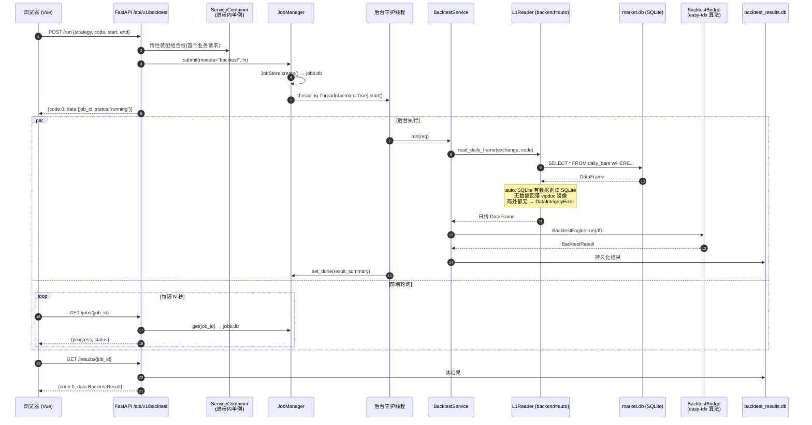
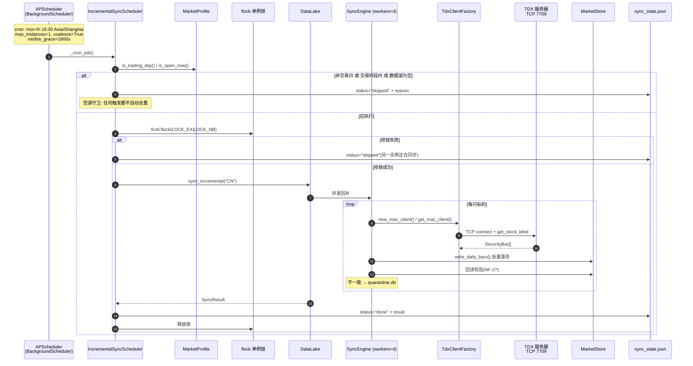
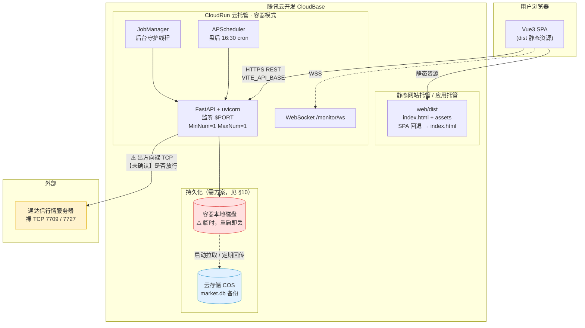

# Kuantix 技术勘察与 CloudBase 部署架构方案

> 勘察对象：`/Users/kongbiao/Downloads/开源量化/Kuantix`
> 勘察方式：逐文件读源码 + 实测本地数据目录，结论均标注来源文件与行号
> 文档定位：交付给工程师撰写「零基础用户部署文档」的原材料
> 标注约定：**【未确认】** = 代码中读不到、需实测或查官方文档确认的事项，禁止在交付文档中当成事实

---

## 摘要：三条必须先知道的结论

| # | 结论 | 影响 |
|---|---|---|
| 1 | **不需要任何 API Token / 密钥**。数据源是通达信（TDX）行情服务器，走**裸 TCP socket**（端口 7709/7727），不是 HTTP API，无需注册、无需申请 key | 零基础用户少了最容易卡住的一环；但引入了「云端能否出裸 TCP」的新风险 |
| 2 | **不依赖本地安装通达信客户端**。`vipdoc` 是 Kuantix 自己从行情服务器下载后写到 `~/.Kuantix/vipdoc` 的产物，不是读用户机器上的通达信目录 | 上云不受"用户没装通达信"阻塞（团队此前的担心可以排除） |
| 3 | **数据落在本地磁盘，实测 1.2 GB（1341 万行日线）**，且服务是**单进程有状态**（内存组合根 + 线程任务 + APScheduler + WebSocket） | 这是上云的**真正硬伤**。CloudRun 容器磁盘是临时的，重启即丢；且只能跑 1 个实例 |

---

# 第一部分：代码结构勘察

## 1. 技术栈清单

### 1.1 后端（来源：`pyproject.toml`，逐行精确读取）

| 项 | 值 | 来源 |
|---|---|---|
| Python 版本要求 | `>=3.10` | `pyproject.toml:10` |
| 本地实际开发版本 | **3.13.12** | `.venv/bin/python --version` 实测 |
| 构建后端 | `hatchling>=1.21` | `pyproject.toml:2` |
| Web 框架 | **FastAPI** `>=0.110`（实装 0.141.1） | `pyproject.toml:24` |
| ASGI 服务器 | **uvicorn** `>=0.29` | `pyproject.toml:25` |
| 数据校验 | pydantic `>=2.6` | `pyproject.toml:26` |
| CLI 框架 | typer `>=0.12` | `pyproject.toml:27` |
| 定时任务 | **APScheduler** `>=3.10,<4`（实装 3.11.3） | `pyproject.toml:33` |
| 数据库 | **Python 标准库 `sqlite3`**（无 ORM、无第三方驱动） | `Kuantix/data/market_store.py:34` |

> 注：`Kuantix serve` 用的是 **uvicorn 编程式启动**（`uvicorn.run(app, ...)`，`Kuantix/main.py:409`），不是 `gunicorn`，也没有 worker 多进程配置。

### 1.2 后端运行时依赖全量（`pyproject.toml:21-34`）

| 包 | 版本约束 | 用途 | 安装体积（实测） | 重量级 |
|---|---|---|---|---|
| `easy-tdx` | **`==1.20.3`（精确锁）** | 通达信行情协议基座，全项目唯一数据源 | 4.4 MB | — |
| `pandas` | `>=2.0,<3` | DataFrame 全链路 | **70 MB** | ⚠️ |
| `fastapi` | `>=0.110` | REST + WebSocket | 1.6 MB | — |
| `uvicorn` | `>=0.29` | ASGI 服务器 | 小 | — |
| `pydantic` | `>=2.6` | 请求/响应模型 | 中 | — |
| `typer` | `>=0.12` | CLI | 小 | — |
| `pyarrow` | `>=15` | 因子库 Parquet 读写 | **126 MB** | ⚠️⚠️ 最大 |
| `scipy` | `>=1.11` | 因子统计（IC/IR） | **99 MB** | ⚠️⚠️ |
| `numpy` | 由 pandas/scipy 传递引入 | 数值计算 | **28 MB** | ⚠️ |
| `tomli` | `>=2.0`，**仅 `python_version < '3.11'`** | TOML 解析（3.11+ 用内置 `tomllib`） | 小 | — |
| `apscheduler` | `>=3.10,<4` | 盘后增量同步 cron | 小 | — |

**site-packages 实测总计：397 MB。** 其中 pyarrow + scipy + pandas + numpy 四个包就占 **323 MB（81%）**。这直接决定了容器镜像会很大、冷启动会慢，是后面选型的核心依据。

> **版本锁定红线**（`pyproject.toml:16-20` 注释）：
> - `easy-tdx` 必须精确 `1.20.3` —— 版本漂移会破坏 `_SECURITY_COEFFICIENTS` 的 import 引用（NF-25）
> - `pandas` 必须 `<3` —— 3.x 会破坏 easy-tdx 的 DataFrame 构造路径
> 这两条在 Dockerfile 里必须原样保留，**禁止 `pip install -U`**。

### 1.3 后端开发依赖（`pyproject.toml:36-41`）

`pytest>=8.0`、`pytest-cov>=5.0`、`ruff>=0.5`。**生产镜像不应安装**（用 `pip install .` 而非 `pip install -e ".[dev]"`）。

### 1.4 前端（来源：`web/package.json`，逐行精确读取）

| 项 | 值 |
|---|---|
| 构建工具 | **Vite** `^5.4.11` |
| 框架 | **Vue 3** `^3.4.38`（**不是 React**） |
| 语言 | TypeScript `^5.5.4` + `vue-tsc ^2.1.6` |
| 状态管理 | **Pinia** `^2.2.2` |
| 路由 | **vue-router** `^4.4.5`，`createWebHistory` 模式 |
| 图表 | **ECharts** `^5.5.1` |
| UI 组件库 | **无**。全部手写组件（`web/src/components/` 下 14 个 `.vue`）+ 纯 CSS（`web/src/styles/main.css`） |
| HTTP 客户端 | **无第三方库**。原生 `fetch`（`web/src/api/client.ts:121`） |
| Node 版本要求 | **`>=18`**（`package.json:27`） |

**依赖清单**
- `dependencies`：`echarts@^5.5.1`、`pinia@^2.2.2`、`vue@^3.4.38`、`vue-router@^4.4.5` —— 仅 4 个，非常干净
- `devDependencies`：`@types/node@^20.16.5`、`@vitejs/plugin-vue@^5.1.4`、`typescript@^5.5.4`、`vite@^5.4.11`、`vue-tsc@^2.1.6`

**构建命令**：`npm run build` = `vue-tsc --noEmit && vite build`，产物目录 **`web/dist`**（`vite.config.ts` `build.outDir`）。

> ⚠️ 注意：`build` 脚本带 `vue-tsc --noEmit` 类型检查，**任何类型错误都会导致构建失败**。零基础用户如果本地 Node 版本不对或依赖装不全，会卡在这一步。交付文档里建议给出「构建失败先跑 `npm run typecheck` 看具体错误」的排查指引。

### 1.5 数据层（关键判断）

| 问题 | 结论 | 证据 |
|---|---|---|
| 用什么存？ | **SQLite（主）+ Parquet（因子）+ 可选二进制 vipdoc 镜像** | `config.toml [storage]`、`Kuantix/data/market_store.py` |
| 行情主存储 | `~/.Kuantix/db/market.db`（SQLite，WAL 模式） | `market_store.py:58`，`config.toml:136` |
| 是否依赖本地通达信数据文件？ | **否**。`[paths].vipdoc = ~/.Kuantix/vipdoc` 是 Kuantix **自己写出来**的目录（`Kuantix/adapters/vipdoc_writer.py`），数据来自行情服务器下载，不读用户的通达信安装目录 | `config.toml:26-27`；`config.py:119-125` 还专门有红线禁止写入 `~/.easy_tdx` |
| `~/.easy_tdx/` 是什么？ | 上游 easy-tdx 包的配置目录，Kuantix **只读**取其中 `config.json` 的已测速节点列表作为补充候选，**永不写回**（NF-1/NF-20）。若容器/干净主机没有该目录，会自动回退到项目内置兜底清单 `Kuantix/resources/easy_tdx_config.json`（已随镜像打包），部署**不依赖**外部项目 | `config.toml:45-51`，`Kuantix/adapters/known_hosts.py` |
| vipdoc 镜像默认开吗？ | **默认关闭**（`vipdoc_mirror = false`）。SQLite 是唯一行情主存储 | `config.toml:141` |

## 2. 目录组织

### 2.1 后端 `Kuantix/`（71 个 Python 文件，27,333 行）

| 路径 | 职责 |
|---|---|
| `config.py` | TOML 配置加载 + `Kuantix__<SECTION>__<KEY>` 环境变量覆盖。**fail-loud**：缺键直接报错，无默认值兜底 |
| `cli.py` | Typer CLI 根（`Kuantix` 命令）。子命令树：`config` / `data` / `factor` / `screen` / `monitor` + `version` / `doctor` / `serve` |
| `main.py` | FastAPI 应用工厂 `create_app()`、`run()`（uvicorn 启动）、全局异常 → 统一信封映射、`/health` 与 `/api/version` |
| `scheduler.py` | `IncrementalSyncScheduler`：APScheduler 盘后 cron + 启动幂等检查 + `fcntl.flock` 跨进程单例锁 |
| `core/` | **契约层，不得 import easy_tdx**。`fail_loud.py`（异常族）、`envelope.py`（统一信封 + 数值安全序列化）、`market.py`（`MarketProfile` 交易日/时段）、`contracts.py`（Bar/Security/Quote/Alert 数据类）、`plugins.py`（插件注册表）、`eventbus.py`（进程内事件总线） |
| `adapters/` | **全项目唯一 import `easy_tdx` 的包**。`tdx_client.py`（三链路客户端工厂 + 连接池）、`universe.py`（全市场枚举）、`quotation.py`（K 线/报价）、`vipdoc_writer.py`（落盘 + 回读校验）、`known_hosts.py`（只读加载上游节点）、`coefficients.py`（证券系数 import 引用）、`backtest_bridge.py` / `factor_bridge.py` / `indicator_bridge.py`（上游算法桥 + `L1Reader` 双后端读侧） |
| `data/` | 数据湖。`datalake.py`（门面）、`market_store.py`（**SQLite 四表 CRUD，1005 行，核心**）、`sync_engine.py`（并发回补）、`sync_state.py`（同步状态）、`migrate.py`（vipdoc→SQLite 迁移）、`verify.py`（写后回读校验）、`quarantine.py`（隔离区）、`security_search.py`（本地清单搜索） |
| `factor/` | 因子库 L2。`service.py`（计算/报告/合成）、`store.py`（Parquet 分区存储 + `factor_meta.db`）、`combiner.py`（IC/IR 加权合成）、`ranking.py`（多因子排名）、`factors/` |
| `backtest/` | 回测。`service.py`（单策略）、`portfolio_service.py`（组合 + 多策略）、`optimize_service.py`（参数网格寻优）、`store.py`（`backtest_results.db`）、`strategy_store.py`（`strategies.db`）、`data_source.py`（`auto`/`local`/`live` 数据源分支） |
| `screen/` | 选股。`service.py`（批次执行 + `screen_results.db`）、`filters.py`（条件插件） |
| `monitor/` | 实时监控。`loop.py`（轮询主循环，**常驻线程**）、`feed.py`（报价源）、`rules.py`（规则引擎）、`position.py`（持仓盈亏）、`store.py`（`monitor.db`）、`notifier.py` + `channels/`（`desktop.py` macOS 通知 / `webhook.py`） |
| `api/` | REST 层。`server.py`（**组合根 `build_container`** + 路由注册）、`deps.py`（`ServiceContainer` / 市场门禁 / 分页 / 信封渲染）、`jobs.py`（`JobManager` 线程任务 + `jobs.db`）、`schemas.py`、`routers/`（9 个业务 router） |
| `resources/` | 打包内置的 `config.default.toml`（wheel 安装时的兜底模板，由 `pyproject.toml:53` 从根 `config.toml` 复制） |
| `tests/` | 包内验收用例 + `conftest.py`（注入 `schedule_enabled=false` 保证测试零网络） |

### 2.2 前端 `web/src/`

| 路径 | 职责 |
|---|---|
| `main.ts` / `App.vue` | 应用入口，挂载 Pinia + Router |
| `api/` | `config.ts`（`API_BASE` 从 `VITE_API_BASE` 读取）、`client.ts`（`RestApi` 类，全部 REST 调用，483 行）、`ws.ts`（`RealMonitorFeed` WebSocket 客户端 + 指数退避重连）、`types.ts`、`index.ts` |
| `views/` | 9 个页面：`Backtest` / `Factors` / `Monitor` / `Screen` / `CompareView` / `OptimizeView` / `PortfolioView` / `StrategiesView` / `SettingsView` |
| `components/` | 14 个通用组件：`EChart` / `KlineChart` / `JobProgress` / `SecuritySearchBox` / `Pagination` / `ToastHost` / `TopBar` / `GradeBadge` 等 |
| `stores/` | 9 个 Pinia store，与 views 一一对应 + `app.ts`（全局） |
| `types/` | 12 个 TS 类型模块，对齐后端契约（`envelope.ts` 是统一信封类型） |
| `grading/` | 前端评级引擎（`engine.ts` / `thresholds.ts` / `combinedMetrics.ts`）+ 单测 |
| `router/index.ts` | `createWebHistory(import.meta.env.BASE_URL)` —— **History 模式，部署时必须配 SPA 回退** |
| `utils/` | `format.ts` / `download.ts` / `toast.ts` |

## 3. 前后端职责边界

| 维度 | 后端（Python） | 前端（Vue） |
|---|---|---|
| 数据获取 | 独占。所有 TDX 连接、行情下载、落盘 | 零直连。只经 REST/WS 拿数据 |
| 计算 | 因子计算、回测、寻优、选股、规则判定 | 仅**评级展示逻辑**（`src/grading/`，把后端返回的指标映射成 A/B/C 等级）与图表渲染 |
| 状态 | SQLite 持久化 + 进程内内存（组合根/连接池/任务线程） | Pinia 内存态，刷新即丢 |
| 长任务 | `JobManager` 提交后台线程，返回 `job_id` | 轮询 `GET .../jobs/{job_id}` 拿进度 |
| 实时推送 | WebSocket `/api/v1/monitor/ws` 主动推 alert | `RealMonitorFeed` 订阅 |
| 契约 | 统一信封 `{code, message, data, meta}`（NF-9），JSON 禁 NaN/Inf、浮点 6 位（NF-12） | `client.ts` 统一解析，`code≠0` 抛 `ApiError` 并 toast |

**边界很干净**：前端没有任何业务计算下沉，也没有直连数据源。这对上云是有利的——前后端可以完全分离部署。

## 4. 环境变量与配置项全量清单

### 4.1 后端环境变量（全局 grep `os.getenv` / `os.environ` 的结果）

实际使用点只有 3 处（`Kuantix/config.py:530`、`config.py:573`、`Kuantix/tests/conftest.py:61`），**代码里没有任何硬编码的密钥读取**。

| 变量名 | 用途 | 默认值 | 必填 | 示例 |
|---|---|---|---|---|
| `Kuantix_CONFIG` | 显式指定 `config.toml` 路径 | 无（走搜索顺序） | 否 | `/app/config.toml` |
| `Kuantix__<SECTION>__<KEY>` | 覆盖 `config.toml` 任意键，双下划线分隔，大小写不敏感 | 无 | 否 | `Kuantix__SERVER__PORT=9001` |
| `Kuantix_NETWORK_TESTS` | 测试用：置 `1` 才跑需外网的用例 | 未设=跳过 | 否 | `1` |

**配置文件搜索顺序**（`config.py:517-548`）：
1. 显式传入路径（CLI `--config`）
2. `$Kuantix_CONFIG`
3. `./config.toml`（**当前工作目录**）
4. 源码树根 `config.toml`
5. 包内置 `Kuantix/resources/config.default.toml`

> ⚠️ **环境变量覆盖的三个坑**（都会导致零基础用户懵）：
> 1. **必须恰好两段**。`Kuantix__PATHS__ROOT` 合法；`Kuantix__A__B__C` 直接报错（`config.py:491-495`）
> 2. **键必须已存在于 TOML 中**。拼错变量名不是"没生效"，而是**启动直接崩**并列出可用键（`config.py:503-507`）。这是 fail-loud 设计，但对新手不友好
> 3. **列表用逗号分隔**：`Kuantix__SERVER__CORS_ORIGINS=https://a.com,https://b.com`（`config.py:430-438`）

### 4.2 `config.toml` 全量字段（10 个分节，共 48 个键）

> 红线（`config.toml:11-12`）：**本文件中不存在的键，读取时直接报错**，代码中不做 `dict.get(key, 默认)` 兜底。所以这份表就是全集。

#### `[app]`
| 键 | 含义 | 默认值 | 可选范围 |
|---|---|---|---|
| `name` | 应用名（FastAPI title） | `"Kuantix"` | 非空字符串 |
| `version` | 版本号展示 | `"0.1.0"` | 非空字符串 |
| `log_level` | 日志级别 | `"INFO"` | `DEBUG`/`INFO`/`WARNING`/`ERROR` |

#### `[paths]` —— 数据落盘根（**上云必须全部覆盖**）
| 键 | 含义 | 默认值 |
|---|---|---|
| `root` | 数据根目录 | `~/.Kuantix` |
| `vipdoc` | 二进制日线镜像目录 | `~/.Kuantix/vipdoc` |
| `factors` | 因子 Parquet 目录 | `~/.Kuantix/factors` |
| `db` | 全部 SQLite 库所在目录 | `~/.Kuantix/db` |
| `logs` | 日志目录 | `~/.Kuantix/logs` |
| `reports` | 报告目录 | `~/.Kuantix/reports` |
| `exports` | 导出目录 | `~/.Kuantix/exports` |

> ⚠️ **7 个路径互相独立，没有从 `root` 派生的逻辑**（`config.py:592-600` 逐个 `_as_path`）。容器里改路径必须**一次改 7 个环境变量**，只改 `Kuantix__PATHS__ROOT` 是无效的（其余 6 个仍指向 `~/.Kuantix/*`）。
> 另有红线：任一路径落在 `~/.easy_tdx` 内会直接抛错（`config.py:119-125`）。

#### `[server]`
| 键 | 含义 | 默认值 | 上云需改 |
|---|---|---|---|
| `host` | 监听地址 | `"127.0.0.1"` | ✅ 必须改 `0.0.0.0` |
| `port` | 监听端口 | `8899` | ✅ 必须跟随平台 `$PORT` |
| `reload` | uvicorn 热重载 | `false` | 保持 false |
| `cors_origins` | CORS 白名单 | `["http://localhost:5173","http://127.0.0.1:5173"]` | ✅ 必须加前端域名 |

#### `[tdx]` —— 上游行情服务器
| 键 | 含义 | 默认值 |
|---|---|---|
| `use_easy_tdx_known_hosts` | 是否只读加载 `~/.easy_tdx/config.json` 的节点 | `true` |
| `port` | A 股标准行情端口 | `7709` |
| `ex_port` | 港美股扩展行情端口 | `7727` |
| `timeout_seconds` | socket 超时 | `15.0` |
| `mac_hosts` | A 股行情节点兜底列表 | `["123.60.47.136","121.36.248.138"]` |
| `std_hosts` | 证券清单节点兜底列表 | `["180.153.18.170","119.147.212.81"]` |
| `mac_ex_hosts` | 港美股节点兜底列表 | `["116.205.135.205","121.37.232.167"]` |

> **这就是"数据源配置"的全部** —— 是一组**公开 IP 地址**，不是 token。用户不需要去任何网站申请账号。

#### `[sync]` —— 数据回补
| 键 | 含义 | 默认值 |
|---|---|---|
| `workers` | 并发回补线程数 | `4` |
| `default_years` | 单标的默认回溯年数 | `10` |
| `page_size` | 证券清单每页条数（上游上限 1000） | `1000` |
| `min_request_interval` | 相邻请求最小间隔秒（防限流） | `0.05` |
| `retry_backoff_seconds` | 失败退避初始秒 | `1.0` |
| `retry_max_attempts` | 最大重试次数 | `3` |
| `verify_tail_bars` | 写后回读校验末尾条数 | `5` |
| `verify_price_tolerance` | 回读价格容差 | `0.001` |
| `schedule_enabled` | 盘后自动增量调度开关 | `true` |
| `schedule_time` | 每日盘后触发时间（`HH:MM`，Asia/Shanghai） | `"16:30"` |
| `schedule_startup_check` | 启动时是否跑幂等检查 | `true` |

#### `[monitor]`
| 键 | 含义 | 默认值 |
|---|---|---|
| `poll_interval_seconds` | 轮询间隔 | `5.0` |
| `batch_size` | 单次批量报价上限（协议限制 80） | `80` |
| `alert_cooldown_seconds` | 同规则告警冷却 | `300.0` |
| `trading_hours_only` | 仅交易时段轮询 | `true` |
| `webhook_url` | Webhook 推送地址，**空串 = 不启用** | `""` |

#### `[markets]`
| 键 | 默认值 | 说明 |
|---|---|---|
| `default` | `"CN"` | 默认市场码 |
| `cn_enabled` | `true` | A 股 |
| `hk_enabled` | `false` | 港股，**置 true 会显式抛 `NotImplementedError`**（占位未实现） |
| `us_enabled` | `false` | 美股，同上 |

#### `[factor]` / `[screen]`
| 键 | 默认值 | 说明 |
|---|---|---|
| `factor.partition` | `"year"` | Parquet 分区粒度 |
| `factor.forward_period` | `5` | 前瞻收益周期（交易日） |
| `factor.quantiles` | `5` | 分层回测层数 |
| `screen.top_n` | `50` | 选股返回条数 |

#### `[storage]`
| 键 | 默认值 | 说明 |
|---|---|---|
| `market_db` | `"market.db"` | 行情主库文件名（位于 `[paths].db` 下） |
| `vipdoc_mirror` | `false` | 是否双写二进制镜像 |
| `migrate_on_startup` | `false` | 启动是否自动迁移（默认只警告不执行） |
| `write_batch_size` | `2000` | 写侧单事务批大小 |

### 4.3 前端环境变量

`web/.env.development`（1 个键）：
```
VITE_API_BASE=http://127.0.0.1:8899/api/v1
```
`web/.env.production`（1 个键，**内容与 development 完全相同**）：
```
VITE_API_BASE=http://127.0.0.1:8899/api/v1
```

| 变量 | 用途 | 默认值 | 上云需改 |
|---|---|---|---|
| `VITE_API_BASE` | 后端 API 基地址 | `http://127.0.0.1:8899/api/v1`（`web/src/api/config.ts:8` 兜底） | ✅ **必须改成 CloudRun 的 HTTPS 地址** |
| `BASE_URL` | Vite 内置，路由 base | `/` | 视托管路径而定 |

> ⚠️ **`.env.production` 现在指向 `127.0.0.1`，直接构建部署上云 100% 打不开数据**。这是部署时第一个必改项。
> 另外 `web/src/api/ws.ts:12-14` 的 WS 地址是从 `API_BASE` 做 `replace(/^http/, 'ws')` 推导的 —— 所以 `VITE_API_BASE` 改成 `https://` 后，WS 会自动变成 `wss://`，**无需单独配置**。这点设计得不错。

### 4.4 关于「数据源 token」的明确结论

**全项目没有任何 Tushare / AkShare / Wind / 聚宽 的痕迹。** 已验证：
- `pyproject.toml` 依赖列表中无相关包
- 全局 grep 无 `tushare`、`akshare`、`token`、`api_key` 类配置项
- 唯一数据源是 `easy-tdx`，通过 `TdxClientFactory` 连接公开的通达信行情服务器 IP

**交付文档应明确写：本项目零 API 密钥，用户不需要注册任何数据服务账号。**

## 5. 数据存储方式

### 5.1 存储清单（实测本地 `~/.Kuantix/`）

| 文件 | 类型 | 实测大小 | 内容 | 产生方式 |
|---|---|---|---|---|
| `db/market.db` | SQLite | **1.2 GB** | **13,413,249 行日线 + 17,634 只证券** | `Kuantix data sync` 全量回补 |
| `db/quarantine.db` | SQLite | 13 MB | 校验不通过的隔离数据 | 同步时自动 |
| `db/backtest_results.db` | SQLite | 1.1 MB | 回测结果 | 回测运行 |
| `db/jobs.db` | SQLite | 40 KB | 异步任务状态 | 任务提交 |
| `db/monitor.db` | SQLite | 44 KB | 规则/自选/持仓/告警 | 用户操作 |
| `db/screen_results.db` | SQLite | 20 KB | 选股批次结果 | 选股运行 |
| `db/factor_meta.db` | SQLite | 12 KB | 因子元数据 | 因子计算 |
| `db/models.db` | SQLite | 12 KB | 合成因子模型 | 因子合成 |
| `db/strategies.db` | SQLite | 12 KB | 用户保存的策略 | 用户操作 |
| `db/sync_state.json` / `sync_checkpoint_CN.json` | JSON | 281 B / 172 KB | 同步状态与断点 | 同步时 |
| `db/sync_scheduler.lock` | 锁文件 | — | `fcntl.flock` 跨进程单例锁 | 调度器 |
| `factors/` | Parquet | 目录 | `{factor}/{year}.parquet` 因子值 | 因子计算 |
| `vipdoc/` | 二进制 | **508 MB** | 通达信 `.day` 格式镜像（**可选**，默认不再写） | 历史迁移遗留 |

**总计约 1.75 GB。** 即使关掉 vipdoc 镜像，`market.db` 单文件仍有 1.2 GB。

### 5.2 `market.db` 表结构（`Kuantix/data/market_store.py:152-210`）

| 表 | 主键 | 说明 |
|---|---|---|
| `securities` | — | 证券清单（代码/名称/市场/交易所） |
| `daily_bars` | `(market, code, date)` **WITHOUT ROWID** | 日线主表，1341 万行；`date` 存 `YYYYMMDD` 整数 |
| `sync_meta` | — | 同步元数据 |
| `sync_checkpoint` | `(market, code)` | 断点续传，O(1) 查询 |

技术细节：
- **WAL 模式** + `busy_timeout = 30000ms` + 进程内 `RLock`（`market_store.py:69`、`:12-16`）
- 写侧 `executemany` 单事务批量提交，迁移期可临时 `PRAGMA synchronous=OFF`
- 有 30 秒 TTL 的统计缓存，避免对 1341 万行反复 `SELECT DISTINCT`（`market_store.py:74-77`）

### 5.3 初始化方式

**表结构自动创建**（`MarketStore.__init__` → `_create_schema`，`CREATE TABLE IF NOT EXISTS`），**无需迁移脚本**。
但**数据必须手动灌**：
1. `Kuantix data sync`（全量回补，从 TDX 服务器下载）
2. 或 `Kuantix data migrate`（把已有 vipdoc 二进制迁进 SQLite；`migrate_on_startup=false` 默认不自动执行，只在启动时打 warning，见 `main.py:157-186`）

**空库行为**：调度器有「空湖守卫」—— 湖为空时**任何触发来源都不自动全量**，避免空机首启引发全市场网络风暴（`scheduler.py:274-275`）。所以部署完不灌数据，页面会一直是空的，且不会自愈。

### 5.4 数据量级与耗时预估（`spikes/results/S2_throughput.json` 实测）

| 指标 | 实测值 |
|---|---|
| 全市场证券枚举 | 52 页 / 5.9 秒（**每页必须新建连接**，复用连接第 2 页起 15.2s/页） |
| A 股标的数 | 5,209 只 |
| 单只 10 年日线拉取 | **0.147 秒**（2,400 行） |
| **全量回补理论耗时** | 5209 × 0.147 ≈ **13 分钟**（单线程；`workers=4` 并发可压缩，但有 `min_request_interval=0.05` 限速） |

**结论：全量回补是分钟级、GB 级的重操作，必须持久化，不能每次容器启动重跑。**

## 6. 服务间调用关系

### 6.1 前端 → 后端 REST 接口全量（52 个端点，从 `Kuantix/api/routers/` 与 `web/src/api/client.ts` 交叉验证）

**基础设施（挂在根路径，非 `/api/v1`）**
| 方法 | 路径 | 用途 |
|---|---|---|
| GET | `/health` | 存活探针 + 启用市场 |
| GET | `/api/version` | 版本 + 上游 easy-tdx 版本 |
| GET | `/docs` / `/openapi.json` | Swagger |

**`/api/v1/data`（D1–D8）**
| 方法 | 路径 | 用途 |
|---|---|---|
| GET | `/status` | 数据湖状态 |
| POST | `/sync` | 触发回补（返回 job） |
| GET | `/sync/{job_id}` | 回补进度 |
| POST | `/sync/{job_id}/cancel` | 取消回补 |
| GET | `/verify` | 数据校验报告 |
| GET | `/quarantine` | 隔离区列表 |
| DELETE | `/quarantine/{code}` | 移除隔离项 |
| GET | `/search` | 证券搜索（走本地 SQLite，零网络） |

**`/api/v1/factor`（F1–F7）**：`GET ""`、`POST /compute`、`GET /jobs/{job_id}`、`GET /report`、`POST /combine`、`GET /models`、`POST /ranking`

**`/api/v1/screen`（S1–S6）**：`GET /filters`、`POST /run`、`GET /jobs/{job_id}`、`GET /batches`、`GET /results`、`GET /results/{batch_id}/export`

**`/api/v1/backtest`（B1–B5, C1）**：`GET /strategies`、`POST /run`、`GET /jobs/{job_id}`、`GET /results/{job_id}`、`GET /jobs`、`GET /kline/{code}`

**`/api/v1/portfolio`（P1–P3）**：`POST /run`、`GET /jobs/{job_id}`、`GET /results/{job_id}`

**`/api/v1/optimize`（O1–O5）**：`POST /run`、`POST /all/run`、`GET /jobs/{job_id}`、`GET /results/{job_id}`、`GET /all/results/{job_id}`

**`/api/v1/strategies`（S1–S5）**：`GET ""`、`POST ""`、`GET /{id}`、`DELETE /{id}`、`POST /run-multi`

**`/api/v1/settings`（E1–E2）**：`GET /status`（数据源状态）、`POST /test-connection`（主机连通性测试，只测不写）

**`/api/v1/monitor`（M1–M17）**：`POST /start`、`POST /stop`、`GET /status`、`GET|POST /watchlist`、`DELETE /watchlist/{code}`、`GET /criteria`、`GET|POST /rules`、`PUT|DELETE /rules/{id}`、`GET|POST /positions`、`DELETE /positions/{code}`、`GET /alerts`、`GET /channels`、**`WS /ws`**

### 6.2 后端 → 外部数据源

| 项 | 值 |
|---|---|
| 外部服务 | 通达信（TDX）公开行情服务器 |
| 协议 | **裸 TCP socket**（非 HTTP/HTTPS） |
| 端口 | **7709**（A 股行情 + 证券清单）、**7727**（港美股扩展，当前禁用） |
| 目标 IP | `config.toml [tdx]` 中的 6 个公网 IP（可扩展） |
| 是否需公网出口 | **是，且必须能出任意端口的 TCP** |
| 频率限制 | 有。`min_request_interval = 0.05s`（S2 实测不限速会被服务端限流挂起） |
| 连接特性 | 三条互不兼容的链路（MacClient/TdxClient/MacExClient），连接**非线程安全**，有进程内连接池 |
| 鉴权 | **无**。不需要账号密码或 token |

### 6.3 后端内部调用链（Mermaid 时序图）

**链路 A：用户发起一次回测（长任务 + 轮询）**



**链路 B：盘后自动增量同步（定时任务 + 外网 TCP）**



### 6.4 定时任务 / 常驻进程 / 长连接盘点

| 类型 | 实现 | 位置 | 上云影响 |
|---|---|---|---|
| **定时任务** | APScheduler `BackgroundScheduler`，cron `mon-fri 16:30` Asia/Shanghai | `scheduler.py:96-110`，由 FastAPI `lifespan` 挂载（`main.py:198-215`） | 需要**常驻进程**，函数计算模型不适用 |
| **启动检查线程** | `threading.Thread(daemon=True)` 跑 `startup_check()` | `main.py:206-210` | 启动即可能触发网络同步 |
| **异步任务线程** | `JobManager.submit` → `threading.Thread(daemon=True)` | `api/jobs.py:372-379` | **任务状态在 SQLite，但执行体在内存线程**。实例重启 = 运行中的任务永久卡住 |
| **监控主循环** | `MonitorLoop` 常驻轮询线程（5 秒间隔） | `monitor/loop.py` | 需要常驻 |
| **WebSocket 长连接** | `/api/v1/monitor/ws`，服务端 30s ping，客户端 25s ping | `api/routers/monitor.py:539-560`，`web/src/api/ws.ts` | 需要平台支持 WS |
| **跨进程单例锁** | `fcntl.flock`，平台不支持则 fail-loud 抛错 | `scheduler.py:308-326` | Linux 容器内可用；但**只在单实例内有效**，多实例各有各的文件系统 |
| **进程内连接池** | `TdxClientFactory._pool`（`dict` + `RLock`） | `adapters/tdx_client.py:183` | 内存态，多实例不共享 |
| **进程内事件总线** | `core/eventbus.py`，WS 推送依赖它 | — | **多实例下 A 实例产生的 alert 推不到连在 B 实例的浏览器** |

---

# 第二部分：CloudBase 部署架构方案

## 7. 整体架构



## 8. 前端：静态网站托管

| 项 | 值 |
|---|---|
| 构建命令 | `cd web && npm ci && npm run build` |
| 产物目录 | **`web/dist`** |
| 部署方式 | 首次用 `manageApps(action="createApp")`（独立子域名 `*.webapps.tcloudbase.com`）；后续更新用 `manageApps(action="updateApp")` |
| SPA 路由回退 | **必须**调用 `setWebsiteDocument`，把 `indexDocument` 和 `errorDocument` **都设为 `index.html`** |

**为什么必须配回退**：`web/src/router/index.ts:13` 用的是 `createWebHistory`，用户直接访问 `/backtest` 或刷新页面时，静态托管会去找 `/backtest` 这个文件，找不到就 404。回退到 `index.html` 后由前端路由接管。

**必改配置**：`web/.env.production`
```diff
- VITE_API_BASE=http://127.0.0.1:8899/api/v1
+ VITE_API_BASE=https://<你的CloudRun服务域名>/api/v1
```
改完后 WebSocket 地址会自动推导成 `wss://<域名>/api/v1/monitor/ws`（`web/src/api/ws.ts:12-14` 的 `replace(/^http/,'ws')`），无需额外配置。

> ⚠️ 顺序很重要：**必须先部署后端拿到 CloudRun 域名，再改 `.env.production`，再构建前端**。反过来做会得到一个指向 `127.0.0.1` 的死包。

## 9. 后端：选型判断

### 9.1 结论：**必须用 CloudRun 容器模式（Container mode），云函数不可行**

主理人的直觉是对的。逐条验证：

| 判据 | 实测/代码事实 | 云函数（Function） | CloudRun 容器 |
|---|---|---|---|
| **依赖体积** | site-packages **397 MB**（pyarrow 126M + scipy 99M + pandas 70M + numpy 28M） | ❌ 远超函数包体积限制 | ✅ 镜像层可容纳 |
| **定时任务** | APScheduler 常驻 `BackgroundScheduler`（`scheduler.py:95`） | ❌ 函数无常驻进程；改用平台定时触发器需重写调度逻辑 | ✅ 进程常驻，原样可用 |
| **WebSocket** | `/api/v1/monitor/ws` 长连接 + 双向 ping | ❌ 函数模型不适配长连接 | ✅ 官方明确支持 WS/SSE |
| **常驻监控循环** | `MonitorLoop` 5 秒轮询线程 | ❌ | ✅ |
| **长耗时请求** | 全量回补理论 ≈13 分钟；参数网格寻优更久 | ❌ 超函数超时上限 | ✅（且已用 job 异步化，HTTP 请求本身很短） |
| **本地数据文件** | `market.db` 1.2 GB | ❌ | ⚠️ 可写但**不持久**（见 §10） |
| **常驻内存缓存** | `TdxClientFactory` 连接池、`ServiceContainer` 单例、`eventbus` | ❌ 函数实例不保证复用 | ✅ 单实例内有效 |
| **Python 运行时** | 需要 3.10+ 与自定义系统依赖 | 受限 | ✅ 自带 Dockerfile 完全可控 |

**七项里六项否决云函数。选 CloudRun 容器模式，无悬念。**

### 9.2 CloudRun 关键配置

```json
{
  "action": "deploy",
  "serverName": "Kuantix-api",
  "targetPath": "/abs/path/to/Kuantix",
  "serverConfig": {
    "OpenAccessTypes": ["PUBLIC"],
    "Cpu": 2,
    "Mem": 4,
    "MinNum": 1,
    "MaxNum": 1,
    "EnvParams": "{\"Kuantix_CONFIG\":\"/app/config.toml\",\"Kuantix__SERVER__HOST\":\"0.0.0.0\",\"Kuantix__PATHS__ROOT\":\"/data\",\"Kuantix__PATHS__DB\":\"/data/db\",\"Kuantix__PATHS__VIPDOC\":\"/data/vipdoc\",\"Kuantix__PATHS__FACTORS\":\"/data/factors\",\"Kuantix__PATHS__LOGS\":\"/data/logs\",\"Kuantix__PATHS__REPORTS\":\"/data/reports\",\"Kuantix__PATHS__EXPORTS\":\"/data/exports\",\"Kuantix__SERVER__CORS_ORIGINS\":\"https://<前端域名>\"}"
  }
}
```

**逐项说明**

| 配置 | 值 | 理由 |
|---|---|---|
| `Cpu` / `Mem` | **2C / 4G** | 平台建议 `Mem = 2 × Cpu`。pandas 处理 1341 万行 + 4 并发 worker，2C4G 是下限；回测/寻优场景建议 4C8G |
| `MinNum` | **1** | 必须 ≥1。冷启动要加载 397 MB 依赖 + 建 SQLite 连接，缩到 0 后首次请求会非常慢；且缩容会杀掉运行中的 job 线程和 APScheduler |
| `MaxNum` | **1（强制）** | **见 §12 风险 3**：本项目是有状态单进程设计，多实例会数据错乱 |
| `OpenAccessTypes` | `PUBLIC` | 浏览器直连需要公网 HTTPS |
| `VpcConf` | **不需要** | 项目不连 VPC 内的 MySQL/Redis，只连公网 TDX 服务器 |

## 10. 数据持久化：这是本方案最大的难点

### 10.1 问题陈述

CloudRun 容器**本地磁盘是临时的**（平台明确列出的常见错误就是"把 CloudRun 当有状态应用托管、把重要状态存本地磁盘"）。而 Kuantix 的全部状态都在本地文件：
- `market.db` 1.2 GB（重建需 ≈13 分钟全网络回补）
- 9 个业务 SQLite（用户的策略、自选、规则、持仓、回测结果——**丢了就是用户资产没了**）
- 因子 Parquet 目录

**容器每次重启/重新部署/自动伸缩，这些全部归零。**

> 【未确认】CloudBase CloudRun 是否支持挂载持久化卷（CFS/NAS）。当前技能文档与 MCP 工具 schema 中**未提及**任何卷挂载参数（`serverConfig` 只有 `OpenAccessTypes`/`Cpu`/`Mem`/`MinNum`/`MaxNum`/`EnvParams`/`VpcConf`）。**部署前必须先在控制台或提工单确认**。如果支持，本节的复杂度可大幅下降——直接挂卷到 `/data` 即可。

### 10.2 四个候选方案

| 方案 | 做法 | 优点 | 缺点 | 推荐度 |
|---|---|---|---|---|
| **A. COS 冷热同步** | 启动时从云存储下载 `*.db` 到 `/data`；定时 + 优雅退出时上传回 COS | 改动相对小；数据能活下来 | 1.2 GB 启动下载**极慢**（分钟级冷启动）；上传期间写入有丢失窗口；**并发写与上传时序难保证一致性** | ⭐⭐ |
| **B. 迁移到云数据库** | `market_store.py` 从 `sqlite3` 改成 MySQL/PostgreSQL | 真正的云原生；可多实例 | `market_store.py` 1005 行纯手写 SQL 全部要改，还有另外 9 个 store 模块；1341 万行入库成本高；**工作量以人周计** | ⭐⭐（长期正解，短期不现实） |
| **C. 缩小数据规模 + COS 同步** | 不做全市场 5209 只，只同步用户自选的 100–300 只 → `market.db` 降到 **约 30–70 MB**，再用方案 A | 冷启动可接受；改动小（只调同步范围） | 功能降级：全市场选股/因子截面失去意义 | ⭐⭐⭐⭐（**演示/个人使用的最优解**） |
| **D. 混合部署** | 前端上 CloudBase 托管，后端**留在用户本地**跑 | 零改造、零风险、功能完整 | 不是"上云"；用户仍需本地跑 Python | ⭐⭐⭐（如果用户真实诉求只是"有个好看的在线界面"） |

### 10.3 建议

- 若 **【未确认】项验证为「CloudRun 支持挂载持久化卷」** → 直接挂卷到 `/data`，方案完美，本节所有复杂度消失。
- 若不支持 → 给零基础用户推 **方案 C**（限定自选池 + COS 同步），并在文档里**明确告知全市场功能受限**。
- **不要**在给零基础用户的文档里推方案 B，那是开发任务不是部署任务。

## 11. 跨域与鉴权

### 11.1 CORS

后端已内置 `CORSMiddleware`（`main.py:267-273`）：
```python
allow_origins = config.server.cors_origins   # 来自 config.toml
allow_credentials = False
allow_methods = ["GET","POST","PUT","DELETE","OPTIONS"]
allow_headers = ["*"]
```
**上云只需注入环境变量**，无需改代码：
```
Kuantix__SERVER__CORS_ORIGINS=https://<前端域名>
```
（多个域名用英文逗号分隔，`config.py:430-438` 支持）

> ⚠️ WebSocket **不走 CORS**（浏览器对 WS 无同源策略），所以 WS 连接不受此配置影响——但也意味着 **WS 端点对任何来源开放**，见下。

### 11.2 鉴权：**当前完全没有，这是重大安全缺口**

代码事实：
- `allow_credentials=False`，没有任何 `Depends(get_current_user)`、没有 JWT、没有 API Key 校验
- `web/.env.production` 注释原文：**"生产/构建模式：对接真实后端（本地工具，无鉴权）"**

这在「本地单机工具」语境下完全合理。但一旦 `OpenAccessTypes: ["PUBLIC"]` 暴露到公网，**任何知道域名的人都可以**：
- 触发全量数据回补（打满 CPU 和外网带宽）
- 提交参数网格寻优（长时间占满实例）
- 读取/删除你保存的策略、自选、持仓
- 通过 `POST /api/v1/settings/test-connection` 拿你的服务器当**任意 IP:端口的探测跳板**（`Kuantix/api/routers/settings.py`，`probe_connection` 接受任意 host/port）

**最后一条尤其严重**，属于 SSRF 面。

**处置建议（按成本从低到高）**
1. **最低成本**：`OpenAccessTypes` 改为 `OA`（办公网访问）或 `VPC`，不开 `PUBLIC`。前端也只能内网访问
2. **推荐**：接入 CloudBase 身份认证。前端用 `auth.getSession()` 取 token，请求带 `Authorization` 头；后端加一个 FastAPI 全局 `Depends` 校验中间件。**这是新增代码，不是配置**（详见 §13 改造清单 R7）
3. **兜底**：至少在 CloudRun 前面加一层网关鉴权或 IP 白名单

> **交付文档里必须对用户明说这一点。** 不能让零基础用户在不知情的情况下把一个无鉴权服务挂到公网。

## 12. 部署风险与阻塞点（诚实清单）

### 🔴 阻塞级（不解决就部署不成功）

**风险 1：出方向裸 TCP 可能被封**
- 事实：数据源是 TCP 7709/7727，**不是 HTTP**（`adapters/tdx_client.py`）
- 【未确认】CloudBase CloudRun 容器的出方向是否放行到任意公网 IP 的非标准端口 TCP
- 影响：**若被封，整个数据同步链路死亡**，项目只能读已有数据，`data sync` / 实时监控 / `live` 数据源全废
- **验证方法（部署前必做）**：起一个最小容器跑
  ```bash
  python -c "import socket;s=socket.create_connection(('123.60.47.136',7709),10);print('OK');s.close()"
  ```
  或部署后调 `POST /api/v1/settings/test-connection`（这个端点就是干这个的，`probe_connection` 只测不写）
- **这是第一优先级验证项，必须放在部署文档的最前面。**

**风险 2：1.2 GB 本地数据无处安放**
- 见 §10。容器磁盘临时，重启即丢
- 【未确认】是否支持挂载持久化卷
- 无卷 + 无改造 = **每次重启用户数据清零**，产品不可用

**风险 3：多实例会直接搞坏数据**
- 事实：以下全是**单进程内存态**
  - `ServiceContainer` 进程内单例（`api/server.py:92`）
  - `JobManager` 用 `threading.Thread` 在**本进程**执行（`api/jobs.py:372`）
  - `TdxClientFactory._pool` 进程内连接池
  - `core/eventbus.py` 进程内事件总线（WS 推送依赖）
  - `fcntl.flock` 只在**同一文件系统**内互斥
- 多实例后果：
  - 前端 `POST /backtest/run` 落到 A 实例，轮询 `GET /jobs/{id}` 落到 B 实例 → **永远查不到任务**（除非 jobs.db 共享，但它也在本地磁盘）
  - 每个实例各跑一份 APScheduler → **重复同步**，flock 拦不住
  - WS 连在 A 实例的浏览器收不到 B 实例产生的 alert
  - 多实例并发写各自的 `market.db` → 数据分叉
- **必须 `MinNum = MaxNum = 1`。这是硬约束，不是优化建议。** 且必须在文档里写明「不要调大实例数」

### 🟡 降级级（能部署，但功能受损）

**风险 4：桌面通知在 Linux 容器必然失效**
- `Kuantix/monitor/channels/desktop.py:62-70` 用 `subprocess.run(["osascript", ...])`，**macOS 专属**
- 容器内会走到 `FileNotFoundError` 分支，日志打「未找到 osascript（非 macOS 环境？）」并返回 `False`
- 行为是**优雅降级**（不崩），但 `GET /monitor/channels` 会显示 desktop 通道不可用
- **缓解**：配 `Kuantix__MONITOR__WEBHOOK_URL` 走 webhook 通道替代

**风险 5：冷启动慢**
- 397 MB 依赖 + FastAPI 启动 + SQLite schema 创建 + （若走 COS 方案）1.2 GB 下载
- `MinNum=1` 可避免常态冷启动，但**每次重新部署仍会经历一次**
- 若走 COS 方案，重新部署 = 分钟级不可用

**风险 6：时区**
- 调度器用 `Asia/Shanghai`（`scheduler.py:94`，来自 `MarketProfile.timezone`），代码内部处理正确
- 但容器默认 `UTC`，日志时间戳会是 UTC，排查时容易看混
- **缓解**：Dockerfile 里 `ENV TZ=Asia/Shanghai` + 装 `tzdata`

**风险 7：端口环境变量不匹配（隐蔽坑）**
- CloudBase 注入的是 `PORT`
- 但本项目的配置系统**只认 `Kuantix__<SECTION>__<KEY>` 恰好两段格式**（`config.py:488-495`），`PORT` 不会被识别
- 更糟：`_apply_env_overrides` 会遍历所有 `Kuantix__` 开头的变量，**指向不存在的分节/键会直接抛错启动失败**
- **必须写启动脚本做映射**（见 R3）

**风险 8：`~` 路径在容器内的归属**
- `[paths]` 默认 `~/.Kuantix`，容器内 `HOME` 通常是 `/root`
- 若不覆盖，数据会写到 `/root/.Kuantix`——能跑，但和挂载点/备份脚本对不上
- **必须一次性覆盖全部 7 个路径键**（只改 `ROOT` 无效，见 §4.2 说明）

### 🟢 已排除的担心

| 原担心 | 实际结论 |
|---|---|
| 依赖本地通达信数据文件（vipdoc） | ❌ 不成立。vipdoc 是 Kuantix 自己下载生成的，且默认已不写（`vipdoc_mirror=false`） |
| 需要 Tushare/AkShare token | ❌ 不成立。零密钥 |
| `~/.easy_tdx/` 必须存在 | ❌ 不成立。`use_easy_tdx_known_hosts` 只是**可选补充**；容器/干净主机没有该目录时，`build_host_book` 内部 `resolve_upstream_path()` 三级回退（环境变量 `Kuantix__TDX__KNOWN_HOSTS_PATH` > `~/.easy_tdx/config.json` > 项目内置兜底 `Kuantix/resources/easy_tdx_config.json`）会自动落到内置兜底清单（已随镜像打包），节点照常合入，`upstream_source=builtin`。部署不依赖外部项目 |
| 港美股功能上云会出问题 | ❌ 不成立。`hk_enabled`/`us_enabled` 默认 `false`，本来就是占位（调用即抛 `NotImplementedError`） |

## 13. 必要的代码改造清单

> 按「必须做 / 建议做」分级，全部具体到文件路径与改动要点。

### 必须做（不改就跑不起来）

**R1. 新增 `Dockerfile`（项目根目录）**

```dockerfile
FROM python:3.12-slim

ENV TZ=Asia/Shanghai \
    PYTHONUNBUFFERED=1 \
    PIP_NO_CACHE_DIR=1

RUN apt-get update && apt-get install -y --no-install-recommends tzdata \
    && rm -rf /var/lib/apt/lists/*

WORKDIR /app

# 先拷依赖声明，利用层缓存
COPY pyproject.toml README.md ./
COPY Kuantix ./Kuantix
COPY config.toml ./config.toml

# 注意：用 pip install .（不带 [dev]），保留 easy-tdx==1.20.3 / pandas<3 的锁
RUN pip install --no-cache-dir .

# 数据目录（若平台支持挂卷，把卷挂到 /data）
RUN mkdir -p /data/db /data/vipdoc /data/factors /data/logs /data/reports /data/exports

COPY docker-entrypoint.sh /app/docker-entrypoint.sh
RUN chmod +x /app/docker-entrypoint.sh

EXPOSE 8899
ENTRYPOINT ["/app/docker-entrypoint.sh"]
```

要点：
- Python **3.12-slim**（`>=3.10` 满足；3.11+ 用内置 `tomllib`，`tomli` 不会被装）
- **不要**用 `pip install -e ".[dev]"`（会带进 pytest/ruff）
- **不要** `pip install -U`（会破坏 `easy-tdx==1.20.3` 和 `pandas<3` 的红线锁）
- 【未确认】`easy-tdx 1.20.3` 是否有 linux/amd64 的 wheel。若只有源码包，需要在镜像里装编译工具链。**构建前先本地 `docker build` 验证一次**

**R2. 新增 `.dockerignore`（项目根目录）**

```
.venv/
.git/
.pytest_cache/
.ruff_cache/
web/node_modules/
web/dist/
tests/
spikes/
docs/
**/__pycache__/
*.db
.DS_Store
```
（不排除 `.venv` 的话会把 397 MB 直接塞进构建上下文）

**R3. 新增 `docker-entrypoint.sh`（解决 `$PORT` 映射，风险 7）**

```bash
#!/bin/sh
set -e
# CloudBase 注入 PORT，但本项目配置系统只认 Kuantix__SECTION__KEY
export Kuantix__SERVER__PORT="${PORT:-8899}"
export Kuantix__SERVER__HOST="0.0.0.0"
# 若走 COS 方案：在此处从云存储拉取 *.db 到 /data/db
exec Kuantix serve
```
> 为什么不直接改 `config.py` 去读 `PORT`：那会破坏「配置只有一个来源」的 NF-16 设计。用 entrypoint 做适配层更干净，也不动业务代码。

**R4. 修改 `web/.env.production`**

```diff
- VITE_API_BASE=http://127.0.0.1:8899/api/v1
+ VITE_API_BASE=https://<CloudRun服务域名>/api/v1
```
必须在**后端部署完拿到域名之后**再改再构建。

**R5. CloudRun 环境变量（不改文件，`EnvParams` 注入）**

| 变量 | 值 |
|---|---|
| `Kuantix_CONFIG` | `/app/config.toml` |
| `Kuantix__SERVER__HOST` | `0.0.0.0` |
| `Kuantix__SERVER__CORS_ORIGINS` | `https://<前端域名>` |
| `Kuantix__PATHS__ROOT` | `/data` |
| `Kuantix__PATHS__DB` | `/data/db` |
| `Kuantix__PATHS__VIPDOC` | `/data/vipdoc` |
| `Kuantix__PATHS__FACTORS` | `/data/factors` |
| `Kuantix__PATHS__LOGS` | `/data/logs` |
| `Kuantix__PATHS__REPORTS` | `/data/reports` |
| `Kuantix__PATHS__EXPORTS` | `/data/exports` |

> **7 个路径一个都不能少**（`config.py:592-600` 逐个独立解析，无派生）。

**R6. 关闭启动自动同步（首次部署期间）**

首次部署时数据湖为空，`schedule_startup_check=true` 会起线程跑检查。虽有空湖守卫会 skip，但为了让首启干净、便于排查，建议首部署时注入：
```
Kuantix__SYNC__SCHEDULE_ENABLED=false
```
数据灌完、验证通过后再改回 `true` 并 `updateConfig`。

### 建议做（安全与稳定性）

**R7. 增加鉴权中间件**（风险：公网无鉴权）

新增 `Kuantix/api/auth.py`，在 `Kuantix/main.py:create_app()` 中挂载：
```python
# 伪代码示意
@app.middleware("http")
async def _require_token(request, call_next):
    if request.url.path in ("/health",):        # 探针放行
        return await call_next(request)
    expected = os.getenv("Kuantix_API_TOKEN")     # 注意：这是新增的独立变量
    if expected and request.headers.get("Authorization") != f"Bearer {expected}":
        return envelope_response(Envelope.fail(code=CODE_INVALID_ARGUMENT, message="未授权", ...))
    return await call_next(request)
```
前端 `web/src/api/client.ts:121` 的 `fetch` 加上 `Authorization` 头；`web/src/api/ws.ts` 的 WS 用 query 参数传 token。

> 若接 CloudBase 身份认证，则改为校验 CloudBase 下发的 token（需读 `auth-web-cloudbase` 技能确认前端取 token 的正确姿势：用 `auth.getSession()` 并要求 `data.session`，**不要**用已废弃的 `getLoginState()` / `auth.getUser()`）。

**R8. 收敛 `POST /api/v1/settings/test-connection` 的 SSRF 面**

`Kuantix/api/routers/settings.py` 的 E2 接口接受任意 `host`/`port`。建议加白名单校验：只允许 `config.toml [tdx]` 中已登记的主机，或至少限定端口为 `{7709, 7727}`。

**R9. 数据持久化钩子**（若走 COS 方案）

- `docker-entrypoint.sh` 启动段：从云存储下载 `db/*.db` 到 `/data/db`
- 新增定时上传（可复用 APScheduler，在 `Kuantix/scheduler.py` 加一个 job，或独立 sidecar 脚本）
- `Kuantix/main.py` 的 `lifespan` `yield` 之后（`main.py:212-213`）加优雅退出上传
> ⚠️ SQLite WAL 模式下直接拷 `.db` 文件是**不安全**的，必须先 `PRAGMA wal_checkpoint(TRUNCATE)` 或用 `sqlite3` 的 backup API，否则备份可能损坏。这点务必写进文档。

**R10. 健康检查端点确认**

`/health`（`main.py:333`）设计上零副作用（不触发组合根装配），**很适合做平台健康探针**。但注意它不检查数据库和 TDX 连通性——探针通过 ≠ 功能正常。

---

## 14. 部署顺序（给文档作者的骨架）

```mermaid
graph LR
    A["0. 前置验证<br/>裸TCP 7709 能否连通<br/>是否支持持久化卷"] --> B["1. 本地 docker build<br/>验证镜像可构建可启动"]
    B --> C["2. 部署 CloudRun<br/>MinNum=MaxNum=1<br/>SCHEDULE_ENABLED=false"]
    C --> D["3. 验证 /health<br/>与 /api/version"]
    D --> E["4. 调 test-connection<br/>确认能连 TDX"]
    E --> F["5. 灌数据<br/>POST /data/sync 或缩小范围"]
    F --> G["6. 改 .env.production<br/>填 CloudRun 域名"]
    G --> H["7. npm run build<br/>产出 web/dist"]
    H --> I["8. manageApps createApp<br/>+ setWebsiteDocument SPA回退"]
    I --> J["9. 回填 CORS_ORIGINS<br/>updateConfig"]
    J --> K["10. 打开 SCHEDULE_ENABLED<br/>端到端验收"]

    style A fill:#ffe0e0,stroke:#d33
```



**第 0 步是 go/no-go 关卡。** 如果裸 TCP 出不去，后面九步都不用做了——应该直接改推方案 D（前端上云 + 后端本地）。

---

## 15. 未确认事项汇总（交付前必须逐条落实）

| # | 事项 | 影响 | 验证方式 |
|---|---|---|---|
| 1 | CloudRun 出方向是否放行任意公网 IP 的非标准端口 TCP（7709/7727） | 🔴 决定项目能否上云 | 最小容器 `socket.create_connection` 实测 |
| 2 | CloudRun 是否支持挂载持久化卷（CFS/NAS） | 🔴 决定持久化方案复杂度 | 控制台 / 工单 |
| 3 | `easy-tdx==1.20.3` 是否有 linux/amd64 wheel | 🟡 影响镜像构建 | 本地 `docker build` |
| 4 | CloudRun WebSocket 的空闲超时时长 | 🟡 影响监控推送稳定性（前端已有 25s 心跳 + 指数退避重连，大概率无碍） | 官方文档 / 实测 |
| 5 | CloudRun 单实例磁盘配额上限 | 🟡 1.2 GB 数据能否放得下 | 官方文档 |
| 6 | 重新部署时是否有优雅退出信号与宽限期 | 🟡 影响 COS 回传方案可靠性 | 官方文档 |

---

*本文档全部结论来自实际读码与本地实测。标注【未确认】的条目请勿在用户交付文档中当作事实陈述。*
