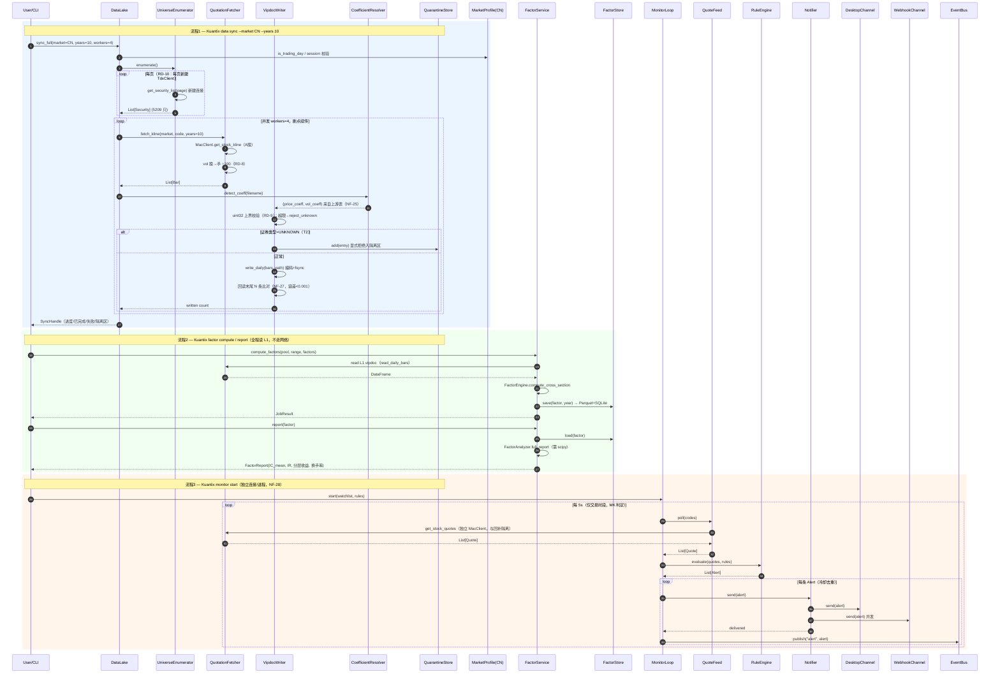
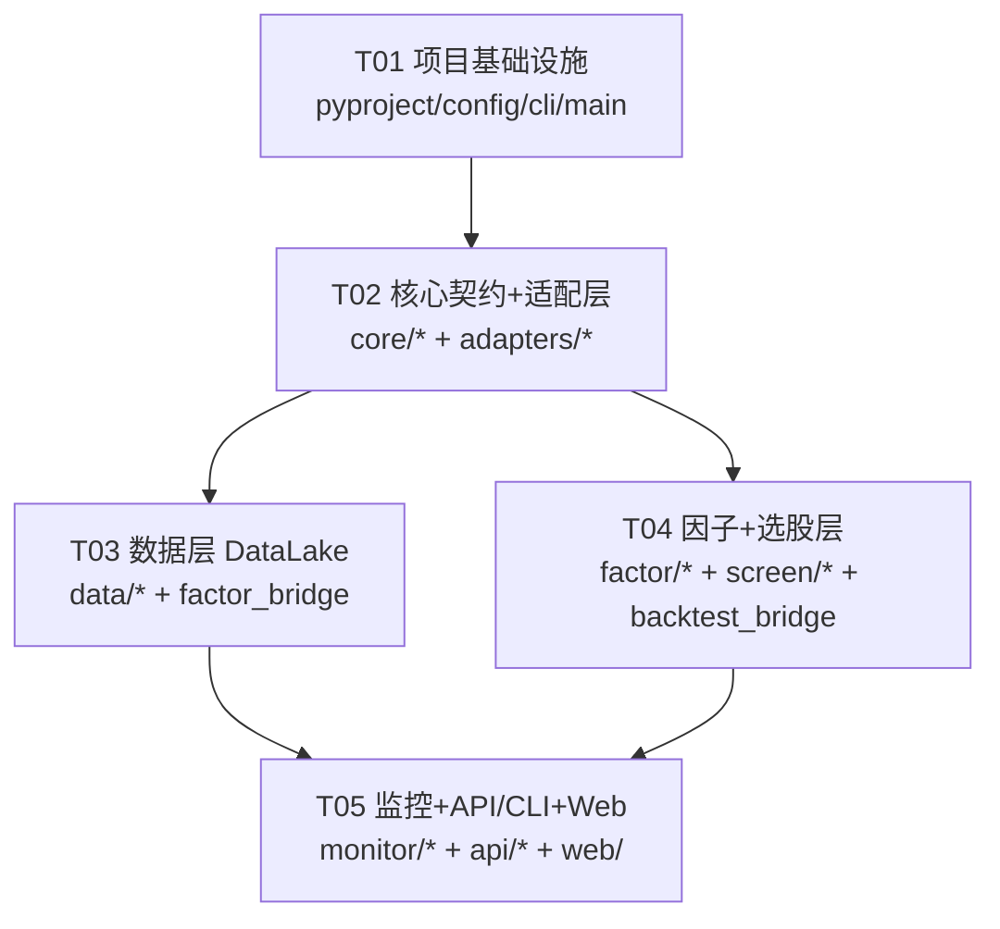

# Kuantix 系统设计与任务分解（Phase 2）

> 文档作者：高见远（software-architect）　时间：2026-08-01
> 上游依赖：`easy-tdx==1.20.3`（仅 `import` 复用，禁止改源码，NF-1）
> 需求基线：`docs/PRD.md` v2.2　技术门禁：`docs/015-技术验证报告.md`（S1–S5 全通过）
> 配套图：`docs/class-diagram.mermaid`、`docs/sequence-diagram.mermaid`

---

# Part A：系统设计

## 1. 实现方案（Implementation Approach）

### 1.1 难点与对策

| 难点 | 对策（已实测验证） |
|------|-------------------|
| **本机无离线行情**（Q3） | 用上游 `sync_daily_bars_from_security_bars` / `sync_ex_daily_bars` 把在线数据落成 **vipdoc 原生格式**至 `~/.Kuantix/vipdoc`；读取侧 `SignalScanner`/`read_daily_bars` 零改造可用（S3 实测闭环通过） |
| **系数静默错价（T1/T2，RD-1）** | 系数表从上游 `import` 引用（禁止复制，NF-25）；写入系数由"读侧判定逻辑"按文件名反推决定；`UNKNOWN` 按 NF-26 显式拒绝入隔离区（S3 步骤 5b 复现 ×0.10 错价） |
| **vol 单位 / uint32 溢出（RD-8 / RD-9）** | 写盘前 `vol ÷ 100`（股→手）；写入前做 **uint32 上界校验**，超限按 NF-26 报错进隔离区（000100 单日量已占上限 90.9%，余量仅 1.1×，S3 步骤 2b/10） |
| **枚举连接 15s 陷阱（RD-10）** | `UniverseEnumerator` 每页新建 `TdxClient` 连接（S2 A0：复用 15.36s vs 新连 0.03s） |
| **港美股独立链路（A1）** | `MacExClient(7727)` + `goods_kline`，与 A 股 `MacClient(7709)` 物理隔离；落盘 `ex_daily`（S4 实测 14 年深度可用） |
| **回补/监控资源争用（NF-28）** | 回补与监控用**独立连接/进程 + 错峰**；内置请求限速 + 退避重试（S2/S3 连续编排实测被服务端限流挂起，直接实证 NF-24/NF-28） |
| **跨模块耦合（NF-3）** | `data/factor/monitor/screen` 互不 import，跨模块只走 `core` 契约 + 事件总线 |
| **静默损坏（NF-26 总则）** | `core.fail_loud` 提供 `require_known/reject_unknown`；禁止 `dict.get(key, 默认)` 兜底与 `try/except: pass` |

### 1.2 框架与库选型

| 层 | 选型 | 理由 |
|----|------|------|
| Web 框架 | **FastAPI + Pydantic v2 + Uvicorn** | 跟随上游栈；自动 OpenAPI（NF-11） |
| 数据计算 | **pandas ≥2.0,<3**、**easy-tdx[science]**（scipy） | 上游强约束，S1 签名校验通过 |
| 存储 | **SQLite**（元数据/持仓/规则/告警/隔离区/选股结果）+ **Parquet**（因子值）+ **vipdoc 二进制**（L1 原始行情） | NF-15 零外部数据库 |
| 前端 | **Vue 3 + Vite + TypeScript + ECharts + Pinia + vue-router** | PRD 指定，跟随上游 `web-ui` 栈，不引入 React/MUI（NF-7/Q7） |
| CLI | **Typer/Click** | 子命令 + `--json` 双入口（NF-10） |
| 插件 | **自研 `PluginRegistry` + `register_plugin` 装饰器** | 6 类扩展点统一注册（NF-2） |
| 调度 | P0 用手动触发 + 后台任务；**APScheduler 留 P1** | 控制 P0 范围 |

### 1.3 架构模式

- **分层单向依赖**（NF-4）：`adapters → core → services → api`，下层不感知上层。
- **门面 + 适配（Adapter）**：所有 easy-tdx 调用收敛到 `Kuantix/adapters/`，上游升级只改此层。
- **插件化（Plugin）**：因子 / 预警判据 / 推送通道 / 选股过滤器 / 券商 CSV 模板 / 市场档案 六类走统一注册表。
- **事件驱动（EventBus）**：监控告警经 `core.eventbus` 分发，解耦规则引擎与推送。
- **资源隔离**：回补链路与监控链路物理分隔连接/进程（NF-28）。

---

## 2. 文件清单（File List）

```
Kuantix/
├── pyproject.toml                      # 依赖：easy-tdx==1.20.3[web,science], fastapi, typer, pandas<3
├── config.toml                         # 端口/轮询间隔/推送通道/数据路径/市场开关
└── Kuantix/
    ├── __init__.py                     # 版本号、包入口
    ├── config.py                       # 配置加载（toml + 环境变量覆盖）
    ├── cli.py                          # Typer CLI 根 + 子命令（--json）
    ├── main.py                         # Kuantix serve 入口（FastAPI + 监控循环）
    ├── core/                           # 领域模型 + 契约 + fail-loud + MarketProfile + 插件
    │   ├── __init__.py
    │   ├── envelope.py                 # Envelope / Meta（NF-9）
    │   ├── fail_loud.py                # require_known / reject_unknown（NF-26）
    │   ├── market.py                   # MarketProfile(ABC) + CN(全)/HK/US(占位) + 注册表
    │   ├── plugins.py                  # PluginRegistry + register_plugin 装饰器
    │   ├── eventbus.py                 # 进程内 EventBus
    │   └── contracts.py                # 跨模块数据契约（Bar/Security/Quote/Alert/ScreenResult…）
    ├── adapters/                       # 唯一触碰 easy_tdx 之处（NF-1）
    │   ├── __init__.py
    │   ├── tdx_client.py               # MacClient / MacExClient / TdxClient 工厂 + 连接池
    │   ├── coefficients.py             # import 上游 _SECURITY_COEFFICIENTS（NF-25，禁止复制）
    │   ├── quotation.py                # QuotationFetcher：A股/港美股路由 + vol÷100（RD-8）
    │   ├── universe.py                 # UniverseEnumerator：每页新连接枚举（RD-10）
    │   ├── vipdoc_writer.py            # VipdocWriter：系数/uint32/fsync/回读校验（RD-1/2/8/9/NF-27）
    │   ├── known_hosts.py              # 只读加载 ~/.easy_tdx/config.json known_hosts（NF-20）
    │   ├── factor_bridge.py            # FactorEngine / FactorAnalyzer 薄包装
    │   └── backtest_bridge.py          # Backtest/Rebalance/SignalScanner/Chanlun 薄包装
    ├── data/                           # DataLake（L1 行情湖）
    │   ├── __init__.py
    │   ├── datalake.py                 # DataLake 门面：sync_full/incremental/verify
    │   ├── sync_engine.py              # 进度/断点续传/后台/限速退避（NF-24）
    │   ├── verify.py                   # 完整性 + 缺失交易日 + 隔离区报告
    │   └── quarantine.py               # QuarantineStore（SQLite 持久化隔离区）
    ├── factor/                         # 因子模块（L2 因子库）
    │   ├── __init__.py
    │   ├── store.py                    # FactorStore：Parquet 分区 + SQLite 元数据
    │   ├── service.py                  # FactorService：compute/report/combine
    │   ├── combiner.py                 # FactorCombiner：等权/IC/IR 加权
    │   └── factors/                    # 自定义因子自动发现目录（注册到上游 FACTORY_REGISTRY）
    │       └── __init__.py
    ├── screen/                         # 选股模块
    │   ├── __init__.py
    │   ├── service.py                  # ScreenService：模型加载→打分→过滤→TopN→落盘
    │   └── filters.py                  # 技术/缠论条件过滤器
    ├── monitor/                        # 监控模块
    │   ├── __init__.py
    │   ├── loop.py                     # MonitorLoop：编排轮询→规则→推送
    │   ├── feed.py                     # QuoteFeed：批量轮询（仅交易时段）
    │   ├── position.py                 # PositionTracker：持仓盈亏
    │   ├── rules.py                    # RuleEngine + 判据插件
    │   ├── notifier.py                 # Notifier：多通道并发投递
    │   └── channels/                   # NotifyChannel 插件
    │       ├── desktop.py              # 桌面通知（P0）
    │       └── webhook.py              # 通用 Webhook（P0）
    └── api/                            # REST + CLI 出口
        ├── __init__.py
        ├── server.py                   # FastAPI 应用工厂（独立端口）
        ├── schemas.py                  # Pydantic v2 响应模型
        └── routers/
            ├── data.py                 # /api/v1/data  (sync/verify)
            ├── factor.py               # /api/v1/factor (compute/report/combine)
            ├── screen.py               # /api/v1/screen (run)
            └── monitor.py              # /api/v1/monitor (add/start/alerts)
└── web/                                # 独立 Vue3 应用（P0 三页面，仅消费 REST）
    ├── package.json
    ├── vite.config.ts
    ├── tsconfig.json
    └── src/
        ├── main.ts
        ├── App.vue
        ├── api/client.ts               # REST 客户端（统一 Envelope 解析）
        ├── router/index.ts
        ├── stores/                     # Pinia：data/factor/screen/monitor
        └── views/
            ├── Factors.vue             # 因子分析页
            ├── Monitor.vue             # 监控看板页
            └── Screen.vue              # 选股结果页
```

---

## 3. 数据结构与接口（classDiagram）

```mermaid
classDiagram
    %% ============ CORE 层 ============
    class Envelope {
        +int code
        +str message
        +Any data
        +Meta meta
    }
    class Meta {
        +datetime generated_at
        +str data_date
        +str market
        +int elapsed_ms
        +str version
    }
    class FailLoud {
        <<static>>
        +require_known(value, context)*T
        +reject_unknown(value, context)$void
    }
    class MarketProfile {
        <<abstract>>
        +str market
        +str currency
        +str timezone
        +float price_limit
        +float tick_size
        +int lot_size
        +int trading_days_per_year
        +is_trading_day(date) bool
        +session_now() Session
    }
    class CNMarketProfile {
        +is_trading_day(date) bool
    }
    class HKMarketProfile {
        +is_trading_day(date) bool
        +note P1：未实现显式抛错
    }
    class USMarketProfile {
        +is_trading_day(date) bool
        +note P1：未实现显式抛错
    }
    class PluginRegistry {
        +register(kind, cls)
        +resolve(kind, name) Type
        +all(kind) list
    }
    class EventBus {
        +subscribe(topic, cb)
        +publish(topic, event)
    }
    class Security {
        +str code
        +str exchange
        +str type
        +str name
    }

    Envelope *-- Meta
    MarketProfile <|-- CNMarketProfile
    MarketProfile <|-- HKMarketProfile
    MarketProfile <|-- USMarketProfile

    %% ============ ADAPTERS 层（唯一触碰 easy_tdx 之处）============
    class TdxClientFactory {
        +get_mac_client() MacClient
        +get_mac_ex_client() MacExClient
        +get_tdx_client() TdxClient
        -pool: dict
    }
    class UniverseEnumerator {
        +enumerate() list~Security~
        -note 每页新建 TdxClient（RD-10）
    }
    class QuotationFetcher {
        +fetch_kline(market, code, years) list~Bar~
        -note A股 MacClient / 港美股 MacExClient
        -note vol 股→手 ÷100（RD-8）
    }
    class CoefficientResolver {
        +detect_coeff(filename) tuple
        -note import 上游 _SECURITY_COEFFICIENTS（NF-25）
    }
    class VipdocWriter {
        +write_daily(bars, path) int
        +write_ex_daily(bars, path) int
        -note 系数按文件名判定（T1）
        -note vol÷100（RD-8）
        -note uint32 上界校验（RD-9）
        -note ex/min 自补 fsync+回读（RD-2/NF-27）
    }
    class Bar {
        +int date
        +float open
        +float high
        +float low
        +float close
        +int vol
        +float amount
    }

    TdxClientFactory ..> QuotationFetcher : creates
    CoefficientResolver ..> VipdocWriter : supplies coeff
    QuotationFetcher ..> Bar : returns
    VipdocWriter ..> Bar : consumes

    %% ============ DATA 层 ============
    class DataLake {
        +sync_full(market, years, workers) SyncHandle
        +sync_incremental() SyncHandle
        +verify() VerifyReport
    }
    class SyncEngine {
        +progress: Progress
        +resume(handle) void
        +run_background(handle) void
        -note 断点续传 + 限速退避（NF-24）
    }
    class QuarantineStore {
        +add(entry) void
        +list() list~QuarantineEntry~
        +remove(code) void
    }
    class QuarantineEntry {
        +str code
        +str reason
        +datetime occurred_at
        +datetime last_try
    }
    class VerifyReport {
        +dict coverage
        +list missing_days
        +list corrupt
        +list quarantined
    }

    DataLake --> UniverseEnumerator
    DataLake --> QuotationFetcher
    DataLake --> VipdocWriter
    DataLake --> SyncEngine
    DataLake --> QuarantineStore
    SyncEngine ..> QuarantineStore : on failure
    VerifyReport *-- QuarantineEntry

    %% ============ FACTOR 层 ============
    class FactorStore {
        +compute(pool, range, factors) void
        +save(factor, year) void
        +load(factor, date, code) DataFrame
        -note Parquet 分区 + SQLite 元数据
    }
    class FactorService {
        +compute_factors(req) JobResult
        +report(factor) FactorReport
        +combine(req) ModelHandle
    }
    class FactorCombiner {
        +combine(values, method) Series
        -note equal / ic / ir 加权
    }
    class ModelHandle {
        +str name
        +dict weights
    }

    FactorService --> FactorStore
    FactorService --> FactorCombiner
    FactorService ..> QuotationFetcher : read L1

    %% ============ SCREEN 层 ============
    class ScreenService {
        +run(req) list~ScreenResult~
    }
    class ScreenFilter {
        +tech_filter(df, cond) bool
        +chanlun_filter(df, cond) bool
    }
    class ScreenResult {
        +str code
        +str name
        +float score
        +dict sub_scores
        +str conditions
        +float price
    }

    ScreenService --> FactorStore
    ScreenService --> ScreenFilter
    ScreenService ..> QuotationFetcher : read L1

    %% ============ MONITOR 层 ============
    class QuoteFeed {
        +poll(codes) list~Quote~
        -note 仅交易时段（MarketProfile）
    }
    class PositionTracker {
        +add_position(p) void
        +pnl() dict
    }
    class RuleEngine {
        +evaluate(quote, rules) list~Alert~
        +register_criterion(cls) void
    }
    class Notifier {
        +send(alert) bool
        -channels: list~NotifyChannel~
    }
    class NotifyChannel {
        <<abstract plugin>>
        +send(alert) bool
    }
    class DesktopChannel {
        +send(alert) bool
    }
    class WebhookChannel {
        +send(alert) bool
    }
    class Alert {
        +str id
        +str code
        +str rule
        +str level
        +str message
        +datetime ts
    }
    class Quote {
        +str code
        +float last
        +float change_pct
    }

    Notifier *-- NotifyChannel
    NotifyChannel <|-- DesktopChannel
    NotifyChannel <|-- WebhookChannel
    RuleEngine ..> Alert : produces
    Notifier ..> Alert : consumes
    QuoteFeed ..> Quote : returns

    %% ============ API 层 ============
    class APIServer {
        +create_app() FastAPI
    }
    class CLIRunner {
        +invoke(args) Envelope
        -note --json 双入口（NF-10）
    }

    APIServer ..> DataLake : routes
    APIServer ..> FactorService : routes
    APIServer ..> ScreenService : routes
    APIServer ..> MonitorLoop : routes
    CLIRunner ..> DataLake
    CLIRunner ..> FactorService
    CLIRunner ..> ScreenService
    CLIRunner ..> MonitorLoop

    %% ============ 跨层契约 ============
    MarketProfile <.. DataLake : 取规则
    MarketProfile <.. QuoteFeed : 取时段
    FailLoud <.. VipdocWriter : 拒绝 UNKNOWN
    FailLoud <.. RuleEngine : 拒绝缺失
    PluginRegistry <.. Notifier : 插件发现
    PluginRegistry <.. RuleEngine : 判据插件
```



---

## 4. 程序调用流程（sequenceDiagram）



---

## 5. 尚不明确 / 假设（Anything UNCLEAR）

| # | 事项 | 处理 |
|---|------|------|
| U1 | **N3 券商 CSV 模板具体券商**：P1「下单清单导出器」需用户实际券商字段/编码 | P0 不受影响；P1 前由用户确认，默认通用模板 + 同花顺 |
| U2 | **N5 汇率来源**：多市场汇总需 CNY/HKD/USD 汇率 | P0 仅 A 股单一货币，无汇率需求；P1 前确认，缺失时按币种分别汇总不强行折算（NF-6） |
| U3 | **HK/US MarketProfile**：PRD 要求接口先行、P1 实现 | P0 提供 `HKMarketProfile`/`USMarketProfile` 占位类，**未实现方法显式抛 `NotImplementedError`**（NF-7），不静默降级 |
| U4 | **分钟线数据湖 / 复权财务**：P1 | P0 仅 A 股日线 L1；接口预留 |
| U5 | **因子衰减/偏离度/拥挤度（I-1/I-2/I-5）**：P1 | 依赖 P0 基础设施（FactorStore + 调度），P1 补齐 |
| U6 | **Scheduler（APScheduler）**：P1 | P0 用手动触发 + 后台运行满足基础；盘前/盘后定时为 P1 |
| U7 | **极端高换手大盘股 uint32 余量**：000100 余量 1.1× | P0 写入前上界校验 + 拒绝进隔离区（RD-9）；若未来出现溢出，评估 float32/更大整型（不改上游编码） |

---

# Part B：任务分解（Task Decomposition）

## 6. 依赖包（Required Packages）

```
# pyproject.toml（Python >=3.10）
easy-tdx==1.20.3          # 上游基座（web 提供 fastapi/uvicorn，science 提供 scipy）
pandas>=2.0,<3            # 上游硬约束，禁止 3.x
fastapi>=0.110            # REST（跟随上游 web 栈）
uvicorn>=0.29             # ASGI 服务器
pydantic>=2.6            # v2 模型 + JSON Schema（NF-9/NF-11）
typer>=0.12              # CLI 根 + 子命令（NF-10）
pyarrow>=15              # Parquet 因子库（L2）
scipy>=1.11              # FactorAnalyzer 必需（science）
tomli>=2.0               # config.toml 读取（Python<3.11 兼容）
# 前端（web/）：vue@^3.4, vite@^5, typescript@^5, echarts@^5, pinia@^2, vue-router@^4
```

---

## 7. 任务清单（Task List，按依赖排序，≤5 个）

> 规则：T01 必为「项目基础设施」；每任务 ≥3 文件；按层/模块分组；尽量仅依赖 T01/T02。

### T01 — 项目基础设施（P0，无前置依赖）
- **文件**：`pyproject.toml`、`config.toml`、`Kuantix/__init__.py`、`Kuantix/config.py`、`Kuantix/cli.py`、`Kuantix/main.py`
- **依赖**：无
- **优先级**：P0
- **内容**：依赖声明（锁定 easy-tdx==1.20.3、pandas<3）、`config.toml` 模板（端口/轮询间隔/数据路径/市场开关）、配置加载（toml + 环境变量覆盖，NF-16/NF-20）、CLI 根骨架（`Kuantix` 入口 + `--json`）、`Kuantix serve` 启动骨架。
- **验收**：`pip install -e .` 成功；`Kuantix --help` 显示子命令骨架；`Kuantix serve` 能起空 FastAPI。

### T02 — 核心契约层 + 适配层（P0，依赖 T01）
- **文件**：`core/envelope.py`、`core/fail_loud.py`、`core/market.py`、`core/plugins.py`、`core/eventbus.py`、`core/contracts.py`、`adapters/tdx_client.py`、`adapters/coefficients.py`、`adapters/quotation.py`、`adapters/universe.py`、`adapters/vipdoc_writer.py`、`adapters/known_hosts.py`
- **依赖**：T01
- **优先级**：P0
- **内容**：统一 JSON 信封（NF-9）、`require_known/reject_unknown`（NF-26）、`MarketProfile` + CN 全实现 / HK/US 占位抛错（NF-5/7）、`PluginRegistry` + 装饰器（NF-2）、EventBus、跨模块契约；适配层封装 easy-tdx（NF-1）：客户端工厂（每进程单例、显式 host/port、禁 `from_best_host`）、**系数 import 引用（NF-25）**、**QuotationFetcher（A股/港美股路由 + vol÷100，RD-8）**、**UniverseEnumerator（每页新连接，RD-10）**、**VipdocWriter（系数判定 + uint32 上界 + ex/min 自补 fsync + 回读校验，RD-1/2/8/9/NF-27）**、只读 known_hosts（NF-20）。
- **验收**：单测——① 系数 import 引用无副本；② `UNKNOWN` 类型写入被拒入隔离区；③ vol÷100 后编码不溢出；④ 枚举每页新连接耗时 <1s/页；⑤ 写→回读数值一致（覆盖 A股/ETF/指数/债券 ≥4 类，NF-25）。

### T03 — 数据层 DataLake（P0，依赖 T02）
- **文件**：`data/datalake.py`、`data/sync_engine.py`、`data/verify.py`、`data/quarantine.py`、`adapters/factor_bridge.py`（注：因子桥接随数据读 L1 需求一并落地）
- **依赖**：T02
- **优先级**：P0
- **内容**：`DataLake` 门面（sync_full / sync_incremental / verify）；`SyncEngine`（并发 workers、断点续传、进度回调、后台运行、限速退避，NF-24）；`QuarantineStore`（SQLite 持久化隔离区，NF-27）；`verify` 完整性 + 缺失交易日 + 隔离区报告。
- **验收**：`Kuantix data sync --market CN --years 10` 落盘 `~/.Kuantix/vipdoc/`，Ctrl+C 后重跑断点续传；`Kuantix data verify --json` 输出合法信封 + 隔离区清单；后台运行不阻塞 CLI。

### T04 — 因子 + 选股层（P0，依赖 T02）
- **文件**：`factor/store.py`、`factor/service.py`、`factor/combiner.py`、`factor/factors/__init__.py`、`screen/service.py`、`screen/filters.py`、`adapters/backtest_bridge.py`
- **依赖**：T02（可并行于 T03，共享 adapter 接口；L1 读取经 `adapters.quotation`）
- **优先级**：P0
- **内容**：`FactorStore`（Parquet 分区 + SQLite 元数据、增量、按 `(因子,日期,代码)` 读）；`FactorService`（compute 读 L1 经 FactorEngine / report 经 FactorAnalyzer / combine 等权·IC·IR）；`FactorCombiner`；自定义因子自动发现目录；`ScreenService`（加载模型→全市场打分→技术/缠论过滤→TopN→落盘 SQLite+JSON/CSV）；`ScreenFilter`；`backtest_bridge`（Backtest/Rebalance/SignalScanner/Chanlun/StrengthRanker 薄包装）。
- **验收**：`Kuantix factor compute` 全程读本地（不走网络）；`Kuantix factor report --json` 含 IC/IR/分层；`Kuantix factor combine --save-model`；`Kuantix screen run --json` 输出排序清单；自定义因子放 `factors/` 后被 `list` 发现。

### T05 — 监控 + API/CLI + Web 三页（P0，依赖 T02/T03/T04）
- **文件**：`monitor/loop.py`、`monitor/feed.py`、`monitor/position.py`、`monitor/rules.py`、`monitor/notifier.py`、`monitor/channels/desktop.py`、`monitor/channels/webhook.py`、`api/server.py`、`api/schemas.py`、`api/routers/data.py`、`api/routers/factor.py`、`api/routers/screen.py`、`api/routers/monitor.py`、`web/`（Vue3 三页面 + client + router + stores）
- **依赖**：T02、T03、T04
- **优先级**：P0
- **内容**：`MonitorLoop`（轮询→规则→推送编排，独立连接/进程，错峰，NF-28）；`QuoteFeed`（仅交易时段批量轮询）；`PositionTracker`；`RuleEngine`+判据插件（价格/指标/止损）；`Notifier`+`NotifyChannel` 插件（桌面 + Webhook，P0）；REST 应用工厂（独立端口、OpenAPI、四路由）+ Pydantic 响应模型；CLI 子命令补全；独立 Vue3 应用三页面（因子/监控/选股，仅消费 REST）。
- **验收**：`Kuantix monitor start` 触发规则→桌面通知 + Webhook 回调 + 告警落库；`Kuantix serve` 起三页面 + OpenAPI；顶栏市场切换器 A 股可用/港美股置灰；各页 `[导出JSON]` 可用；NF-21 全库无下单接口、NF-25 无系数副本、业务代码无硬编码 A 股常量（静态检查）。

---

## 8. 共享知识（Shared Knowledge，给 Engineer）

- **统一响应契约（NF-9）**：所有 CLI/REST 返回 `{code, message, data, meta}`；`meta` 含 `generated_at/data_date/market/elapsed_ms/version`；`market` 贯穿全链路（NF-6）。
- **数值安全（NF-12）**：JSON 禁止 `NaN/Infinity`，序列化为 `null`；浮点保留 6 位。
- **fail-loud（NF-26）**：一切不确定（UNKNOWN 类型/市场未实现/系数缺失/因子列缺失/插件加载失败/配置缺省/数据异常）一律显式报错+跳过+记隔离区；**禁止 `dict.get(k, 默认)` 与 `try/except: pass` 兜底**。
- **系数红线（NF-25）**：写入 L1 的价格/量系数必须与上游读侧 `_SECURITY_COEFFICIENTS` 判定一致；**从上游 `import` 引用，禁止复制**。代码库不得存在系数表副本（CI 静态检查）。
- **写盘前置（RD-8/9/2/NF-27）**：`vol÷100`（股→手）；`uint32` 上界校验；ex/min 自补 `fsync`；每标的写后回读末尾 N 条比对（价格容差 <0.001），不一致进隔离区。
- **枚举（RD-10）**：`get_security_list` 每页新建 `TdxClient` 连接，禁止复用。
- **连接隔离（NF-28）**：回补与监控用独立连接/进程 + 错峰（交易时段禁全量回补）。
- **上游只读（NF-1）**：仅 `import` easy-tdx；所有调用收敛 `adapters/`；禁 `from_best_host`/写 `~/.easy_tdx`。
- **市场抽象（NF-5）**：交易日历/涨跌幅/货币/时区/每手/复权口径一律经 `MarketProfile`；业务代码禁硬编码 A 股常量。
- **L1 存原始未复权（RD-5）**：复权在 L2 派生，避免历史数据被反复重写破坏增量/断点。
- **存储布局（NF-15/18）**：`~/.Kuantix/{vipdoc,factors,db,logs,reports,exports}/`；与 `~/.easy_tdx/` 完全隔离。

---

## 9. 任务依赖图（Task Dependency Graph）


