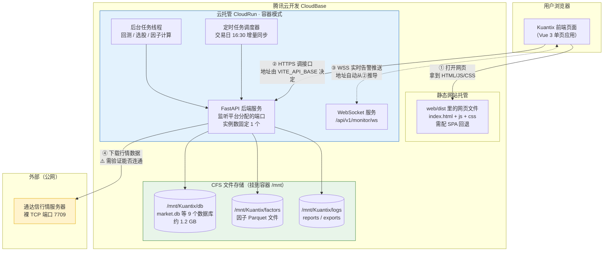
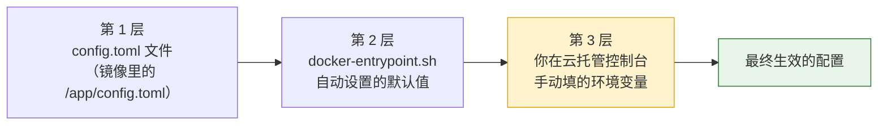
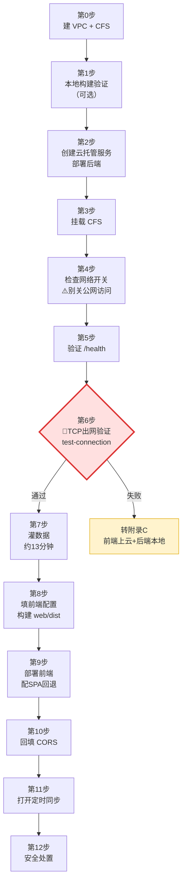
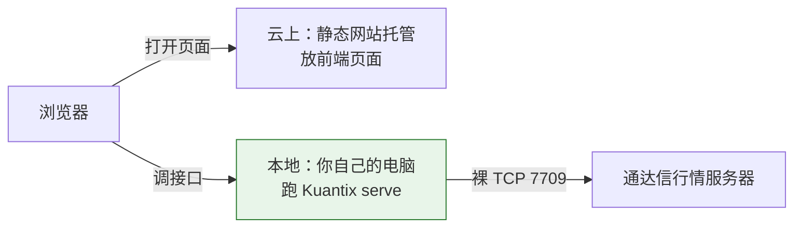

# Kuantix 部署交付文档

> **本文档写给谁**：没有服务器运维经验、没写过 Dockerfile、第一次接触腾讯云开发的普通用户。
> **读完能做到什么**：把 Kuantix 完整部署到腾讯云开发（CloudBase），拿到一个可以在浏览器打开的网址，并且数据在服务重启后不会丢。
> **预计耗时**：顺利的话 2～3 小时，其中约 15 分钟是等数据下载。
> **文档版本**：v1.0　|　对应项目版本：Kuantix 0.1.0

---

## 阅读前须知

### 本文档的三个约定

1. **每一步都会告诉你「在哪里操作」**。只有两种地方：
   - 🖥️ **本地终端** —— 你自己电脑上的命令行窗口（Mac 叫「终端 / Terminal」，Windows 叫「PowerShell」）
   - ☁️ **腾讯云控制台** —— 浏览器里打开的 https://console.cloud.tencent.com 或 https://tcb.cloud.tencent.com 页面

2. **每一步都有「预期结果」和「怎么验证」**。做完一步先对照验证，通过了再做下一步。中途出错不要硬着头皮往下走，直接跳到第六章查。

3. **凡是需要你替换的内容，都写成 `<尖括号>` 形式**。比如 `<你的后端域名>`，你要把整个尖括号连同里面的字一起换掉。除此之外的命令都可以原样复制粘贴。

### 名词速查（后面会反复出现）

| 名词 | 一句话解释 |
|---|---|
| **容器 / 镜像** | 把「程序 + 它需要的全部运行环境」打包成的一个压缩包。镜像是这个包本身，容器是这个包跑起来之后的样子。好处是「在你电脑上能跑，在云上就一定能跑」 |
| **Dockerfile** | 一份「怎么打包」的说明书，告诉打包工具装哪个版本的 Python、装哪些依赖、启动时执行什么命令。本文档已经帮你写好了 |
| **云托管 / CloudRun** | 腾讯云开发里专门跑容器的服务。你把镜像交给它，它负责开机、分配网址、出故障自动重启 |
| **静态网站托管** | 腾讯云开发里专门放网页文件（HTML/CSS/JS）的地方，相当于一个网盘 + 网址 |
| **CFS 文件存储** | 一块独立于容器的云硬盘，可以「挂」到容器里的某个目录。容器销毁了，这块盘上的数据还在 |
| **VPC 私有网络** | 云上的一个虚拟局域网。挂 CFS 需要容器和 CFS 在同一个局域网里，才能互相找到 |
| **环境变量** | 在程序启动前塞给它的一组「名字=值」的设置项。改设置不用改代码，改完重启即可生效 |
| **CORS（跨域许可）** | 浏览器的一条安全规则。默认情况下，A 网址的页面不许调用 B 网址的接口。所以后端必须明确声明「我允许 A 这个网址来调我」，这个声明就叫 CORS 配置 |
| **WebSocket（WS）** | 一种「保持连线」的通信方式。普通接口是你问一句它答一句，WebSocket 是接通之后服务器可以随时主动推消息给你。本项目的实时告警用它 |
| **SPA 回退** | 单页应用（SPA）的所有页面其实只有一个 HTML 文件。用户直接访问 `/backtest` 时服务器上根本没有这个文件，必须配置成「找不到就返回 index.html」，否则会 404 |
| **实例** | 容器跑起来的一份副本。1 个实例 = 1 个正在运行的程序进程 |

---

# 一、项目概述

## 1.1 Kuantix 是什么

Kuantix 是一个**个人用的 A 股量化研究工作台**。你可以用它做四件事：

| 能力 | 说明 |
|---|---|
| **数据管理** | 从通达信公开行情服务器下载 A 股历史日线，存到本地数据库，供后续分析使用 |
| **因子研究** | 计算量化因子（衡量股票某种特征的指标），做分层回测、IC/IR 有效性评估、多因子合成 |
| **策略回测** | 用历史数据检验交易策略的表现，支持单策略、多策略组合、参数网格寻优 |
| **选股与监控** | 按条件批量筛选股票；盘中实时轮询自选股报价，触发规则后告警推送 |

### 一个对新手最重要的好消息

**本项目不需要任何 API 密钥、Token 或数据服务账号。**

行情数据来自通达信（TDX）的公开行情服务器，通过一组公开 IP 地址直接连接，不需要注册、不需要申请 key、不需要付费订阅。已经确认全项目没有 Tushare / AkShare / Wind / 聚宽 的任何痕迹。

所以你**不用**去任何网站注册数据账号，这一环可以直接跳过。

### 一个必须提前知道的坏消息

**数据源用的是「裸 TCP」协议，不是普通网页那种 HTTPS 协议。**

通俗解释：普通网站访问走的是 443 端口（HTTPS）或 80 端口（HTTP），这两个口全世界的网络环境都放行。但通达信行情服务器用的是 **7709 端口**，走的是原始 TCP 连接。有些云环境出于安全考虑会限制访问非标准端口。

这意味着：**部署到云上之后，容器能不能连通行情服务器，需要实测才知道。** 我们在第四章第 6 步专门设了一个验证关卡，一旦这里不通，就不要继续往下做了，直接转用附录 C 的备选方案。

---

## 1.2 整体架构图



### 图怎么读

- **①** 用户在浏览器输入网址，静态网站托管把网页文件发过去，页面显示出来。
- **②** 页面上的所有操作（查数据、跑回测、看结果）都变成 HTTPS 请求发给后端。前端怎么知道后端地址？靠构建时写死的 `VITE_API_BASE` 变量 —— **这就是为什么必须先部署后端、拿到域名，再构建前端**。
- **③** 实时监控页面会额外建立一条 WebSocket 长连接。它的地址不用你配，前端会自动把 ② 里的 `https://` 换成 `wss://` 推导出来。
- **④** 后端定时或按需去通达信服务器拉行情数据，写进 CFS 上的数据库。这条线是唯一的外部依赖，也是最需要验证的一条。
- **绿色区域**是关键：所有值钱的东西（历史行情、你保存的策略、自选股、持仓记录、回测结果）都在 CFS 上。容器可以随便重启重建，CFS 上的数据不受影响。

---

## 1.3 前后端职责划分

| 维度 | 后端（Python / FastAPI） | 前端（Vue 3） |
|---|---|---|
| **数据获取** | 独占。所有连接行情服务器、下载、落盘的动作都在后端 | 完全不直连数据源，只调后端接口 |
| **计算** | 因子计算、回测、参数寻优、选股筛选、监控规则判定 | 只做展示层计算：把后端返回的指标映射成 A/B/C 评级、渲染图表 |
| **状态存储** | 数据库文件持久化 + 进程内存（任务线程、连接池） | 浏览器内存，刷新页面就清空 |
| **长任务** | 提交后立刻返回一个任务号（job_id），真正的计算在后台线程跑 | 拿到 job_id 后每隔几秒查一次进度 |
| **实时推送** | WebSocket 主动推送告警 | 订阅并显示 |
| **接口约定** | 所有响应统一包成 `{code, message, data, meta}` 四段式信封 | 统一解析，`code` 不等于 0 就弹错误提示 |

**结论**：前后端边界非常干净，前端没有任何业务逻辑下沉，也不直连数据源。所以可以放心地把两者**分开部署**到不同的服务上。

---

## 1.4 部署方案总览（以及为什么这么选）

| 部分 | 部署到哪 | 为什么这么选 |
|---|---|---|
| **后端** | 云托管 CloudRun **容器模式** | 见下方「为什么不能用云函数」 |
| **前端** | 静态网站托管 | 就是一堆静态网页文件，用最便宜最简单的方式放着即可 |
| **数据** | CFS 文件存储，挂到容器 `/mnt` | 容器本地磁盘重启就清空，1.2 GB 数据重新下载要 13 分钟，用户保存的策略更是丢了就没了 |

### 为什么不能用云函数（这是很多人的第一反应）

| 判断项 | 实际情况 | 云函数 | 云托管容器 |
|---|---|---|---|
| 依赖体积 | 光 Python 依赖就 **397 MB**（pyarrow 126MB + scipy 99MB + pandas 70MB + numpy 28MB） | ❌ 远超函数包体积上限 | ✅ 镜像装得下 |
| 定时任务 | 需要一个常驻的调度器进程 | ❌ 函数跑完就退出，没有常驻进程 | ✅ 进程一直在 |
| WebSocket | 实时告警需要保持长连接 | ❌ 函数模型不支持 | ✅ 官方支持 |
| 常驻监控循环 | 盘中每 5 秒轮询一次报价 | ❌ | ✅ |
| 超长任务 | 全量下载数据约 13 分钟，参数寻优更久 | ❌ 超过函数执行时长上限 | ✅ |
| 本地数据文件 | 1.2 GB 的 SQLite 数据库 | ❌ | ✅ 配合 CFS 可持久化 |

**六项否决云函数。所以只能用容器模式，这一点没有讨论余地。**

---

## 1.5 ⚠️ 部署前必须知道的六件事（诚实清单）

这一节把所有「事后才发现会很崩溃」的事情提前讲清楚。请务必读完再动手。

### 🔴 第 1 件：实例数必须锁死为 1，绝对不能调大

这是**硬约束**，不是性能建议。

**说人话的原因**：这个程序把很多东西记在「自己的记忆里」，而不是写在共享的数据库里。如果你开 2 个实例，就相当于有两个互相不认识的店员在同时干活：

- 你在 A 实例提交了一个回测任务，任务号记在 A 的记忆里。前端下一次查进度时请求被分给了 B，B 说「没有这个任务」→ **你的回测永远查不到结果，进度条卡死**
- 两个实例各自都有一个定时器，每天 16:30 各跑一遍数据同步 → **重复下载，互相抢写同一个数据库文件，数据可能损坏**
- 你的浏览器 WebSocket 连在 A 上，但告警是 B 产生的 → **告警永远收不到**
- 两个实例同时往同一个数据库文件写入 → **数据分叉、内容错乱**

**具体做法**：创建服务时把「最小实例数」和「最大实例数」**都设为 1**。以后任何时候看到「扩容」「提升并发」之类的建议，对这个项目都不适用。

### 🔴 第 2 件：必须挂载 CFS，否则数据一重启就没

云托管的容器本地磁盘是**临时的**。容器每次重启、每次重新部署、每次平台维护，本地磁盘上的东西全部归零。

而 Kuantix 的全部身家都在磁盘文件里：
- `market.db` —— 1.2 GB，1341 万行日线数据，重新下载要约 13 分钟
- 另外 8 个数据库 —— 你保存的策略、自选股、持仓、监控规则、回测结果。**这些丢了就是真丢了，没有任何办法找回**

所以第四章第 0 步和第 3 步是关于 CFS 的，请不要跳过。

如果你实在不想额外开通 CFS，请看**附录 B** 的两个降级方案，但要清楚代价。

### 🟡 第 3 件：桌面通知在云上一定用不了

项目里的「桌面通知」功能是用 macOS 专属命令实现的。放到 Linux 容器里必然失效。

**表现**：监控页面的「通知渠道」里会显示 desktop 渠道不可用。这是**优雅降级**，不会导致程序崩溃。

**替代方案**：配置 `Kuantix__MONITOR__WEBHOOK_URL` 环境变量，把告警推到企业微信 / 钉钉 / 飞书的机器人地址上。配置方法见 3.3 节。

### 🟡 第 4 件：服务启动比较慢，重新部署会有几分钟不可用

依赖有 397 MB，容器冷启动要加载这么多东西，再加上建立数据库连接，启动时间是**分钟级**的。

因为我们把最小实例数设成了 1，正常运行时不会缩容到 0，所以**日常使用不会遇到冷启动**。但是**每次重新部署新版本，都会经历一次几分钟的启动过程**，这期间服务不可用。建议选在非交易时段更新。

### 🟡 第 5 件：首次灌数据要等约 13 分钟，而且不会自动开始

- 全市场 A 股约 5209 只，单只 10 年日线拉取实测 0.147 秒，理论总耗时约 **13 分钟**（并发能压缩，但有防限流的最小请求间隔，不会快太多）
- 程序有「空数据库守卫」：**数据库为空时，任何定时触发都不会自动全量下载**。这是防止空机首次启动引发全市场网络风暴的保护机制
- 所以**首次部署完成后，页面会一直是空的，而且不会自己好**。你必须手动触发一次全量同步，见第四章第 7 步

### 🟡 第 6 件：这套系统目前没有任何登录鉴权

代码里没有登录、没有密码、没有 Token 校验。这在「本地单机工具」的定位下完全合理，但一旦挂到公网，**任何知道你域名的人都能直接操作它**。

风险和处理办法见第四章第 12 步和**附录 D**。请务必读一下，不要在不知情的情况下把无鉴权服务挂到公网。

---

# 二、环境准备

## 2.1 账号准备

| 项目 | 说明 | 从哪里办 |
|---|---|---|
| **腾讯云账号** | 需完成**实名认证**（个人认证即可） | https://cloud.tencent.com 注册 |
| **云开发环境** | 一个 CloudBase 环境，**建议选「按量计费」** | https://tcb.cloud.tencent.com → 「创建环境」 |
| **账户余额** | 云托管、CFS、流量都按量计费，账户不能欠费 | 控制台右上角「费用中心」 |

### 关于地域的重要提醒

创建云开发环境时会让你选**地域**（比如「上海」「广州」「北京」）。

⚠️ **请记住你选的地域，后面创建 VPC 私有网络和 CFS 文件存储时，必须选完全相同的地域**，否则挂载不上。这是最常见的踩坑点之一。

建议：如果你在中国大陆，选一个离你近的即可，比如上海或广州。**选定后就不要改了**。

## 2.2 本地电脑需要的软件

| 软件 | 版本要求 | 用途 | 是否必需 | 检查命令（在本地终端执行） |
|---|---|---|---|---|
| **Node.js** | **>= 18** | 构建前端网页文件 | ✅ 必需 | `node -v` |
| **npm** | 随 Node.js 自带 | 安装前端依赖 | ✅ 必需 | `npm -v` |
| **Docker Desktop** | 任意较新版本 | 本地预先验证镜像能否构建 | ⭕ 可选但强烈建议 | `docker --version` |
| **curl** | 系统自带 | 命令行测试接口 | ⭕ 可选 | `curl --version` |

### 怎么检查

🖥️ **在本地终端执行**：

```bash
node -v
npm -v
docker --version
```

**预期结果**：

```
v20.11.0          <- 只要第一个数字 >= 18 就行
10.2.4
Docker version 28.1.1, build 4eba377327
```

**如果 `node -v` 显示版本低于 18 或者提示「command not found」**：去 https://nodejs.org 下载 LTS 版本安装，装完**关掉终端重新开一个**再检查。

**如果没装 Docker**：可以跳过，第四章第 1 步的本地验证会变成「直接让云平台构建」。但建议装上，本地验证能提前发现问题，比在云上反复试快得多。

## 2.3 腾讯云侧要开通的资源清单

按顺序开通，后面的依赖前面的：

| 顺序 | 资源 | 规格建议 | 在哪开通 | 说明 |
|---|---|---|---|---|
| 1 | **云开发环境** | 按量计费 | https://tcb.cloud.tencent.com | 记住地域 |
| 2 | **VPC 私有网络 + 子网** | 默认配置即可 | 控制台 → 私有网络 | **必须与云开发环境同地域** |
| 3 | **CFS 文件存储** | 通用标准型，容量按需（建议起步 ≥ 10 GB） | 控制台 → 文件存储 | **必须与上面的 VPC 在同一子网** |
| 4 | **云托管服务** | 2核4G，实例数固定 1 | 云开发控制台 → 云托管 | 放后端 |
| 5 | **静态网站托管** | 随环境自带 | 云开发控制台 → 静态网站托管 | 放前端 |

## 2.4 💰 费用提示（重要）

这套部署方案有**两处持续产生费用**的地方，请提前有心理准备：

### 会持续计费的部分

| 项目 | 为什么会持续计费 | 能不能省 |
|---|---|---|
| **云托管实例** | 我们设了最小实例数 = 1，意味着**实例常驻不会缩容到 0**，24 小时都在计费 | ❌ 不能。缩容到 0 会杀死定时任务和运行中的回测，这个项目不允许 |
| **CFS 文件存储** | 按已购容量（或实际用量，看你选的类型）持续计费，与用不用无关 | ⭕ 可以选小容量起步，不够再扩 |
| **公网出流量** | 下载行情数据、页面访问都会产生流量费 | ⭕ 量不大 |

### 关于具体价格

**本文档不提供具体价格数字**，因为云服务价格会调整，写死在文档里反而会误导你。

请自行到以下位置查看**当前实时价格**：
- 云托管：云开发控制台 → 云托管 → 页面上的「计费说明」链接
- CFS：https://buy.cloud.tencent.com/price/cfs
- 或者在创建资源时，页面右侧/底部通常会实时显示「预估费用」

### 强烈建议：设置费用告警

☁️ **在腾讯云控制台操作**：

1. 打开「费用中心」→「费用告警」
2. 新建一个告警规则，设一个你能接受的月度金额（比如 50 元）
3. 填上你的手机号和邮箱

这样超支时会收到通知，不会月底才发现。

## 2.5 环境自检清单

动手前请逐项打勾：

- [ ] 腾讯云账号已实名认证
- [ ] 云开发环境已创建，我记下了地域是：`________`
- [ ] 账户余额充足，已设置费用告警
- [ ] 本地 `node -v` 显示 >= 18
- [ ] 已下载 Kuantix 项目源码到本地，我记下了路径是：`________`
- [ ] 我已经读完 1.5 节的六件事，特别是「实例数必须为 1」和「必须挂 CFS」

---

# 三、配置说明

## 3.1 配置系统是怎么工作的

Kuantix 的配置分**三层**，后面的会覆盖前面的：



**你需要动手的只有第 3 层**。第 1 层是项目自带的，第 2 层是本次交付的启动脚本自动处理的。

## 3.2 🔴 红线警告：环境变量名写错一个字母，服务就起不来

这是本项目**最容易让新手崩溃**的一个设计，必须单独拿出来讲。

### 规则一：格式必须**恰好两段**

环境变量名的格式是固定的：

```
Kuantix__<分节名>__<键名>
        ↑↑      ↑↑
      两个下划线  两个下划线
```

| 写法 | 结果 |
|---|---|
| `Kuantix__SERVER__PORT` | ✅ 合法（SERVER 是分节，PORT 是键） |
| `Kuantix__PATHS__ROOT` | ✅ 合法 |
| `Kuantix__SERVER_PORT` | ❌ 报错（中间只有一个下划线，不是两段） |
| `Kuantix__A__B__C` | ❌ 报错（三段） |
| `PORT` | ❌ 不会被识别（没有 Kuantix__ 前缀，程序根本不看它） |

### 规则二：分节名和键名**必须真实存在**

这条是关键。程序采用一种叫 **fail-loud（大声失败）** 的设计哲学：**宁可启动崩溃，也不静默忽略错误配置**。

所以如果你把变量名拼错了，比如写成 `Kuantix__PATH__DB`（应该是 `PATHS` 复数），结果**不是「这个设置没生效」，而是「整个服务启动失败」**，日志里会打印：

```
[fail-loud/NF-26] 环境变量 Kuantix__PATH__DB 指向不存在的配置分节 [path]
（/app/config.toml 中可用分节：['app', 'factor', 'markets', 'monitor', 'paths', 'screen', 'server', 'storage', 'sync', 'tdx']）
```

**好消息**：报错信息里会直接列出所有可用的分节名/键名，照着改就行。
**坏消息**：如果你不看日志，只会看到「服务启动失败」四个字，一头雾水。

### 规则三：列表用**英文逗号**分隔

比如允许两个前端域名访问：

```
Kuantix__SERVER__CORS_ORIGINS=https://a.tcloudbaseapp.com,https://b.example.com
```

注意是英文逗号 `,`，不是中文逗号 `，`，中间**不要加空格**。

### 规则四（最容易漏）：7 个路径变量一个都不能少

`[paths]` 分节下有 7 个路径键，它们在代码里是**逐个独立解析**的，**没有「从 root 自动派生」的逻辑**。

也就是说，只设 `Kuantix__PATHS__ROOT=/mnt/Kuantix` 是**无效的** —— 另外 6 个仍然会指向 `~/.Kuantix/*`（在容器里就是 `/root/.Kuantix/*`，属于临时磁盘，重启即丢）。

**本次交付的 `docker-entrypoint.sh` 已经帮你把 7 个全部设好了**，所以你在控制台其实不用填这 7 个。但你必须知道有这回事，万一以后要改数据目录，记得 7 个一起改。

## 3.3 后端环境变量完整清单

### A. 你需要在云托管控制台手动填的（只有 2 个）

| 变量名 | 含义（说人话） | 示例值 | 是否必填 | 从哪儿获取 |
|---|---|---|---|---|
| `Kuantix__SERVER__CORS_ORIGINS` | 跨域许可名单。告诉后端「允许哪个网址的页面来调用我」。不填的话前端页面会报「跨域错误」，所有数据加载失败 | `https://Kuantix-1a2b3c.tcloudbaseapp.com` | ✅ 必填 | 第四章第 9 步部署完前端后，从静态网站托管页面复制默认域名 |
| `Kuantix__SYNC__SCHEDULE_ENABLED` | 是否开启每天 16:30 的自动数据同步。**首次部署时填 `false`**，等数据灌完验证通过再改成 `true` | 首次：`false`<br/>验收后：`true` | ✅ 建议填 | 手填，无需获取 |

> **为什么首次要关掉自动同步**：让第一次启动尽可能干净，排查问题时不受后台任务干扰。虽然程序有「空数据库守卫」不会真的自动全量下载，但关掉更保险。

### B. 启动脚本已自动设置的（你不用填，了解即可）

以下变量由 `docker-entrypoint.sh` 自动设置。如果你在控制台填了同名变量，**你填的优先**。

| 变量名 | 自动设置的值 | 含义 |
|---|---|---|
| `Kuantix_CONFIG` | `/app/config.toml` | 配置文件位置。显式指定，避免依赖工作目录搜索 |
| `Kuantix__SERVER__HOST` | `0.0.0.0` | 监听地址。**必须是 0.0.0.0**，默认的 `127.0.0.1` 只接受容器内部访问，外部和健康检查都进不来 |
| `Kuantix__SERVER__PORT` | 取平台注入的 `PORT`，没有则 `8899` | 监听端口。**这是本次交付脚本的核心作用之一** —— 平台注入的变量叫 `PORT`，但程序只认 `Kuantix__SERVER__PORT`，必须做这层翻译 |
| `Kuantix__PATHS__ROOT` | `/mnt/Kuantix` | 数据根目录 |
| `Kuantix__PATHS__DB` | `/mnt/Kuantix/db` | 全部 9 个 SQLite 数据库存放目录 |
| `Kuantix__PATHS__VIPDOC` | `/mnt/Kuantix/vipdoc` | 二进制行情镜像目录（默认不写入） |
| `Kuantix__PATHS__FACTORS` | `/mnt/Kuantix/factors` | 因子 Parquet 文件目录 |
| `Kuantix__PATHS__LOGS` | `/mnt/Kuantix/logs` | 日志目录 |
| `Kuantix__PATHS__REPORTS` | `/mnt/Kuantix/reports` | 报告目录 |
| `Kuantix__PATHS__EXPORTS` | `/mnt/Kuantix/exports` | 导出文件目录 |

### C. 可选的增强配置

| 变量名 | 含义（说人话） | 示例值 | 是否必填 | 从哪儿获取 |
|---|---|---|---|---|
| `Kuantix__MONITOR__WEBHOOK_URL` | 告警推送地址。因为桌面通知在容器里用不了，配这个可以把告警推到企业微信/钉钉/飞书群 | `https://qyapi.weixin.qq.com/cgi-bin/webhook/send?key=xxx` | ⭕ 可选 | 企业微信群 → 群设置 → 群机器人 → 添加 → 复制 Webhook 地址 |
| `Kuantix__APP__LOG_LEVEL` | 日志详细程度。排查问题时改成 `DEBUG` 能看到更多细节，但日志量会暴涨 | `INFO`（默认）/ `DEBUG` | ⭕ 可选 | 手填。可选：`DEBUG`/`INFO`/`WARNING`/`ERROR` |
| `Kuantix_DATA_ROOT` | 数据根目录的「总开关」。改了它，7 个路径变量的默认值会跟着变 | `/mnt/Kuantix` | ⭕ 可选 | 一般不用改 |
| `Kuantix__SYNC__WORKERS` | 下载数据时的并发线程数。调大能快一点，但容易被行情服务器限流 | `4`（默认） | ⭕ 可选 | 建议保持默认 |
| `Kuantix__SYNC__SCHEDULE_TIME` | 每日自动同步的触发时间（北京时间，24 小时制） | `16:30`（默认） | ⭕ 可选 | 建议保持默认（收盘后） |
| `Kuantix__MONITOR__POLL_INTERVAL_SECONDS` | 盘中监控轮询间隔（秒） | `5.0`（默认） | ⭕ 可选 | 手填 |

### ⛔ 千万不要设置的变量

| 变量名 | 为什么不能设 |
|---|---|
| `Kuantix__MARKETS__HK_ENABLED` = `true` | 港股功能只是占位没实现，置 true 后调用会直接抛异常 |
| `Kuantix__MARKETS__US_ENABLED` = `true` | 同上，美股功能未实现 |
| `Kuantix__SERVER__RELOAD` = `true` | 热重载是开发模式用的，生产环境开启会导致进程行为异常 |
| 任何拼错的变量名 | 直接导致服务启动失败，见 3.2 节 |

## 3.4 config.toml 配置文件全量字段说明

这份文件在镜像里的路径是 `/app/config.toml`，**正常情况下你不需要改它**（改环境变量就够了）。这里列出全部字段是为了让你知道有哪些东西可以调，以及环境变量名怎么拼。

> **红线提醒**：这个文件里**不存在**的键，代码读取时会直接报错，没有默认值兜底。所以下面这张表就是全集，表外的东西设了也没用（而且会导致启动失败）。

### `[app]` —— 应用基本信息

| 键 | 对应环境变量 | 含义 | 默认值 | 可选范围 |
|---|---|---|---|---|
| `name` | `Kuantix__APP__NAME` | 应用名称，显示在接口文档标题上 | `Kuantix` | 任意非空字符串 |
| `version` | `Kuantix__APP__VERSION` | 版本号展示 | `0.1.0` | 任意非空字符串 |
| `log_level` | `Kuantix__APP__LOG_LEVEL` | 日志级别 | `INFO` | `DEBUG`/`INFO`/`WARNING`/`ERROR` |

### `[paths]` —— 数据落盘目录（上云必须全改，共 7 个）

| 键 | 对应环境变量 | 含义 | 本地默认值 | 云上应设为 |
|---|---|---|---|---|
| `root` | `Kuantix__PATHS__ROOT` | 数据根目录 | `~/.Kuantix` | `/mnt/Kuantix` |
| `db` | `Kuantix__PATHS__DB` | SQLite 数据库目录 | `~/.Kuantix/db` | `/mnt/Kuantix/db` |
| `vipdoc` | `Kuantix__PATHS__VIPDOC` | 二进制行情镜像目录 | `~/.Kuantix/vipdoc` | `/mnt/Kuantix/vipdoc` |
| `factors` | `Kuantix__PATHS__FACTORS` | 因子 Parquet 目录 | `~/.Kuantix/factors` | `/mnt/Kuantix/factors` |
| `logs` | `Kuantix__PATHS__LOGS` | 日志目录 | `~/.Kuantix/logs` | `/mnt/Kuantix/logs` |
| `reports` | `Kuantix__PATHS__REPORTS` | 报告目录 | `~/.Kuantix/reports` | `/mnt/Kuantix/reports` |
| `exports` | `Kuantix__PATHS__EXPORTS` | 导出目录 | `~/.Kuantix/exports` | `/mnt/Kuantix/exports` |

> ⚠️ 还有一条隐藏红线：**任何一个路径都不能落在 `~/.easy_tdx` 目录里面**，否则启动直接报错。这是项目「绝不写入上游依赖目录」的设计约束。用 `/mnt/Kuantix` 不会触发这条。

### `[server]` —— Web 服务

| 键 | 对应环境变量 | 含义 | 默认值 | 云上应设为 |
|---|---|---|---|---|
| `host` | `Kuantix__SERVER__HOST` | 监听地址 | `127.0.0.1` | **`0.0.0.0`**（启动脚本已自动设） |
| `port` | `Kuantix__SERVER__PORT` | 监听端口 | `8899` | 跟随平台 `PORT`（启动脚本已自动设） |
| `reload` | `Kuantix__SERVER__RELOAD` | 代码热重载 | `false` | 保持 `false` |
| `cors_origins` | `Kuantix__SERVER__CORS_ORIGINS` | 跨域许可名单 | `["http://localhost:5173", "http://127.0.0.1:5173"]` | **改成你的前端域名** |

### `[tdx]` —— 行情服务器（这就是「数据源配置」的全部）

| 键 | 对应环境变量 | 含义 | 默认值 |
|---|---|---|---|
| `use_easy_tdx_known_hosts` | `Kuantix__TDX__USE_EASY_TDX_KNOWN_HOSTS` | 是否额外读取上游包记录的节点列表作为补充候选（只读，永不写回） | `true` |
| `port` | `Kuantix__TDX__PORT` | A 股行情端口 | `7709` |
| `ex_port` | `Kuantix__TDX__EX_PORT` | 港美股扩展端口（当前功能未启用） | `7727` |
| `timeout_seconds` | `Kuantix__TDX__TIMEOUT_SECONDS` | 连接超时秒数 | `15.0` |
| `mac_hosts` | `Kuantix__TDX__MAC_HOSTS` | A 股行情节点 IP 列表 | `123.60.47.136,121.36.248.138` |
| `std_hosts` | `Kuantix__TDX__STD_HOSTS` | 证券清单节点 IP 列表 | `180.153.18.170,119.147.212.81` |
| `mac_ex_hosts` | `Kuantix__TDX__MAC_EX_HOSTS` | 港美股节点 IP 列表 | `116.205.135.205,121.37.232.167` |

> 📌 **再次强调**：这一整节里**没有任何账号、密码、token**。所谓「配置数据源」就是配一组公开 IP 地址而已。
> 如果将来某个 IP 失效了，你可以通过环境变量换一批（多个 IP 用英文逗号分隔）。

### `[sync]` —— 数据下载与同步

| 键 | 对应环境变量 | 含义 | 默认值 |
|---|---|---|---|
| `workers` | `Kuantix__SYNC__WORKERS` | 并发下载线程数 | `4` |
| `default_years` | `Kuantix__SYNC__DEFAULT_YEARS` | 单只股票默认回溯年数 | `10` |
| `page_size` | `Kuantix__SYNC__PAGE_SIZE` | 证券清单每页条数（上游上限 1000） | `1000` |
| `min_request_interval` | `Kuantix__SYNC__MIN_REQUEST_INTERVAL` | 相邻请求最小间隔秒数，防止被限流 | `0.05` |
| `retry_backoff_seconds` | `Kuantix__SYNC__RETRY_BACKOFF_SECONDS` | 失败后首次重试的等待秒数 | `1.0` |
| `retry_max_attempts` | `Kuantix__SYNC__RETRY_MAX_ATTEMPTS` | 最大重试次数 | `3` |
| `verify_tail_bars` | `Kuantix__SYNC__VERIFY_TAIL_BARS` | 写盘后回读校验的末尾条数 | `5` |
| `verify_price_tolerance` | `Kuantix__SYNC__VERIFY_PRICE_TOLERANCE` | 回读校验的价格容差 | `0.001` |
| `schedule_enabled` | `Kuantix__SYNC__SCHEDULE_ENABLED` | 是否开启每日自动同步 | `true`（首次部署建议设 `false`） |
| `schedule_time` | `Kuantix__SYNC__SCHEDULE_TIME` | 每日触发时间（北京时间 HH:MM） | `16:30` |
| `schedule_startup_check` | `Kuantix__SYNC__SCHEDULE_STARTUP_CHECK` | 启动时是否执行一次幂等检查 | `true` |

### `[monitor]` —— 实时监控

| 键 | 对应环境变量 | 含义 | 默认值 |
|---|---|---|---|
| `poll_interval_seconds` | `Kuantix__MONITOR__POLL_INTERVAL_SECONDS` | 轮询间隔秒数 | `5.0` |
| `batch_size` | `Kuantix__MONITOR__BATCH_SIZE` | 单次批量报价上限（协议限制 80） | `80` |
| `alert_cooldown_seconds` | `Kuantix__MONITOR__ALERT_COOLDOWN_SECONDS` | 同一规则告警冷却秒数，防刷屏 | `300.0` |
| `trading_hours_only` | `Kuantix__MONITOR__TRADING_HOURS_ONLY` | 是否只在交易时段轮询 | `true` |
| `webhook_url` | `Kuantix__MONITOR__WEBHOOK_URL` | 告警推送地址，**空 = 不启用** | `""` |

### `[markets]` / `[factor]` / `[screen]` / `[storage]`

| 分节 | 键 | 对应环境变量 | 含义 | 默认值 |
|---|---|---|---|---|
| `markets` | `default` | `Kuantix__MARKETS__DEFAULT` | 默认市场 | `CN` |
| `markets` | `cn_enabled` | `Kuantix__MARKETS__CN_ENABLED` | A 股开关 | `true` |
| `markets` | `hk_enabled` | `Kuantix__MARKETS__HK_ENABLED` | 港股开关（⛔ 未实现，勿开） | `false` |
| `markets` | `us_enabled` | `Kuantix__MARKETS__US_ENABLED` | 美股开关（⛔ 未实现，勿开） | `false` |
| `factor` | `partition` | `Kuantix__FACTOR__PARTITION` | 因子文件分区粒度 | `year` |
| `factor` | `forward_period` | `Kuantix__FACTOR__FORWARD_PERIOD` | 前瞻收益周期（交易日） | `5` |
| `factor` | `quantiles` | `Kuantix__FACTOR__QUANTILES` | 分层回测层数 | `5` |
| `screen` | `top_n` | `Kuantix__SCREEN__TOP_N` | 选股返回条数 | `50` |
| `storage` | `market_db` | `Kuantix__STORAGE__MARKET_DB` | 行情主库文件名 | `market.db` |
| `storage` | `vipdoc_mirror` | `Kuantix__STORAGE__VIPDOC_MIRROR` | 是否双写二进制镜像 | `false` |
| `storage` | `migrate_on_startup` | `Kuantix__STORAGE__MIGRATE_ON_STARTUP` | 启动时是否自动迁移 | `false` |
| `storage` | `write_batch_size` | `Kuantix__STORAGE__WRITE_BATCH_SIZE` | 写入单事务批大小 | `2000` |

## 3.5 前端环境变量

前端只有**一个**需要配置的变量。

| 变量名 | 含义（说人话） | 示例值 | 是否必填 | 从哪儿获取 |
|---|---|---|---|---|
| `VITE_API_BASE` | 后端接口的基地址。前端所有请求都往这个地址发 | `https://Kuantix-api-1a2b3c.ap-shanghai.run.tcloudbase.com/api/v1` | ✅ 必填 | 第四章第 2 步部署完后端后，从云托管服务详情页复制「访问地址」，然后**手动在末尾加上 `/api/v1`** |

### 填写规则（三条都要满足）

| 规则 | 为什么 |
|---|---|
| 必须以 `https://` 开头 | 前端页面部署在 HTTPS 域名上，浏览器会**拦截**所有指向 `http://` 的请求。这叫「混合内容拦截」，是浏览器的安全策略，你改不了。**后端也必须是 HTTPS** |
| 必须以 `/api/v1` 结尾 | 后端所有业务接口都挂在这个前缀下 |
| 结尾不要多加斜杠 | 写成 `.../api/v1/` 会导致请求路径出现双斜杠，部分网关会返回 404 |

### ⚠️ 顺序不能颠倒

`VITE_API_BASE` 是在**构建时**被写死进 JS 文件的，不是运行时读取的。所以：

```
必须：先部署后端 → 拿到域名 → 填 VITE_API_BASE → 再构建前端 → 部署前端
错误：先构建前端 → 部署 → 再部署后端
```

顺序反了的话，你会得到一个指向 `http://127.0.0.1:8899` 的死包，页面全是加载失败，**必须重新构建才能修好**。

### 不需要配置的东西

- **WebSocket 地址**：不用配。前端会自动把 `VITE_API_BASE` 里的 `http` 替换成 `ws`，也就是 `https://` 自动变成 `wss://`，然后拼上 `/monitor/ws`。
- **数据源密钥**：本项目一个都不需要。

## 3.6 本次交付的配套文件说明

以下 4 个文件已经**实际创建**在项目里，你不需要自己写：

| 文件路径 | 作用 | 你要不要改 |
|---|---|---|
| `Dockerfile` | 打包说明书。告诉平台用 Python 3.12、装哪些依赖、时区设成东八区、启动时执行什么 | ❌ 不用改 |
| `.dockerignore` | 打包排除清单。项目里的 `.venv/` 有 397 MB、`web/node_modules` 也很大，不排除的话每次构建都要白传几百 MB | ❌ 不用改 |
| `docker-entrypoint.sh` | 启动脚本。负责把平台的 `PORT` 翻译成程序认识的 `Kuantix__SERVER__PORT`、创建数据子目录、做写权限自检 | ❌ 不用改 |
| `web/.env.production.example` | 前端配置模板。你要把它**复制**成 `web/.env.production` 并填入后端域名 | ✅ 需要复制并填写 |

### 关于 Dockerfile 的四个设计要点（供了解）

1. **数据目录不在 Dockerfile 里创建，而在启动脚本里创建**
   因为 CFS 挂载会**覆盖挂载点的原有内容**。容器启动顺序是「先挂载卷 → 再执行启动脚本」，所以只有在启动脚本里创建的子目录才能真正落在 CFS 上。如果写在 Dockerfile 里，挂载后就消失了。

2. **依赖安装用 `pip install .`，不带 `-U`，不带 `[dev]`**
   项目有两条版本锁死红线：`easy-tdx` 必须精确 `1.20.3`，`pandas` 必须小于 `3`。任何形式的升级安装都会打破这两条锁导致程序崩溃。不装 `[dev]` 是为了不把测试工具打进生产镜像。

3. **镜像里固定了时区 `Asia/Shanghai`**
   定时任务用的是北京时间，代码内部处理是正确的。但容器默认是 UTC 时区，日志时间戳会比北京时间慢 8 小时，排查问题时极易看混。所以在镜像层就把时区固定下来。

4. **安装前会先删掉 `Kuantix/resources/config.default.toml`**
   这是本次交付实测发现的一个项目打包缺陷的绕行处理。项目的打包配置会在打包时自动把根目录的 `config.toml` 复制成 `Kuantix/resources/config.default.toml`，但源码树里**已经存在**一个同名文件，导致同一个路径被写入两次，打包工具直接报错，`pip install .` 会 100% 失败。
   Dockerfile 里在安装前先删掉容器内的这份重复文件（**不影响你本地的源码**），让打包配置按设计意图重新生成它。详见第六章 Q2-b。

---

# 四、部署步骤

> **总览**：一共 12 步。第 6 步是 **go/no-go 关卡**，不通过就不要继续往下做。



---

## 第 0 步：创建 VPC 私有网络和 CFS 文件存储

**这一步做什么**：准备一块「重启也不会丢数据」的云硬盘。

**为什么要先做**：CFS 必须和云托管在同一个私有网络里才能挂载，而私有网络必须先建好。

### 0.1 创建 VPC 私有网络

☁️ **操作位置**：腾讯云控制台 → 顶部搜索框输入「私有网络」→ 进入「私有网络 VPC」控制台

1. 左上角**地域选择器**，切换到**与你的云开发环境相同的地域**（这一步极其关键，选错了后面挂不上）
2. 点击「+新建」
3. 填写：
   - 名称：`Kuantix-vpc`
   - IPv4 CIDR：保持默认（比如 `10.0.0.0/16`）
   - 子网名称：`Kuantix-subnet`
   - 可用区：任选一个
   - 子网 IPv4 CIDR：保持默认
4. 点「确定」

**预期结果**：列表里出现一条名为 `Kuantix-vpc` 的记录，状态为「可用」。

**怎么验证**：点进去能看到下面挂着一个 `Kuantix-subnet` 子网。

### 0.2 创建 CFS 文件存储

☁️ **操作位置**：腾讯云控制台 → 顶部搜索「文件存储」→ 进入「文件存储 CFS」控制台

1. 左上角**地域选择器**，切换到**与上面 VPC 相同的地域**
2. 点击「新建」
3. 填写：
   - 文件系统名称：`Kuantix-data`
   - 地域/可用区：与 VPC 子网**同一个可用区**
   - 文件系统协议：**NFS**（这是标准的网络文件共享协议）
   - 存储类型：**通用标准型**（性能足够，价格适中）
   - 私有网络：选刚创建的 `Kuantix-vpc`
   - 子网：选 `Kuantix-subnet`
   - 权限组：默认权限组
4. 点「立即购买」，确认

**预期结果**：文件系统列表里出现 `Kuantix-data`，状态从「创建中」变为「可使用」（约 1 分钟）。

**怎么验证**：点进文件系统详情页，能看到：
- **文件系统 ID**：形如 `cfs-a1b2c3d4`
- **挂载点 ID**：形如 `cfs-a1b2c3d4`（在「挂载点信息」标签页）

📝 **请把这两个 ID 抄下来，第 3 步要用**：
```
文件系统 ID：________________
挂载点 ID：  ________________
```

---

## 第 1 步（可选）：本地构建镜像验证

**这一步做什么**：在自己电脑上先试着打包一次，提前发现问题。

**能不能跳过**：可以。如果你没装 Docker，直接跳到第 2 步，让云平台帮你构建。但本地验证出错时排查更快，建议做。

🖥️ **在本地终端执行**：

```bash
cd "/Users/kongbiao/Downloads/开源量化/Kuantix"
docker build --platform linux/amd64 -t Kuantix-api:local .
```

> **为什么要加 `--platform linux/amd64`**：云托管的服务器是 x86_64 架构。如果你用的是 Apple 芯片的 Mac（M1/M2/M3/M4），不加这个参数会构建出 ARM 架构的镜像，推到云上会因为架构不符启动失败。Windows 和 Intel Mac 加上也没坏处。

**预期结果**：最后几行显示

```
 => exporting to image
 => => naming to docker.io/library/Kuantix-api:local
```

整个过程约 3～10 分钟（取决于网速，主要时间花在下载 pandas/pyarrow/scipy 这几个大包上）。

**怎么验证成功**：

```bash
docker images | grep Kuantix-api
```

能看到一行输出，SIZE 大约在 1 GB 左右，就说明构建成功了。

### 顺便做个本地跑通测试（强烈建议）

```bash
docker run --rm -p 8899:8899 \
  -e PORT=8899 \
  -e Kuantix_DATA_ROOT=/tmp/Kuantix-test \
  Kuantix-api:local
```

**预期结果**：终端里会看到启动脚本打印的信息，类似：

```
[Kuantix-entrypoint] ===================== Kuantix 容器启动 =====================
[Kuantix-entrypoint] 时区       : Asia/Shanghai  (当前时间 2026-01-15 10:30:00 CST)
[Kuantix-entrypoint] 配置文件   : /app/config.toml
[Kuantix-entrypoint] 监听地址   : 0.0.0.0:8899
[Kuantix-entrypoint] 数据根目录 : /tmp/Kuantix-test
[Kuantix-entrypoint] 写权限自检 : 通过
[Kuantix-entrypoint] 警告：未检测到 /mnt 的外部存储挂载。
...
INFO:     Uvicorn running on http://0.0.0.0:8899
```

（本地测试出现「未检测到 /mnt 挂载」的警告是**正常的**，因为本地没挂 CFS。）

**再开一个终端窗口**验证接口：

```bash
curl http://127.0.0.1:8899/health
```

**预期结果**：返回一段 JSON，里面包含 `"status":"ok"`。

测完按 `Ctrl + C` 停掉容器。

---

## 第 2 步：创建云托管服务并部署后端

**这一步做什么**：把后端跑起来，拿到一个访问域名。

☁️ **操作位置**：腾讯云开发控制台 https://tcb.cloud.tencent.com → 选择你的环境 → 左侧菜单「云托管」

### 2.1 新建服务

1. 点击「新建服务」
2. 填写：
   - **服务名称**：`Kuantix-api`（只能用小写字母、数字、短横线）
   - **部署方式**：选择「**容器型**」或「代码包部署」
   - **公网访问**：**开启**（后面前端要通过公网调它）
3. 确认创建

### 2.2 上传代码并部署

平台通常提供三种上传方式，**推荐第一种**：

| 方式 | 怎么做 | 适合谁 |
|---|---|---|
| **① 本地代码上传**（推荐） | 把项目文件夹打成 zip 上传，平台在云端读取 `Dockerfile` 自动构建 | 零基础用户 |
| ② 关联 Git 仓库 | 填仓库地址，平台自动拉取构建 | 有代码仓库的用户 |
| ③ 推送镜像 | 本地 `docker push` 到腾讯云镜像仓库，再填镜像地址 | 熟悉 Docker 的用户 |

#### 用方式 ① 的操作步骤

🖥️ **先在本地终端打包**（注意排除大文件夹，否则上传会非常慢）：

```bash
cd "/Users/kongbiao/Downloads/开源量化"
zip -r Kuantix-deploy.zip Kuantix \
  -x "Kuantix/.venv/*" \
  -x "Kuantix/web/node_modules/*" \
  -x "Kuantix/web/dist/*" \
  -x "Kuantix/.git/*" \
  -x "Kuantix/**/__pycache__/*" \
  -x "Kuantix/.pytest_cache/*" \
  -x "Kuantix/.ruff_cache/*" \
  -x "Kuantix/**/.DS_Store"
```

**预期结果**：生成 `Kuantix-deploy.zip`，大小应该在 **几 MB 以内**。

**怎么验证**：

```bash
ls -lh Kuantix-deploy.zip
```

如果显示的大小超过 50 MB，说明有大文件夹没排除干净，请检查上面的命令是不是复制完整了。

☁️ **然后回到控制台**：

1. 在服务的「版本管理」或「部署」页面，点「新建版本」
2. 上传方式选「本地代码」，选择刚才的 `Kuantix-deploy.zip`
3. **构建目录 / Dockerfile 路径**：填 `./` 和 `Dockerfile`（如果 zip 解开后多了一层 `Kuantix/` 目录，就填 `./Kuantix/` 和 `Kuantix/Dockerfile`）
4. **端口**：填 `8899`
5. **规格**：
   - CPU：**2 核**
   - 内存：**4 GB**
   > 为什么要这么大：程序要用 pandas 处理 1341 万行数据，还有 4 个并发下载线程。2核4G 是**下限**。如果你主要做参数寻优这类重计算，建议上 4核8G。
6. **实例数量**：
   - 最小实例数：**1**
   - 最大实例数：**1**
   > 🔴 **这两个都必须填 1，原因见 1.5 节第 1 件事。填错会导致回测任务永远查不到结果、数据重复下载甚至损坏。**
7. 点「确定」开始部署

**预期结果**：进入构建日志页面，能看到 Docker 构建过程滚动输出。约 5～15 分钟后状态变为「正常」。

**怎么验证**：服务详情页顶部显示：
- 状态：**正常 / 运行中**
- 实例数：**1/1**
- **访问地址**：形如 `https://Kuantix-api-1a2b3c4d.ap-shanghai.run.tcloudbase.com`

📝 **请把访问地址抄下来，第 8 步要用**：
```
后端访问地址：https://________________________________
```

> **如果这一步失败了**：先别急着重试，点开「构建日志」看最后 20 行报错，然后对照第六章的 Q1～Q3。

---

## 第 3 步：挂载 CFS 文件存储

**这一步做什么**：把第 0 步创建的云硬盘挂到容器里，让数据能永久保存。

**⚠️ 这一步做完必须重启服务才生效。**

☁️ **操作位置**：云开发控制台 → 云托管 → `Kuantix-api` 服务 → 服务详情页 → 找到「**存储挂载**」标签页或配置区

1. 点「启用」或「新增挂载」
2. 填写：

| 配置项 | 填什么 | 说明 |
|---|---|---|
| **存储类型** | 选「**文件存储 CFS**」 | |
| **文件系统 ID** | 填第 0 步抄下来的，形如 `cfs-a1b2c3d4` | 下拉框里选，选不到说明地域/VPC 不匹配 |
| **挂载点 ID** | 填第 0 步抄下来的 | 同上 |
| **远程目录** | `/` | CFS 上的哪个目录。填根目录即可 |
| **挂载路径** | `/mnt` | 挂到容器内的哪个位置。**必须是 `/mnt`**，因为启动脚本把数据根定在 `/mnt/Kuantix` |
| **权限** | 选「**读写**」 | 🔴 选成「只读」会导致服务启动时写权限自检失败并退出 |

3. 保存，然后**重启服务**（服务详情页通常有「重启」按钮，或者重新部署一次当前版本）

### ⛔ 禁止挂载的目录（别踩这些坑）

以下目录**不能**作为挂载路径，会导致容器无法启动：

```
/          /proc      /sys       /dev       /var/run       /app/cert
```

我们用的 `/mnt` 是安全的，也是 CFS 的默认挂载路径。

**预期结果**：重启后服务状态回到「正常」。

**怎么验证挂载成功**：

☁️ 打开服务的「**日志**」页面，找启动时的这几行：

```
[Kuantix-entrypoint] 数据根目录 : /mnt/Kuantix
[Kuantix-entrypoint] 写权限自检 : 通过
[Kuantix-entrypoint] 持久化     : 检测到 /mnt 已挂载外部存储，数据可跨重启保留
```

✅ 看到「**检测到 /mnt 已挂载外部存储**」就说明成功了。

❌ 如果看到「**警告：未检测到 /mnt 的外部存储挂载**」，说明挂载没生效，请回头检查文件系统 ID、挂载路径是否填对，以及 CFS 和云托管是否在同一个 VPC 和地域。

❌ 如果看到「**错误：数据目录不可写**」，说明权限选成了「只读」，改成「读写」再重启。

---

## 第 4 步：检查网络配置（省钱 + 避坑的关键一步）

**这一步做什么**：确认容器既能访问 CFS（需要私有网络），又能访问公网行情服务器（需要公网出口）。

☁️ **操作位置**：云托管 → `Kuantix-api` → 服务详情页 → 「网络配置」区域

这里有**两个独立的开关**，很多人会搞混：

| 开关 | 应该设成什么 | 作用 |
|---|---|---|
| **私有网络（VPC）** | ✅ **开启**，并选择第 0 步创建的 `Kuantix-vpc` + `Kuantix-subnet` | 让容器能访问 CFS |
| **公网访问** | ✅ **保持开启**（这是默认状态） | 让容器能访问外部的通达信行情服务器，也让浏览器能访问你的后端 |

### 🔴 最重要的一句话：不要关闭「公网访问」开关

这是**最容易花冤枉钱**的地方，请仔细读：

- 「**公网访问 = 开**」（默认状态）：容器的出向流量走平台默认出口，**可以正常访问公网**。这种情况下**不需要买 NAT 网关**。
- 「**公网访问 = 关**」：这时容器出不了公网，才需要额外配置 VPC + **NAT 网关**（要单独付费）。
- 两者的联动规则是：**关闭「公网访问」之前必须先开启「私有网络」**。反过来，开启「私有网络」并不要求你关闭「公网访问」。

**所以正确做法是**：为了挂 CFS 而开启「私有网络」，但**千万不要顺手把「公网访问」关掉**。这样容器既能读写 CFS，又能连通行情服务器，而且**不用买 NAT 网关**。

有些教程会说「开了 VPC 就必须配 NAT 网关」，那是针对「关闭了公网访问」的场景。我们的场景不需要。

**预期结果**：网络配置区域显示「私有网络：已开启（Kuantix-vpc）」、「公网访问：已开启」。

**怎么验证**：进入第 5 步和第 6 步，能访问到服务且能连通行情服务器，就说明网络配置正确。

---

## 第 5 步：验证后端服务活着

**这一步做什么**：确认后端启动成功、能被外部访问。

🖥️ **在本地终端执行**（把域名换成你自己的）：

```bash
curl https://<你的后端域名>/health
```

比如：
```bash
curl https://Kuantix-api-1a2b3c4d.ap-shanghai.run.tcloudbase.com/health
```

**预期结果**：返回类似这样的 JSON（格式可能是压缩成一行的）：

```json
{
  "code": 0,
  "message": "ok",
  "data": {
    "status": "ok",
    "started_at": "2026-01-15T10:30:00+08:00",
    "uptime_seconds": 125.36,
    "markets_enabled": { "CN": true, "HK": false, "US": false }
  },
  "meta": { "version": "0.1.0", "market": "CN" }
}
```

**怎么判断成功**：
- ✅ `"code": 0` 且 `"status": "ok"` → 服务正常
- ✅ `started_at` 的时间是**北京时间**（末尾是 `+08:00`）→ 说明时区配置生效了
- ✅ `"CN": true` → A 股市场已启用

### 再验证一个版本接口

```bash
curl https://<你的后端域名>/api/version
```

**预期结果**：

```json
{
  "code": 0,
  "message": "ok",
  "data": {
    "name": "Kuantix",
    "version": "0.1.0",
    "upstream_easy_tdx": "1.20.3",
    "config_source": "/app/config.toml",
    "market_default": "CN"
  }
}
```

**重点看两个字段**：
- `"upstream_easy_tdx": "1.20.3"` → 版本锁生效了，没有被意外升级
- `"config_source": "/app/config.toml"` → 读的是镜像里的配置文件，路径正确

### 还可以用浏览器打开接口文档

在浏览器地址栏输入：

```
https://<你的后端域名>/docs
```

**预期结果**：出现一个交互式的接口文档页面（Swagger UI），列出全部 52 个接口。你可以在这个页面上直接点「Try it out」调接口，比敲 curl 方便。后面几步如果你不习惯用命令行，都可以在这个页面上操作。

### 如果失败了

| 现象 | 去看 |
|---|---|
| `curl: (6) Could not resolve host` | 域名抄错了，回服务详情页重新复制 |
| 返回 502 / 503 | 服务还在启动中，等 2 分钟再试；仍然不行看第六章 Q4 |
| 半天没反应然后超时 | 检查「公网访问」是不是被关掉了 |

---

## 第 6 步：🚦 go/no-go 关卡 —— 验证能否连通行情服务器

> **这是整个部署流程中最关键的一步。这一步不通过，后面的步骤全部没有意义，请不要继续往下做。**

**这一步做什么**：验证云环境是否放行到 7709 端口的原始 TCP 连接。

**为什么单独设一关**：如前所述，行情数据走的是裸 TCP 7709 端口，不是普通的 HTTPS。部分云环境的出向策略会限制非标准端口。这一点**没有任何人能替你在本地验证**，只能在你自己的云环境里实测。

**好消息**：项目自带了一个专门做这件事的接口 `POST /api/v1/settings/test-connection`，它**只测试连接，不写入任何东西**，测完立刻断开，非常安全。

### 怎么测

🖥️ **在本地终端执行**（把域名换成你自己的）：

```bash
curl -X POST "https://<你的后端域名>/api/v1/settings/test-connection" \
  -H "Content-Type: application/json" \
  -d '{"kind":"mac","host":"123.60.47.136","port":7709}'
```

> **参数说明**：
> - `kind`：链路类型，可选 `std`（证券清单）/ `mac`（A 股行情）/ `mac_ex`（港美股）。测 A 股用 `mac`
> - `host`：行情服务器 IP，用 `config.toml` 里自带的兜底 IP 之一
> - `port`：A 股行情端口固定 `7709`

**也可以在浏览器里测**：打开 `https://<你的后端域名>/docs`，找到 `POST /api/v1/settings/test-connection`，点「Try it out」，把上面的 JSON 粘进去，点「Execute」。

### ✅ 通过的样子

```json
{
  "code": 0,
  "message": "ok",
  "data": {
    "ok": true,
    "kind": "mac",
    "host": "123.60.47.136",
    "port": 7709,
    "elapsed_ms": 156.2
  }
}
```

关键是 **`"ok": true`**。看到它就说明云环境放行 7709 端口，可以继续第 7 步。

### ❌ 失败的样子

```json
{
  "code": 0,
  "message": "ok",
  "data": {
    "ok": false,
    "host": "123.60.47.136",
    "port": 7709,
    "error": "TimeoutError: timed out"
  }
}
```

注意：**失败时 `code` 仍然是 0**（因为「连不上」是一个正常的测试结果，不是接口错误），**要看的是 `data.ok` 字段**。

### 失败了怎么办

**先换几个 IP 多试两次**，可能只是某台服务器临时不可用：

```bash
# 试第二个 A 股行情节点
curl -X POST "https://<你的后端域名>/api/v1/settings/test-connection" \
  -H "Content-Type: application/json" \
  -d '{"kind":"mac","host":"121.36.248.138","port":7709}'

# 试证券清单节点
curl -X POST "https://<你的后端域名>/api/v1/settings/test-connection" \
  -H "Content-Type: application/json" \
  -d '{"kind":"std","host":"180.153.18.170","port":7709}'
```

**如果全部 IP 都失败**：说明你的云环境不放行 7709 端口的出向 TCP 连接。这种情况下：

| 你还能做什么 | 效果 |
|---|---|
| ⛔ **不要**继续第 7 步 | 数据永远灌不进去，做了也是白做 |
| ✅ **转用附录 C 的方案**：前端上云 + 后端留在本地 | 零改造，功能完整，只是后端要在自己电脑上跑 |
| ⭕ 联系腾讯云工单咨询能否放行 | 结果不确定，可以试 |

---

## 第 7 步：灌入行情数据

**这一步做什么**：触发一次全量数据下载，把 A 股历史日线灌进数据库。

**预计耗时**：约 **13 分钟**（5209 只股票 × 10 年日线）。请耐心等待，中途不要重启服务。

**为什么必须手动做**：程序有「空数据库守卫」—— 数据库为空时，任何定时触发都**不会**自动开始全量下载（防止空机首启引发全市场网络风暴）。所以第一次必须你自己发起。

### 7.1 先看看当前数据状态

```bash
curl "https://<你的后端域名>/api/v1/data/status"
```

**预期结果**（首次部署时）：返回的 `data` 里各项计数都是 0 或空，说明数据库确实是空的。

### 7.2 触发全量下载

```bash
curl -X POST "https://<你的后端域名>/api/v1/data/sync" \
  -H "Content-Type: application/json" \
  -d '{"mode":"full","market":"CN","years":10}'
```

> **参数说明**：
> - `mode`：`full` = 全量下载，`incremental` = 只补最近缺的
> - `market`：市场代码，A 股填 `CN`
> - `years`：回溯年数，默认 10 年。**想快一点可以填 3**，数据量小很多，几分钟就能完成，适合先跑通流程

**预期结果**：立刻返回一个任务号，不会卡住：

```json
{
  "code": 0,
  "message": "ok",
  "data": {
    "job_id": "job_20260115_103500_a1b2c3",
    "status": "running"
  }
}
```

📝 **把 `job_id` 抄下来**。

### 7.3 查看下载进度

```bash
curl "https://<你的后端域名>/api/v1/data/sync/<你的job_id>"
```

**预期结果**：每隔一两分钟查一次，能看到进度在涨：

```json
{
  "code": 0,
  "data": {
    "job_id": "job_20260115_103500_a1b2c3",
    "status": "running",
    "progress": 0.42,
    "message": "已处理 2188 / 5209"
  }
}
```

**完成的标志**：`"status": "done"`（或 `"succeeded"`），`"progress": 1.0`。

### 7.4 验证数据真的进去了

```bash
curl "https://<你的后端域名>/api/v1/data/status"
```

**预期结果**：现在应该能看到实实在在的数字了，比如证券数量约 5000 多只、日线行数上千万行。

**再搜一只股票试试**：

```bash
curl "https://<你的后端域名>/api/v1/data/search?q=600519"
```

**预期结果**：返回贵州茅台的信息，说明数据可查。

### ⚠️ 这一步的注意事项

| 事项 | 说明 |
|---|---|
| **不要在交易时段做全量下载** | 程序有保护机制，交易时段（9:30-15:00）内发起全量回补需要显式加 `"force": true` 参数。建议直接选收盘后或周末做 |
| **中途不要重启服务** | 任务执行体在内存线程里，重启会让任务永久卡在 running 状态（虽然可以重新发起，但要重新来过） |
| **可以随时取消** | `curl -X POST "https://<你的后端域名>/api/v1/data/sync/<job_id>/cancel"` |
| **磁盘会涨到约 1.2 GB** | 确认你的 CFS 容量够用 |

---

## 第 8 步：配置并构建前端

**这一步做什么**：把后端域名填进前端配置，然后把前端源码编译成可以直接部署的网页文件。

**⚠️ 顺序提醒**：必须先完成第 2 步拿到后端域名，才能做这一步。

### 8.1 创建前端配置文件

🖥️ **在本地终端执行**：

```bash
cd "/Users/kongbiao/Downloads/开源量化/Kuantix/web"
cp .env.production.example .env.production
```

然后用任意文本编辑器打开 `web/.env.production`，找到最后一行：

```
VITE_API_BASE=https://<你的CloudRun服务域名>/api/v1
```

把 `<你的CloudRun服务域名>` 换成第 2 步抄下来的域名（**不带 https:// 前缀，只要域名部分**），改成类似：

```
VITE_API_BASE=https://Kuantix-api-1a2b3c4d.ap-shanghai.run.tcloudbase.com/api/v1
```

**再检查一遍这三条**：
- [ ] 以 `https://` 开头（不是 `http://`）
- [ ] 以 `/api/v1` 结尾
- [ ] 结尾**没有**多余的斜杠

### 8.2 安装前端依赖

🖥️ **在本地终端执行**：

```bash
cd "/Users/kongbiao/Downloads/开源量化/Kuantix/web"
npm ci
```

> `npm ci` 和 `npm install` 的区别：`npm ci` 严格按照 `package-lock.json` 里锁定的版本安装，结果可复现。如果报错说找不到 lock 文件，改用 `npm install`。

**预期结果**：出现 `added XXX packages` 之类的输出，没有红色的 `ERR!`。耗时约 1～3 分钟。

### 8.3 构建

```bash
npm run build
```

**预期结果**：

```
vue-tsc --noEmit && vite build
vite v5.4.11 building for production...
✓ 1234 modules transformed.
dist/index.html                   0.45 kB
dist/assets/index-a1b2c3d4.css   45.67 kB
dist/assets/index-e5f6g7h8.js   890.12 kB
✓ built in 12.34s
```

**怎么验证成功**：

```bash
ls -la dist/
```

能看到 `index.html` 和一个 `assets/` 文件夹，就说明成功了。

### ⚠️ 构建失败的常见原因

构建命令实际是两步：`vue-tsc --noEmit`（类型检查）+ `vite build`（真正打包）。**类型检查不通过会直接终止，连打包都不会开始。**

| 报错关键词 | 原因 | 解决 |
|---|---|---|
| `error TS****` | TypeScript 类型错误 | 单独跑 `npx vue-tsc --noEmit` 看完整错误列表 |
| `Cannot find module` | 依赖没装全 | 删掉 `node_modules` 重新 `npm ci` |
| `Unsupported engine` | Node 版本低于 18 | 升级 Node.js |

### 8.4 ⚠️ 构建后必查：确认域名真的写进去了

这是一个**很容易被忽略但极其重要**的检查。因为 `VITE_API_BASE` 是在构建时写死进 JS 文件的，如果你改了配置但没重新构建，或者文件名写错了（比如写成 `.env.prod`），构建出来的包里还是旧地址，而且**表面上看不出来**。

🖥️ **在本地终端执行**：

```bash
cd "/Users/kongbiao/Downloads/开源量化/Kuantix/web"
grep -r "run.tcloudbase.com" dist/assets/ | head -3
```

**预期结果**：能搜到你的后端域名。

**如果搜不到，或者搜到的是 `127.0.0.1`**：

```bash
grep -r "127.0.0.1" dist/assets/ | head -3
```

搜到了就说明配置没生效。检查：
1. 文件名是不是**准确的** `.env.production`（不是 `.env.prod`、不是 `env.production`、末尾没有 `.txt`）
2. 文件是不是在 `web/` 目录下（不是项目根目录）
3. 改完之后有没有**重新执行** `npm run build`

修正后重新构建再检查。

---

## 第 9 步：部署前端到静态网站托管

**这一步做什么**：把 `web/dist` 里的文件传到云上，拿到前端访问网址。

☁️ **操作位置**：腾讯云开发控制台 → 你的环境 → 左侧菜单「静态网站托管」

### 9.1 开启静态网站托管

如果是第一次用，页面上会有「开启」按钮，点一下，等几十秒开通完成。

**预期结果**：出现文件管理界面，并且页面上显示一个**默认域名**，形如 `Kuantix-1a2b3c.tcloudbaseapp.com`。

📝 **把这个前端域名抄下来，第 10 步要用**：
```
前端访问地址：https://________________________________
```

### 9.2 上传文件

1. 在文件管理界面点「**上传文件夹**」
2. 选择本地的 `web/dist` 文件夹
3. ⚠️ **关键**：要上传的是 `dist` **里面的内容**，不是 `dist` 文件夹本身

**怎么判断对不对**：上传完成后，文件列表的**根目录**下应该直接能看到 `index.html` 和 `assets/`。

❌ 错误的样子：根目录下只有一个 `dist/` 文件夹，`index.html` 在 `dist/` 里面。
→ 这样访问网址会 404。删掉重传，或者上传时选中 dist 里的所有文件而不是 dist 目录。

### 9.3 🔴 配置 SPA 回退（必做，否则刷新页面就 404）

**为什么必须做**：Kuantix 前端是「单页应用」—— 整个网站其实只有一个 `index.html` 文件，`/backtest`、`/factors` 这些页面路径都是前端 JS 在浏览器里模拟出来的，服务器上**根本不存在**这些文件。

所以当你直接访问 `https://前端域名/backtest`，或者在这个页面上按 F5 刷新时，服务器会去找一个叫 `backtest` 的文件，找不到就返回 404。

解决办法就是告诉服务器：「**找不到文件时，一律返回 index.html**」，剩下的交给前端 JS 处理。

☁️ **操作位置**：静态网站托管页面 → 「**基础配置**」或「设置」标签页

| 配置项 | 填什么 |
|---|---|
| **索引文档**（Index Document） | `index.html` |
| **错误文档**（Error Document） | `index.html` |

**两个都填 `index.html`，这是关键。** 很多人只填了索引文档，导致首页能开但刷新就 404。

保存后等 1～2 分钟 CDN 缓存刷新。

### 9.4 验证

在浏览器打开 `https://<你的前端域名>`。

**预期结果**：Kuantix 的界面出现了。

**这时候页面上的数据大概率还是加载失败的** —— 这是正常的，因为还没配 CORS（跨域许可）。继续第 10 步。

**验证 SPA 回退是否生效**：
1. 在页面上点进任意一个子页面（比如「回测」）
2. 看地址栏变成了 `https://<前端域名>/backtest`
3. **按 F5 刷新**
4. ✅ 页面正常重新加载 → SPA 回退配置成功
5. ❌ 出现 404 页面 → 回去检查「错误文档」是不是填了 `index.html`

---

## 第 10 步：回填 CORS 跨域许可

**这一步做什么**：告诉后端「允许前端那个网址来调用我」。

**为什么现在才做**：因为要等第 9 步拿到前端域名。

### 先理解一下什么是 CORS

浏览器有一条安全规则：**A 网址的页面，默认不允许调用 B 网址的接口**（这叫「跨域」）。这是为了防止恶意网站偷偷调用你已登录的其他网站的接口。

我们的情况正好是跨域：
- 前端在 `https://Kuantix-1a2b3c.tcloudbaseapp.com`
- 后端在 `https://Kuantix-api-1a2b3c4d.ap-shanghai.run.tcloudbase.com`

两个域名不一样，所以浏览器会拦。破解办法是**后端主动声明**：「我允许 `https://Kuantix-1a2b3c.tcloudbaseapp.com` 这个网址来调我」。这个声明就是 CORS 配置。

好消息是后端代码里已经内置了这个能力，**只需要配一个环境变量，不用改代码**。

### 操作

☁️ **操作位置**：云开发控制台 → 云托管 → `Kuantix-api` → 服务详情页 → 「**环境变量**」配置区

添加/修改以下变量：

| 变量名 | 值 |
|---|---|
| `Kuantix__SERVER__CORS_ORIGINS` | `https://<你的前端域名>` |

比如：
```
Kuantix__SERVER__CORS_ORIGINS=https://Kuantix-1a2b3c.tcloudbaseapp.com
```

**注意事项**：
- 值里要带 `https://` 前缀
- 结尾**不要**加斜杠
- 如果有多个前端地址（比如还有自定义域名），用**英文逗号**分隔，中间不要空格：
  ```
  https://Kuantix-1a2b3c.tcloudbaseapp.com,https://Kuantix.mydomain.com
  ```

保存后**重启服务**（改环境变量需要重启才生效）。

**预期结果**：服务重启完成，状态「正常」。

**怎么验证**：

🖥️ 用 curl 模拟一次跨域请求：

```bash
curl -i -X OPTIONS "https://<你的后端域名>/api/v1/data/status" \
  -H "Origin: https://<你的前端域名>" \
  -H "Access-Control-Request-Method: GET"
```

**预期结果**：响应头里能看到

```
access-control-allow-origin: https://<你的前端域名>
```

✅ 看到这一行就说明 CORS 配好了。

**更直接的验证**：刷新前端页面，数据应该能正常加载出来了。

---

## 第 11 步：打开定时同步并做端到端验收

**这一步做什么**：把首次部署时关掉的自动同步打开，然后完整走一遍功能。

☁️ **操作位置**：云托管 → `Kuantix-api` → 环境变量

把这个变量改掉（或者直接删除，因为默认就是 true）：

| 变量名 | 改成 |
|---|---|
| `Kuantix__SYNC__SCHEDULE_ENABLED` | `true` |

保存并重启服务。

**预期结果**：服务日志里能看到调度器挂载成功的信息，提到 `16:30` 和 `Asia/Shanghai`。

**这个定时任务会做什么**：每个交易日（周一到周五，节假日会自动跳过）北京时间 16:30，自动下载当天新增的行情数据。它只补增量，不会重新下载全部，所以很快。

然后进入**第五章**做完整验收。

---

## 第 12 步：安全处置（请务必读完再决定）

**这一步做什么**：决定你的服务要不要对公众开放，以及怎么降低风险。

### 现状：这个服务目前没有任何登录鉴权

代码里没有登录页、没有密码、没有 Token 校验。这在「自己电脑上跑的本地工具」定位下完全合理，但现在它挂在公网上了。

**任何知道你后端域名的人，都可以直接**：

| 能做什么 | 后果 |
|---|---|
| 触发全量数据回补 | 打满你的 CPU 和外网带宽，产生流量费用 |
| 提交参数网格寻优 | 长时间占满实例，你自己反而用不了 |
| 读取、修改、删除你保存的策略 / 自选股 / 持仓 / 监控规则 | **你的研究成果被人看光或删光** |
| 调用 `POST /api/v1/settings/test-connection` 探测任意 IP 和端口 | 把你的服务器当成**端口扫描跳板**去探测别人。这是最严重的一条，可能给你带来麻烦 |

### 三档处置方案，按你的实际情况选

#### 🟢 首选：不对公众开放（零代码，最推荐）

如果这个系统只有你自己用，最简单的办法就是**不要把域名给别人**，并且尽量减少暴露面：

| 做法 | 怎么做 |
|---|---|
| **不公开传播域名** | 云托管的默认域名是一串随机字符，不主动泄露基本不会被人扫到。这是最低成本的保护 |
| **使用访问控制限制来源** | 云托管服务设置里如果有「访问控制」「IP 白名单」之类的选项，把你的家庭/公司出口 IP 加进去 |
| **平时关闭公网访问，需要时再开** | 如果你只是偶尔用一下，可以在不用的时候把服务的「公网访问」关掉。⚠️ 注意关掉后容器也访问不了行情服务器，定时同步会失败 |
| **用自定义域名 + 不解析** | 进阶玩法，不展开 |

#### 🟡 次选：必须公网开放，但清楚知道风险（零代码）

如果你确实需要在外面随时访问，至少要做到**心里有数**：

- [ ] 我知道任何拿到域名的人都能操作我的数据
- [ ] 我不会在这个系统里存放任何敏感信息
- [ ] 我已经设置了费用告警，万一被人刷流量能及时发现
- [ ] 我会定期备份数据（见 7.5 节）
- [ ] 我知道 `test-connection` 接口可以被人当探测跳板使用

#### 🔵 进阶：加一层 Token 鉴权（需要改代码）

如果你有一点技术能力，或者能找人帮忙，**附录 D** 给出了一份完整可用的鉴权中间件代码。加上之后，所有接口都需要携带一个你自己设定的密钥才能调用。

这是**可选增强**，不是必做项。零基础用户建议先用「首选」方案，等有需要时再考虑。

---

# 五、部署后验证

把下面的清单从头到尾走一遍，全部打勾才算部署完成。

## 5.1 后端接口连通性

🖥️ **在本地终端逐条执行**（域名换成你自己的）：

| # | 检查项 | 命令 | 通过标准 |
|---|---|---|---|
| 1 | 存活探针 | `curl https://<后端域名>/health` | 返回 `"status":"ok"` |
| 2 | 时区正确 | 看上一条返回的 `started_at` | 结尾是 `+08:00` |
| 3 | 版本信息 | `curl https://<后端域名>/api/version` | `upstream_easy_tdx` 是 `1.20.3` |
| 4 | 配置来源 | 看上一条返回的 `config_source` | 是 `/app/config.toml` |
| 5 | 接口文档 | 浏览器打开 `https://<后端域名>/docs` | 出现 Swagger 页面 |
| 6 | 行情服务器连通 | `curl -X POST "https://<后端域名>/api/v1/settings/test-connection" -H "Content-Type: application/json" -d '{"kind":"mac","host":"123.60.47.136","port":7709}'` | `data.ok` 是 `true` |
| 7 | 数据源状态 | `curl https://<后端域名>/api/v1/settings/status` | 返回的 paths 全部指向 `/mnt/Kuantix/*` |
| 8 | CORS 生效 | `curl -i -X OPTIONS "https://<后端域名>/api/v1/data/status" -H "Origin: https://<前端域名>" -H "Access-Control-Request-Method: GET"` | 响应头有 `access-control-allow-origin` |

> **第 7 条特别重要**：如果返回的 paths 里出现了 `/root/.Kuantix/...`，说明路径环境变量没生效，数据在往临时磁盘写，重启就会丢。立刻回第 3 步检查。

## 5.2 前端页面访问

🌐 **在浏览器操作**：

| # | 检查项 | 怎么做 | 通过标准 |
|---|---|---|---|
| 1 | 首页能打开 | 访问 `https://<前端域名>` | 页面正常显示，不是白屏或 404 |
| 2 | 没有跨域报错 | 按 F12 打开开发者工具 → Console 标签 | 没有红色的 `CORS` 或 `blocked by CORS policy` 错误 |
| 3 | 没有混合内容拦截 | 同上 | 没有 `Mixed Content` 错误 |
| 4 | 接口请求成功 | F12 → Network 标签 → 刷新页面 | `/api/v1/...` 的请求状态码是 200，不是红色 |
| 5 | 子页面可访问 | 依次点进回测、因子、选股、监控、设置 | 每个页面都能正常渲染 |
| 6 | **刷新不 404** | 在任意子页面按 F5 | 页面正常重新加载 |
| 7 | 直接输网址能进 | 地址栏直接输 `https://<前端域名>/backtest` | 能进入回测页 |

## 5.3 数据读写

| # | 检查项 | 怎么做 | 通过标准 |
|---|---|---|---|
| 1 | 数据湖有数据 | 页面上看数据状态，或 `curl https://<后端域名>/api/v1/data/status` | 证券数、日线行数都不为 0 |
| 2 | 能搜到股票 | 在页面搜索框输入 `600519` | 出现「贵州茅台」 |
| 3 | 能看 K 线 | 打开回测页，选一只股票 | K 线图正常渲染 |
| 4 | **能写入数据** | 在监控页添加一只自选股 | 添加成功，列表里出现 |
| 5 | 能跑回测 | 在回测页提交一个回测任务 | 进度条正常推进，最后出结果 |
| 6 | WebSocket 连通 | F12 → Network → WS 标签，打开监控页 | 有一条 `wss://` 连接，状态 101 Switching Protocols |

## 5.4 🔴 持久化验证（最重要的一项，千万别跳过）

**这一项验证的是：服务重启后，你的数据还在不在。** 如果这一项不通过，前面做的一切都是沙上建塔。

**操作步骤**：

1. **先制造一个可识别的数据点**：在监控页添加一只自选股，比如 `600519`（贵州茅台）
2. ☁️ 去云托管控制台，点「**重启**」按钮，等服务重启完成（约 2～5 分钟）
3. 刷新前端页面，回到监控页

**通过标准**：
- ✅ 刚才添加的 `600519` **还在自选列表里** → CFS 挂载成功，数据持久化正常
- ❌ 自选列表**空了** → 数据写在临时磁盘上，CFS 没挂上。**立刻回第 3 步排查，否则你以后所有的工作都会在下次重启时消失**

**顺便再确认一下行情数据也在**：

```bash
curl https://<你的后端域名>/api/v1/data/status
```

日线行数应该和重启前一样（上千万行），而不是变回 0。

## 5.5 验收总表

全部打勾才算完成：

- [ ] 5.1 的 8 条后端检查全部通过
- [ ] 5.2 的 7 条前端检查全部通过
- [ ] 5.3 的 6 条数据检查全部通过
- [ ] **5.4 的持久化验证通过（重启后数据还在）**
- [ ] 云托管实例数确认是 **1/1**，不是 2 或更多
- [ ] 已设置费用告警
- [ ] 已阅读第 12 步的安全提示，并做出了处置选择

---

# 六、常见问题排查

## 快速定位表

| 你看到的现象 | 跳到 |
|---|---|
| 构建镜像时报错 | Q1、Q2、Q3 |
| 服务部署后状态一直不正常 / 反复重启 | Q4、Q5、Q6 |
| 日志里有 `fail-loud` 字样 | Q5 |
| 重启后数据全没了 | Q7 |
| 页面打开了但全是「加载失败」 | Q8、Q9 |
| 页面刷新就 404 | Q10 |
| 数据一直是空的 | Q11 |
| 数据下载失败 / 很慢 | Q12、Q13 |
| 回测提交后进度条卡死 | Q14 |
| 实时监控没有告警 | Q15、Q16 |
| 前端构建失败 | Q17 |
| 费用比预期高 | Q18 |

---

### Q1：`docker build` 报错 `failed to solve: failed to read dockerfile`

**现象**：构建一开始就失败，提示找不到 Dockerfile。

**原因**：当前目录不对，或者构建上下文路径填错了。

**解决**：
🖥️ 确认你在项目根目录（能看到 `Dockerfile`、`pyproject.toml`、`config.toml` 这几个文件）：
```bash
cd "/Users/kongbiao/Downloads/开源量化/Kuantix"
ls Dockerfile pyproject.toml config.toml
```
三个文件都在，再重新执行 `docker build`。

---

### Q2：构建时报错 `README.md: no such file` 或 `config.toml: no such file`

**现象**：`COPY pyproject.toml README.md config.toml ./` 这一层失败。

**原因**：这两个文件是构建必需的：
- `pyproject.toml` 里声明了 `readme = "README.md"`，缺了会构建失败
- `config.toml` 会被打包成程序内置的默认配置模板，缺了也会失败

**解决**：确认项目根目录下这两个文件都在。如果你是从压缩包解压的，检查是不是解压不完整。

---

### Q2-b：构建报错 `A second file is being added to the wheel archive at the same path: Kuantix/resources/config.default.toml`

**现象**：`pip install .` 阶段失败，完整报错类似：

```
ValueError: A second file is being added to the wheel archive at the same path:
`Kuantix/resources/config.default.toml`.
The most likely cause of this is an entry in the
`tool.hatch.build.targets.wheel.force-include` table.
error: metadata-generation-failed
```

**原因**（这是项目本身的一个打包缺陷，本次交付实测发现）：

`pyproject.toml` 里配了一条规则，要求打包时把根目录的 `config.toml` 复制一份成 `Kuantix/resources/config.default.toml`（作为程序内置的默认配置兜底模板）。

但是源码树里**已经物理存在**一个 `Kuantix/resources/config.default.toml` 文件（内容和根目录的 `config.toml` 一模一样）。而打包配置又会把 `Kuantix/` 目录下的所有文件都收进去。结果同一个路径被写入两次，打包工具检测到冲突就直接报错了。

**为什么之前没人发现**：本地开发用的是「可编辑安装」（`pip install -e .`），走的是另一条构建路径，不会触发这个重名检查。只有正式打包安装（`pip install .`，也就是容器里用的方式）才会暴露。

**解决**：**本次交付的 Dockerfile 已经处理了这个问题**，在安装前会先删掉容器内的重复文件。如果你看到这个报错，说明你用的不是本次交付的 Dockerfile，或者被改动过。请确认 Dockerfile 里有这一行：

```dockerfile
RUN rm -f Kuantix/resources/config.default.toml \
    && pip install --no-cache-dir .
```

> **如果你想从根本上修掉它**（属于改项目源码，可选）：在 `pyproject.toml` 里二选一 —— 要么删掉 `[tool.hatch.build.targets.wheel.force-include]` 那两行，要么把 `Kuantix/resources/config.default.toml` 从版本库里移除。两者留一个即可。

---

### Q3：构建卡在安装依赖，或者报错 `No matching distribution found for easy-tdx==1.20.3`

**现象**：`pip install` 阶段失败或极慢。

**可能原因与解决**：

| 原因 | 解决 |
|---|---|
| 网络问题，连不上 PyPI | 换个网络重试；或者在 Dockerfile 的 `pip install` 行加上国内镜像源参数：`pip install --no-cache-dir -i https://pypi.tuna.tsinghua.edu.cn/simple .` |
| 架构不匹配（Apple 芯片没加 `--platform`） | 构建命令加上 `--platform linux/amd64` |
| 磁盘空间不够 | 清理 Docker 缓存：`docker system prune -a`（注意会删掉所有未使用的镜像） |

**关于时间**：正常情况下这一步要 3～10 分钟，因为 pandas + pyarrow + scipy + numpy 加起来有 323 MB 要下载。慢是正常的，不要以为卡死了就中断。

---

### Q4：服务部署后一直显示「异常」或反复重启

**排查顺序**：

☁️ **第一步：看日志**。云托管 → `Kuantix-api` → 「日志」标签页，把时间范围调到最近，找**红色的错误行**或者启动脚本打印的 `[Kuantix-entrypoint]` 开头的行。

根据日志内容对号入座：

| 日志里出现 | 跳到 |
|---|---|
| `[fail-loud/NF-26] 环境变量 ... 指向不存在的...` | Q5 |
| `[Kuantix-entrypoint] 错误：数据目录 ... 不可写` | Q6 |
| `Address already in use` | 端口冲突，检查服务配置里的端口是不是填了 8899 |
| `ModuleNotFoundError` | 镜像构建有问题，重新构建 |
| 完全没有任何日志 | 容器可能根本没启动起来，检查镜像架构是不是 amd64 |

---

### Q5：日志里有 `[fail-loud/NF-26] 环境变量 XXX 指向不存在的配置分节/配置键`

**现象**：服务启动即失败，日志里有这样一行：

```
[fail-loud/NF-26] 环境变量 Kuantix__PATH__DB 指向不存在的配置分节 [path]
（/app/config.toml 中可用分节：['app', 'factor', 'markets', 'monitor', 'paths', 'screen', 'server', 'storage', 'sync', 'tdx']）
```

**原因**：你在控制台配的环境变量名**拼错了**。这个项目采用「大声失败」设计 —— 宁可启动崩溃也不静默忽略，就是为了让你立刻发现拼写错误。

**解决**：

1. 仔细读报错信息，它已经告诉你**哪个变量错了**，以及**有哪些正确的选项**
2. 常见拼写错误对照：

| 错误写法 | 正确写法 | 错在哪 |
|---|---|---|
| `Kuantix__PATH__DB` | `Kuantix__PATHS__DB` | `PATHS` 是复数 |
| `Kuantix__SERVER_PORT` | `Kuantix__SERVER__PORT` | 中间要**两个**下划线 |
| `Kuantix__SERVER__CORS_ORIGIN` | `Kuantix__SERVER__CORS_ORIGINS` | `ORIGINS` 是复数 |
| `Kuantix__SYNC__SCHEDULE_ENABLE` | `Kuantix__SYNC__SCHEDULE_ENABLED` | 结尾是 `ED` |
| `Kuantix__MONITOR__WEBHOOK` | `Kuantix__MONITOR__WEBHOOK_URL` | 少了 `_URL` |
| `Kuantix_SERVER_HOST`（单下划线） | `Kuantix__SERVER__HOST` | 前缀和分隔都是**双**下划线 |

3. 对照 3.4 节的全量表格逐项核对
4. 改完保存，重启服务

---

### Q6：日志里有 `错误：数据目录 /mnt/Kuantix/db 不可写`

**原因**：CFS 挂载的权限设成了「只读」。

**解决**：
☁️ 云托管 → `Kuantix-api` → 「存储挂载」→ 找到那条 CFS 挂载项 → 把权限从「只读」改成「**读写**」→ 保存 → 重启服务。

---

### Q7：🔴 重启服务后，我保存的策略/自选股/数据全没了

**原因**：CFS 没有挂载成功，数据一直写在容器的临时磁盘上。

**怎么确认**：

☁️ 看服务启动日志，找这一行：

```
[Kuantix-entrypoint] 持久化     : 检测到 /mnt 已挂载外部存储，数据可跨重启保留
```

如果看到的是：

```
[Kuantix-entrypoint] 警告：未检测到 /mnt 的外部存储挂载。
```

那就确诊了。

**解决**：回到第四章第 3 步重新配置挂载，重点检查：

| 检查项 | 正确值 |
|---|---|
| 挂载路径 | 必须是 `/mnt`（不是 `/mnt/Kuantix`，也不是 `/data`） |
| 权限 | 读写 |
| 文件系统 ID | 与第 0 步创建的一致 |
| CFS 地域 | 与云开发环境**同地域** |
| CFS 所在 VPC/子网 | 与云托管配置的私有网络**是同一个** |
| 云托管的「私有网络」 | 已开启，且选的是 CFS 所在的那个 VPC |

**如果下拉框里根本选不到你的文件系统**：99% 是地域或 VPC 不匹配。CFS 必须和云开发环境同地域，且和云托管在同一个 VPC 子网里。

**已经丢失的数据能找回吗**：行情数据可以重新下载（第 7 步，约 13 分钟）；但你手动保存的策略、自选股、持仓记录**无法找回**。这就是为什么 5.4 节的持久化验证必须在正式使用前做。

---

### Q8：页面能打开，但所有数据都显示「加载失败」，F12 里有 CORS 报错

**现象**：浏览器 F12 → Console 里有红色报错：

```
Access to fetch at 'https://Kuantix-api-xxx.run.tcloudbase.com/api/v1/data/status'
from origin 'https://Kuantix-xxx.tcloudbaseapp.com' has been blocked by CORS policy
```

**原因**：后端没有把前端域名加进跨域许可名单。

**解决**：

1. ☁️ 云托管 → 环境变量 → 检查 `Kuantix__SERVER__CORS_ORIGINS`
2. 它的值必须**精确等于**浏览器地址栏里的前端域名，包括 `https://` 前缀
3. **常见错误**：

| 错误 | 正确 |
|---|---|
| `Kuantix-xxx.tcloudbaseapp.com`（少了协议头） | `https://Kuantix-xxx.tcloudbaseapp.com` |
| `https://Kuantix-xxx.tcloudbaseapp.com/`（多了结尾斜杠） | `https://Kuantix-xxx.tcloudbaseapp.com` |
| `https://a.com, https://b.com`（逗号后有空格） | `https://a.com,https://b.com` |
| `https://a.com，https://b.com`（中文逗号） | `https://a.com,https://b.com` |

4. 改完**必须重启服务**才生效

---

### Q9：F12 里报 `Mixed Content` 或者请求被浏览器直接拦截

**现象**：

```
Mixed Content: The page at 'https://xxx.tcloudbaseapp.com/' was loaded over HTTPS,
but requested an insecure resource 'http://xxx/api/v1/...'. This request has been blocked.
```

**原因**：前端页面是 HTTPS 的，但 `VITE_API_BASE` 填成了 `http://`。浏览器禁止 HTTPS 页面加载 HTTP 资源，这是安全策略，**改不了也绕不过**。

**解决**：
1. 🖥️ 打开 `web/.env.production`，把 `http://` 改成 `https://`
2. 重新 `npm run build`
3. 重新上传 `dist` 里的内容到静态网站托管
4. 强制刷新浏览器（Mac: `Cmd+Shift+R`，Windows: `Ctrl+Shift+R`）

---

### Q10：首页能打开，但点进子页面后刷新（F5）就 404

**原因**：SPA 回退没配好。

**解决**：
☁️ 静态网站托管 → 基础配置 → **索引文档**和**错误文档**都填 `index.html`。

**两个都要填**。只填索引文档的话，首页能开但刷新会 404。

配置保存后等 1～2 分钟 CDN 缓存刷新，然后强制刷新浏览器再试。

---

### Q11：一切正常，但数据页面一直是空的

**原因**：还没有灌数据。程序有「空数据库守卫」，**不会自动开始下载**。

**解决**：执行第四章第 7 步，手动触发一次全量同步。

**怎么确认确实是这个原因**：

```bash
curl https://<你的后端域名>/api/v1/data/status
```

如果各项计数都是 0，就是没灌数据。

---

### Q12：数据同步任务失败，或者 `test-connection` 返回 `ok: false`

**原因**：容器连不上通达信行情服务器。

**排查顺序**：

1. **换几个 IP 试**（可能只是某台服务器临时故障）：
   ```bash
   curl -X POST "https://<后端域名>/api/v1/settings/test-connection" \
     -H "Content-Type: application/json" \
     -d '{"kind":"mac","host":"121.36.248.138","port":7709}'
   ```
   `config.toml` 里自带 6 个 IP 可以轮流试：
   - A 股行情（kind=mac）：`123.60.47.136`、`121.36.248.138`
   - 证券清单（kind=std）：`180.153.18.170`、`119.147.212.81`

2. **检查「公网访问」是不是被关掉了**
   ☁️ 云托管 → 网络配置 → 「公网访问」必须是**开启**状态。如果为了「安全」把它关了，容器就出不了公网，也就连不上行情服务器。

3. **如果所有 IP 都连不上**：说明你的云环境不放行 7709 端口的出向 TCP。
   → 转用**附录 C** 的备选方案（前端上云 + 后端本地）。

---

### Q13：数据同步很慢，或者中途大量失败

**正常耗时参考**：
- 全市场证券清单枚举：52 页 / 约 6 秒
- 单只股票 10 年日线：约 0.147 秒
- 全量 5209 只：**约 13 分钟**

**如果明显慢于这个数**：

| 可能原因 | 解决 |
|---|---|
| 被行情服务器限流 | 这是正常保护。程序已设了 0.05 秒的最小请求间隔。**不要**去调大 `Kuantix__SYNC__WORKERS`，调大反而更容易被限流挂起 |
| 云环境到行情服务器的网络质量差 | 试试换 IP（见 Q12） |
| 内存不足导致频繁 GC | 把规格从 2核4G 提到 4核8G |

**如果部分股票失败**：程序有重试机制（默认 3 次），失败的会记录到「隔离区」。查看隔离区：
```bash
curl "https://<你的后端域名>/api/v1/quarantine"
```
少量失败是正常的（有些是退市股或停牌股），不影响整体使用。

---

### Q14：提交回测后，进度条一直不动 / 永远查不到任务

**最可能的原因：实例数被设成了大于 1。**

**说人话**：你提交任务时请求被分给了实例 A，任务记在 A 的内存里；下一次查进度时请求被分给了实例 B，B 完全不知道有这个任务，所以永远返回「找不到」。

**解决**：
☁️ 云托管 → `Kuantix-api` → 检查「最小实例数」和「最大实例数」，**两个都必须是 1**。改完重启。

**其他可能原因**：

| 原因 | 现象 | 解决 |
|---|---|---|
| 服务中途重启了 | 任务卡在 running 永不变化 | 重新提交。任务执行体在内存线程里，重启会丢 |
| 数据库里没有这只股票的数据 | 任务很快变成 failed | 先确认数据灌好了 |
| 内存不足被杀 | 日志里有 OOM 相关信息 | 提升规格到 4核8G |

---

### Q15：实时监控没有任何告警推送

**先确认监控是否已启动**：

```bash
curl "https://<你的后端域名>/api/v1/monitor/status"
```

**常见原因**：

| 原因 | 说明 | 解决 |
|---|---|---|
| **不在交易时段** | 默认只在交易时段（9:30-11:30, 13:00-15:00）轮询 | 这是正常行为。想全天轮询可设 `Kuantix__MONITOR__TRADING_HOURS_ONLY=false`，但非交易时段报价不会变，意义不大 |
| **桌面通知失效** | macOS 专属功能，Linux 容器里必然用不了 | 这是**已知的降级**，见 1.5 节第 3 件事。配 Webhook 替代 |
| **告警冷却中** | 同一规则 5 分钟内只推一次，防刷屏 | 正常行为 |
| 没配规则或自选股 | — | 先在监控页添加自选股和规则 |

**配置 Webhook 推送**（替代桌面通知）：

☁️ 云托管 → 环境变量 → 添加：

| 变量名 | 值 |
|---|---|
| `Kuantix__MONITOR__WEBHOOK_URL` | 你的机器人 Webhook 地址 |

企业微信机器人地址获取：企业微信群 → 右上角设置 → 群机器人 → 添加 → 复制 Webhook 地址。

保存后重启服务。

---

### Q16：WebSocket 连不上，或者连上一会儿就断

**怎么确认**：F12 → Network → WS 标签，看有没有 `wss://` 的连接，状态是不是 `101 Switching Protocols`。

| 现象 | 原因 | 解决 |
|---|---|---|
| 连接地址是 `ws://` 不是 `wss://` | `VITE_API_BASE` 填的是 `http://` | 改成 `https://`，重新构建部署 |
| 连不上，报 404 | 后端域名不对 | 检查 `VITE_API_BASE` |
| 连上后过一会儿断开，然后自动重连 | 平台的空闲超时机制 | **这是正常的**。前端有 25 秒心跳 + 指数退避自动重连，会自己恢复，不影响使用 |
| 频繁断开重连 | 实例数大于 1 导致连接在实例间跳 | 确认实例数是 1 |

---

### Q17：前端 `npm run build` 失败

**先看错误类型**：

| 报错关键词 | 原因 | 解决 |
|---|---|---|
| `error TS****` | TypeScript 类型检查不通过 | 单独跑 `npx vue-tsc --noEmit` 看完整错误清单 |
| `Cannot find module 'xxx'` | 依赖没装全 | `rm -rf node_modules && npm ci` |
| `Unsupported engine` / `requires Node >=18` | Node 版本太低 | 升级到 Node 18+ |
| `EACCES: permission denied` | 权限问题 | 别用 sudo 装 npm 包；或者换个目录 |
| 卡住不动 | npm 源慢 | `npm config set registry https://registry.npmmirror.com` 后重试 |

> **为什么类型错误会导致构建失败**：`npm run build` 实际执行的是 `vue-tsc --noEmit && vite build`，前面的类型检查不通过，后面的打包根本不会开始。这是项目刻意的质量保障设计。

---

### Q18：费用比预期高

**先看构成**。☁️ 腾讯云控制台 → 费用中心 → 账单详情，按产品分类看。

| 大头 | 说明 | 能怎么办 |
|---|---|---|
| **云托管实例** | 最小实例数=1 意味着 24 小时常驻计费。这是本项目的硬约束，不能改 | 如果只是偶尔用，可以在长期不用时**删除服务**（数据在 CFS 上不会丢），要用时重新部署 |
| **CFS 存储** | 按容量计费。全量数据约 1.2 GB，加上因子文件和日志，建议 10 GB 起步 | 不要买太大；定期清理 `exports/` 和旧日志 |
| **公网流量** | 下载行情数据 + 页面访问 | 量通常不大。如果异常高，警惕是不是服务被人扫到滥用了（见第 12 步安全处置） |

**省钱建议**：

1. 如果只做研究不需要实时监控，可以关掉定时同步（`Kuantix__SYNC__SCHEDULE_ENABLED=false`），需要时手动触发
2. 长期不用时删除云托管服务（保留 CFS），下次要用再部署，数据还在
3. **务必设置费用告警**

---

# 七、运维与更新

## 7.1 日志查看

### 后端日志

☁️ **操作位置**：云开发控制台 → 云托管 → `Kuantix-api` → 「**日志**」标签页

| 你想看什么 | 搜索关键词 |
|---|---|
| 启动过程是否正常 | `Kuantix-entrypoint` |
| 配置错误 | `fail-loud` |
| 数据同步情况 | `sync` |
| 定时任务是否触发 | `scheduler` 或 `APScheduler` |
| 接口报错 | `ERROR` 或 `Traceback` |

**日志时间戳是北京时间**（因为镜像里固定了 `TZ=Asia/Shanghai`）。

### 应用自己写的日志文件

程序还会往 `/mnt/Kuantix/logs/` 目录写日志文件。这些文件在 CFS 上，容器重启也不会丢。

想看的话，可以在云托管的「WebShell / 登录容器」功能里执行：

```bash
ls -lh /mnt/Kuantix/logs/
tail -100 /mnt/Kuantix/logs/<日志文件名>
```

### 提升日志详细度（排查问题时用）

☁️ 环境变量里加：

| 变量名 | 值 |
|---|---|
| `Kuantix__APP__LOG_LEVEL` | `DEBUG` |

重启后日志会详细很多。⚠️ **排查完记得改回 `INFO`**，DEBUG 级别日志量很大，会增加存储和检索成本。

## 7.2 日常巡检

建议每周花两分钟看一眼：

| 检查项 | 怎么看 | 正常标准 |
|---|---|---|
| 服务状态 | 云托管服务详情页 | 状态「正常」，实例 1/1 |
| 数据是否在更新 | `curl https://<后端域名>/api/v1/data/status` | 最新日期是最近一个交易日 |
| 定时任务是否在跑 | 日志搜 `scheduler` | 每个交易日 16:30 附近有记录 |
| CFS 容量 | CFS 控制台 | 使用率 < 80% |
| 费用 | 费用中心 | 在预期范围内 |
| 隔离区 | `curl https://<后端域名>/api/v1/quarantine` | 条目数没有暴涨 |

## 7.3 版本更新

### 更新后端

**前提**：源码已经改好。

1. 🖥️ **重新打包**（和第 2.2 步一样）：
   ```bash
   cd "/Users/kongbiao/Downloads/开源量化"
   rm -f Kuantix-deploy.zip
   zip -r Kuantix-deploy.zip Kuantix \
     -x "Kuantix/.venv/*" -x "Kuantix/web/node_modules/*" \
     -x "Kuantix/web/dist/*" -x "Kuantix/.git/*" \
     -x "Kuantix/**/__pycache__/*" -x "Kuantix/.pytest_cache/*" \
     -x "Kuantix/.ruff_cache/*" -x "Kuantix/**/.DS_Store"
   ```

2. ☁️ 云托管 → `Kuantix-api` → 「版本管理」→「新建版本」→ 上传新的 zip

3. **配置保持和上一个版本一致**（规格 2核4G、实例数 1/1、端口 8899）

4. 等待构建部署完成

**⚠️ 更新时的注意事项**：

| 事项 | 说明 |
|---|---|
| **会有几分钟不可用** | 依赖 397 MB，冷启动是分钟级的。建议选在**非交易时段**更新 |
| **运行中的任务会丢** | 回测、数据同步这些后台任务在内存线程里，重启会中断。更新前确认没有正在跑的任务 |
| **数据不受影响** | 数据在 CFS 上，与容器生命周期无关 |
| **环境变量会保留** | 一般不需要重新配 |

**更新后验证**：跑一遍 5.1 节的检查清单。

### 更新前端

1. 🖥️ 重新构建：
   ```bash
   cd "/Users/kongbiao/Downloads/开源量化/Kuantix/web"
   npm ci
   npm run build
   ```

2. ⚠️ **确认 `.env.production` 还在且内容正确**（这个文件不会进 git，容易被忘记）

3. ☁️ 静态网站托管 → 上传 `dist` 里的内容，覆盖原有文件

4. **强制刷新浏览器**（Mac: `Cmd+Shift+R`，Windows: `Ctrl+Shift+R`）

> **前端更新后看不到变化？** 是 CDN 缓存。等几分钟，或者用无痕窗口打开确认。

## 7.4 回滚

### 后端回滚

☁️ 云托管 → `Kuantix-api` → 「版本管理」

平台会保留历史版本。找到上一个正常的版本，点「**切换流量**」或「回滚」，把流量切回去。

**这是最快的恢复方式**，通常一两分钟就能生效，不需要重新构建。

**建议**：每次更新前，记下当前正常运行的版本号。

### 前端回滚

静态网站托管**没有版本管理**，所以：

**建议做法**：每次构建成功后，把 `dist` 目录备份一份：

```bash
cd "/Users/kongbiao/Downloads/开源量化/Kuantix/web"
cp -r dist "dist-backup-$(date +%Y%m%d-%H%M)"
```

需要回滚时，把备份目录的内容重新上传即可。

### 数据回滚

数据没有自动版本管理，只能靠备份。见 7.5 节。

## 7.5 数据备份

### 为什么要备份

- CFS 本身有可靠性保障，但**防不了误操作**（比如你自己删了数据、或者接口被人恶意调用删了策略）
- 你保存的策略、自选股、持仓记录**丢了无法重建**（行情数据倒是可以重新下载）

### 怎么备份

☁️ 在云托管的「WebShell / 登录容器」里执行：

```bash
# 1) 建备份目录
mkdir -p /mnt/Kuantix/backup

# 2) 备份除了 market.db 之外的所有数据库
#    （market.db 有 1.2 GB 且可以重新下载，一般不需要备份）
cd /mnt/Kuantix/db
for f in strategies.db monitor.db backtest_results.db screen_results.db factor_meta.db models.db; do
  if [ -f "$f" ]; then
    sqlite3 "$f" ".backup '/mnt/Kuantix/backup/${f}.$(date +%Y%m%d)'"
  fi
done

# 3) 看看备份结果
ls -lh /mnt/Kuantix/backup/
```

### 🔴 重要：不要直接用 `cp` 复制数据库文件

这些 SQLite 数据库开启了 **WAL 模式**（一种提升并发性能的日志机制）。在 WAL 模式下，一个数据库实际由 `xxx.db` + `xxx.db-wal` + `xxx.db-shm` **三个文件**组成，最新的数据可能还在 `-wal` 文件里没合并进主文件。

**直接 `cp xxx.db` 会得到一个不完整甚至损坏的备份。**

正确做法是用上面命令里的 `sqlite3 xxx.db ".backup 目标路径"`，这个命令会正确处理 WAL，保证备份是一致的。

如果容器里没有 `sqlite3` 命令，可以用 Python 替代：

```bash
python3 -c "
import sqlite3, sys
src = sqlite3.connect('/mnt/Kuantix/db/strategies.db')
dst = sqlite3.connect('/mnt/Kuantix/backup/strategies.db.bak')
src.backup(dst)
dst.close(); src.close()
print('备份完成')
"
```

### 备份频率建议

| 数据 | 建议频率 | 理由 |
|---|---|---|
| `strategies.db`（你的策略） | 每次新增/修改策略后 | 丢了无法重建 |
| `monitor.db`（自选/规则/持仓） | 每周 | 丢了无法重建 |
| `backtest_results.db` | 每月 | 可以重跑 |
| `market.db`（行情） | 不用备份 | 1.2 GB，可以重新下载 |

**更保险的做法**：定期把 `/mnt/Kuantix/backup/` 里的文件下载到自己电脑上。

## 7.6 成本控制

| 措施 | 效果 | 代价 |
|---|---|---|
| 设置费用告警 | 及时发现异常 | 无 |
| CFS 从小容量起步 | 减少存储费 | 需要时手动扩容 |
| 定期清理 `exports/` 和旧日志 | 减少存储占用 | 无 |
| 长期不用时删除云托管服务（保留 CFS） | 省掉最大的一块费用 | 下次要用需重新部署（约 15 分钟） |
| 关闭定时同步，改为手动触发 | 省少量流量费 | 数据不会自动更新 |

**⛔ 不要为了省钱做的事**：

| 不要做 | 后果 |
|---|---|
| 把最小实例数改成 0 | 定时任务和后台任务全部失效，冷启动要几分钟 |
| 把实例数调大 | 不但更贵，还会导致数据错乱（见 1.5 节） |
| 降到 1核2G | pandas 处理千万行数据会内存不足被杀 |
| 不挂 CFS | 数据全丢 |

## 7.7 常用命令速查

🖥️ **在本地终端执行**（把 `<后端域名>` 换成你的）：

```bash
# 健康检查
curl https://<后端域名>/health

# 版本信息
curl https://<后端域名>/api/version

# 数据湖状态
curl https://<后端域名>/api/v1/data/status

# 测试行情服务器连通性
curl -X POST "https://<后端域名>/api/v1/settings/test-connection" \
  -H "Content-Type: application/json" \
  -d '{"kind":"mac","host":"123.60.47.136","port":7709}'

# 触发增量同步（补最近缺的数据，很快）
curl -X POST "https://<后端域名>/api/v1/data/sync" \
  -H "Content-Type: application/json" \
  -d '{"mode":"incremental","market":"CN"}'

# 触发全量同步（约 13 分钟）
curl -X POST "https://<后端域名>/api/v1/data/sync" \
  -H "Content-Type: application/json" \
  -d '{"mode":"full","market":"CN","years":10}'

# 查任务进度
curl "https://<后端域名>/api/v1/data/sync/<job_id>"

# 取消任务
curl -X POST "https://<后端域名>/api/v1/data/sync/<job_id>/cancel"

# 数据校验报告
curl "https://<后端域名>/api/v1/data/verify"

# 隔离区（校验不通过的数据）
curl "https://<后端域名>/api/v1/quarantine"

# 搜索证券
curl "https://<后端域名>/api/v1/data/search?q=600519"

# 监控状态
curl "https://<后端域名>/api/v1/monitor/status"

# 数据源与路径配置状态（确认路径是否指向 /mnt/Kuantix）
curl "https://<后端域名>/api/v1/settings/status"
```

---

# 附录

## 附录 A：环境变量速查卡

> 建议打印或截图保存。配置时逐项对照，可以避免 90% 的启动失败。

### 你需要在云托管控制台填的

```
Kuantix__SERVER__CORS_ORIGINS = https://<你的前端域名>
Kuantix__SYNC__SCHEDULE_ENABLED = false     # 首次部署；验收后改成 true
```

### 启动脚本自动设置的（无需手填，此处仅供核对）

```
Kuantix_CONFIG              = /app/config.toml
Kuantix__SERVER__HOST       = 0.0.0.0
Kuantix__SERVER__PORT       = ${PORT:-8899}
Kuantix__PATHS__ROOT        = /mnt/Kuantix
Kuantix__PATHS__DB          = /mnt/Kuantix/db
Kuantix__PATHS__VIPDOC      = /mnt/Kuantix/vipdoc
Kuantix__PATHS__FACTORS     = /mnt/Kuantix/factors
Kuantix__PATHS__LOGS        = /mnt/Kuantix/logs
Kuantix__PATHS__REPORTS     = /mnt/Kuantix/reports
Kuantix__PATHS__EXPORTS     = /mnt/Kuantix/exports
```

### 可选

```
Kuantix__MONITOR__WEBHOOK_URL = https://qyapi.weixin.qq.com/cgi-bin/webhook/send?key=xxx
Kuantix__APP__LOG_LEVEL       = INFO
```

### 命名规则（三条铁律）

```
1. 前缀 Kuantix__ 后面必须恰好两段：Kuantix__<分节>__<键>
2. 分隔符是两个下划线 __，不是一个
3. 分节名和键名必须真实存在，拼错会导致服务启动失败（不是「不生效」）
```

### 关键配置速查

```
云托管规格      : 2 核 4 GB（重计算场景建议 4 核 8 GB）
实例数          : 最小 1，最大 1（🔴 硬约束，不可调大）
容器端口        : 8899
CFS 挂载路径    : /mnt
CFS 权限        : 读写
公网访问        : 开启（🔴 不要关，关了就连不上行情服务器）
私有网络        : 开启，选 CFS 所在的 VPC
静态托管索引文档 : index.html
静态托管错误文档 : index.html（🔴 必填，否则刷新 404）
```

---

## 附录 B：不挂 CFS 的两个备选方案

如果你不想额外开通 CFS（比如觉得麻烦或者想省钱），有两个降级方案。**但请清楚各自的代价。**

### 方案 B-1：缩小数据规模（推荐给「只关注少数股票」的用户）

**思路**：不下载全市场 5209 只，只同步你实际关注的 100～300 只自选股。

**效果**：
- `market.db` 从 1.2 GB 降到约 **30～70 MB**
- 即使数据丢了，重新下载只要**几十秒**，不是 13 分钟
- 配合定期备份到本地，风险可控

**代价（必须知道）**：
- ❌ **全市场选股功能失去意义**（只能在你同步过的那几百只里筛）
- ❌ **因子截面分析失去意义**（因子的 IC/IR 评估需要全市场横截面数据才有统计意义）
- ✅ 单股回测、K 线查看、实时监控、策略管理**完全正常**

**怎么做**：不要跑全量同步（第 7 步），改成只同步指定股票。具体接口用法参考 `https://<后端域名>/docs` 里 `/api/v1/data/sync` 的参数说明。

**依然存在的问题**：容器重启后数据还是会丢，只是重建成本低了。你保存的策略、自选股仍然会丢。

### 方案 B-2：COS 云存储冷热同步（复杂，不推荐零基础用户）

**思路**：容器启动时从对象存储 COS 下载数据库文件到本地磁盘，定时和退出时再上传回去。

**为什么不推荐**：
- ❌ 1.2 GB 的启动下载会让**冷启动变成分钟级**，每次重新部署都要等很久
- ❌ 上传期间如果有写入，会有**数据丢失窗口**
- ❌ SQLite 的 WAL 模式下直接拷贝 `.db` 文件是**不安全**的，必须先做检查点操作，否则备份可能损坏
- ❌ 需要额外写同步脚本，**这是开发任务不是部署任务**

**结论**：技术上可行，但对零基础用户来说复杂度和风险都远高于直接挂 CFS。**建议还是老老实实挂 CFS。**

### 三个方案对比

| 方案 | 数据安全 | 功能完整度 | 复杂度 | 成本 | 推荐度 |
|---|---|---|---|---|---|
| **挂载 CFS**（主线方案） | ✅ 完整持久化 | ✅ 完整 | 中 | CFS 单独计费 | ⭐⭐⭐⭐⭐ |
| B-1 缩小数据规模 | ⚠️ 重启仍会丢，但重建快 | ⚠️ 全市场功能受限 | 低 | 最低 | ⭐⭐⭐ |
| B-2 COS 冷热同步 | ⚠️ 有丢失窗口 | ✅ 完整 | 高 | COS 计费 | ⭐⭐ |

---

## 附录 C：备选方案 —— 前端上云 + 后端留在本地

**什么时候用这个方案**：第四章第 6 步的 TCP 连通性验证**失败**时，或者你就是不想为云服务付费时。

### 思路



- **前端**放在云上（静态托管），随时随地能打开
- **后端**在你自己电脑上跑，数据存在本机
- 优点：零改造、零风险、功能 100% 完整、几乎零成本
- 缺点：**你的电脑必须开着**，而且要能被浏览器访问到

### 怎么做

#### 1. 本地跑后端

🖥️ **在本地终端执行**：

```bash
cd "/Users/kongbiao/Downloads/开源量化/Kuantix"
pip install .
Kuantix serve
```

**预期结果**：看到 `Uvicorn running on http://127.0.0.1:8899`。

#### 2. 让浏览器能访问到本地后端

有两种方式：

| 方式 | 做法 | 适合场景 |
|---|---|---|
| **只在本机用** | 前端也在本地跑 `npm run dev`，访问 `http://localhost:5173` | 最简单，但只能在这台电脑上用 |
| **内网穿透** | 用 ngrok / frp / cpolar 等工具，把本地 8899 端口映射出一个公网 HTTPS 地址 | 想在手机或其他设备上访问 |

#### 3. 如果用内网穿透

假设穿透工具给了你 `https://abc123.ngrok.io`：

1. 🖥️ 编辑 `web/.env.production`：
   ```
   VITE_API_BASE=https://abc123.ngrok.io/api/v1
   ```
2. 🖥️ 构建：`cd web && npm run build`
3. ☁️ 上传 `dist` 内容到静态网站托管，配好 SPA 回退
4. 🖥️ 本地后端要允许这个前端域名跨域访问。启动前设置环境变量：
   ```bash
   export Kuantix__SERVER__CORS_ORIGINS="https://<你的前端域名>"
   export Kuantix__SERVER__HOST="0.0.0.0"
   Kuantix serve
   ```

> ⚠️ **内网穿透的安全提醒**：这相当于把你自己的电脑开了个公网入口，而这个服务**没有任何鉴权**。务必配合附录 D 的鉴权方案，或者选用支持访问密码的穿透工具。

---

## 附录 D：添加 Token 鉴权（可选增强，需要改代码）

> **这是可选项，不是必做项。** 零基础用户可以先跳过，用第 12 步的「首选」方案（不公开域名）。
> 如果你有一点技术能力，或者能找人帮忙，加上这个能显著提升安全性。

### 效果

加上之后，所有接口都需要在请求头里带一个你自己设定的密钥才能调用。没有密钥的人即使知道域名也访问不了。

### 第 1 步：新增后端鉴权文件

在项目里创建 `Kuantix/api/auth.py`：

```python
"""简易 Bearer Token 鉴权中间件（可选增强，非项目原生功能）。

设计说明：
- 通过独立环境变量 Kuantix_API_TOKEN 控制，**不走 config.toml**。
  原因：config.toml 是 fail-loud 设计，新增键会影响既有配置校验逻辑；
  用独立环境变量可以做到「不设置 = 不启用」的平滑降级。
- /health 放行：平台健康探针不会带 Token，拦掉会导致实例被判定为不健康。
- /docs 与 /openapi.json 也放行：否则你自己都打不开接口文档。
  如果你希望连文档也保护，把它们从 _PUBLIC_PATHS 里删掉即可。
"""
from __future__ import annotations

import hmac
import os
from collections.abc import Awaitable, Callable

from fastapi import FastAPI, Request
from fastapi.responses import Response

from Kuantix import __version__
from Kuantix.core.envelope import Envelope

__all__ = ["install_auth_middleware"]

#: 无需鉴权即可访问的路径（健康探针 + 接口文档）
_PUBLIC_PATHS: frozenset[str] = frozenset({
    "/health",
    "/docs",
    "/openapi.json",
    "/docs/oauth2-redirect",
})

#: 鉴权失败时返回的业务错误码（沿用项目的「参数非法」码位）
_CODE_UNAUTHORIZED: int = 400_001


def _expected_token() -> str:
    """读取期望的 Token。

    Returns:
        环境变量 Kuantix_API_TOKEN 的值；未设置时返回空串（表示不启用鉴权）。
    """
    return os.getenv("Kuantix_API_TOKEN", "").strip()


def _extract_token(request: Request) -> str:
    """从请求中提取调用方提供的 Token。

    支持两种传递方式：
    1. HTTP 头 ``Authorization: Bearer <token>`` —— REST 接口用
    2. 查询参数 ``?token=<token>`` —— WebSocket 用（浏览器 WS API
       不支持自定义请求头，只能通过 URL 传递）

    Args:
        request: FastAPI 请求对象。

    Returns:
        提取到的 Token 字符串；没有则返回空串。
    """
    header = request.headers.get("Authorization", "").strip()
    if header.lower().startswith("bearer "):
        return header[7:].strip()
    return request.query_params.get("token", "").strip()


def _unauthorized_response() -> Response:
    """构造统一信封格式的「未授权」响应。

    Returns:
        HTTP 401 响应，响应体是项目标准的 {code, message, data, meta} 信封。
    """
    envelope = Envelope.fail(
        code=_CODE_UNAUTHORIZED,
        message="未授权：请在请求头携带 Authorization: Bearer <token>",
        market="CN",
        version=__version__,
    )
    return Response(
        content=envelope.to_json(),
        status_code=401,
        media_type="application/json",
    )


def install_auth_middleware(app: FastAPI) -> None:
    """把 Token 鉴权中间件挂载到 FastAPI 应用上。

    未设置 Kuantix_API_TOKEN 环境变量时，中间件直接放行所有请求，
    行为与未安装完全一致（平滑降级，不影响本地开发）。

    Args:
        app: FastAPI 应用实例。
    """

    @app.middleware("http")
    async def _require_token(
        request: Request,
        call_next: Callable[[Request], Awaitable[Response]],
    ) -> Response:
        """逐请求校验 Token。"""
        expected = _expected_token()

        # 未配置 Token = 不启用鉴权（本地开发场景）
        if not expected:
            return await call_next(request)

        # 公开路径放行
        if request.url.path in _PUBLIC_PATHS:
            return await call_next(request)

        # 浏览器跨域预检请求放行（OPTIONS 不会带 Authorization 头）
        if request.method == "OPTIONS":
            return await call_next(request)

        # 用 compare_digest 做常数时间比较，避免时序侧信道攻击
        provided = _extract_token(request)
        if not hmac.compare_digest(provided, expected):
            return _unauthorized_response()

        return await call_next(request)
```

### 第 2 步：在应用工厂里挂载

打开 `Kuantix/main.py`，找到 `create_app()` 函数里添加 CORS 中间件的那几行：

```python
    app.add_middleware(
        CORSMiddleware,
        allow_origins=list(resolved.server.cors_origins),
        allow_credentials=False,
        allow_methods=["GET", "POST", "PUT", "DELETE", "OPTIONS"],
        allow_headers=["*"],
    )
```

在这段**下面**加两行：

```python
    # 可选：Bearer Token 鉴权（未设置 Kuantix_API_TOKEN 时自动跳过）
    from Kuantix.api.auth import install_auth_middleware

    install_auth_middleware(app)
```

> **为什么加在 CORS 后面**：FastAPI 的中间件是「后添加的先执行」。鉴权中间件加在 CORS 之后，实际执行时会先于 CORS 处理，这样未授权请求能被尽早拦截。但因为我们放行了 `OPTIONS` 预检请求，跨域仍然正常工作。

### 第 3 步：前端携带 Token

打开 `web/src/api/client.ts`，找到发起 `fetch` 请求的地方（约 121 行），在请求头里加上 Authorization：

```typescript
const token = import.meta.env.VITE_API_TOKEN ?? ''
const headers: Record<string, string> = {
  'Content-Type': 'application/json',
}
if (token) {
  headers['Authorization'] = `Bearer ${token}`
}
```

然后把 `headers` 传给 `fetch`。

WebSocket 部分打开 `web/src/api/ws.ts`，在连接地址后面拼上 token 查询参数：

```typescript
const token = import.meta.env.VITE_API_TOKEN ?? ''
const wsUrl = token ? `${baseWsUrl}?token=${encodeURIComponent(token)}` : baseWsUrl
```

### 第 4 步：配置 Token

**生成一个随机密钥**：

🖥️ 本地终端执行：
```bash
python3 -c "import secrets; print(secrets.token_urlsafe(32))"
```

会输出一串随机字符，比如 `xK9mP2vL8nQ4rT7wY1zA3bC6dE0fG5hJ`。

**后端配置**：
☁️ 云托管 → 环境变量 → 添加：

| 变量名 | 值 |
|---|---|
| `Kuantix_API_TOKEN` | 刚才生成的那串字符 |

**前端配置**：
🖥️ 编辑 `web/.env.production`，加一行：

```
VITE_API_TOKEN=刚才生成的那串字符
```

然后重新构建部署前端。

### ⚠️ 这个方案的局限

| 局限 | 说明 |
|---|---|
| Token 会出现在前端代码里 | 任何打开你页面的人，通过浏览器开发者工具都能看到这个 Token。所以它防的是「随机扫描者」，不是「有心的攻击者」 |
| 没有用户体系 | 只有一个全局密钥，不能区分不同用户，也不能单独吊销 |
| WebSocket 的 Token 在 URL 里 | 可能被记录到访问日志中 |

**结论**：这是一个「够用就好」的方案，能挡住绝大多数自动化扫描和无意闯入。如果你需要真正的安全性，应该接入 CloudBase 身份认证体系，但那是一个更大的工程。

### 附带建议：收敛 test-connection 的探测风险

`POST /api/v1/settings/test-connection` 接受任意 host 和 port，可能被人当作端口探测跳板。加了 Token 鉴权后这个风险基本消除。

如果你想进一步收敛，可以在 `Kuantix/api/routers/settings.py` 的 E2 接口里加一层白名单校验：只允许端口是 `7709` 或 `7727`，或者只允许 `config.toml [tdx]` 里登记过的 IP。

---

## 附录 E：项目关键技术事实速查

供你和技术支持沟通时快速引用。

| 项目 | 事实 |
|---|---|
| 后端语言/框架 | Python（要求 >= 3.10，镜像用 3.12）+ FastAPI + uvicorn |
| 前端框架 | **Vue 3**（不是 React）+ Vite 5 + Pinia + vue-router + ECharts |
| 前端 Node 要求 | >= 18 |
| 数据库 | Python 标准库 sqlite3，**无 ORM、无第三方驱动**；因子用 Parquet |
| 定时任务 | APScheduler，交易日 16:30（Asia/Shanghai） |
| 数据源 | 通达信公开行情服务器，**裸 TCP 7709/7727**，无鉴权无密钥 |
| Python 依赖体积 | 397 MB（pyarrow 126 + scipy 99 + pandas 70 + numpy 28 是大头） |
| 版本锁死红线 | `easy-tdx==1.20.3`（精确）、`pandas<3`。**禁止 pip install -U** |
| 数据规模 | `market.db` 约 1.2 GB / 1341 万行日线 / 17634 只证券 |
| 全量下载耗时 | 约 13 分钟（5209 只 × 0.147 秒） |
| SQLite 文件数 | 9 个（market / quarantine / backtest_results / jobs / monitor / screen_results / factor_meta / models / strategies） |
| REST 接口数 | 52 个 |
| 响应格式 | 统一信封 `{code, message, data, meta}`，`code=0` 表示成功 |
| 前端路由模式 | `createWebHistory`（History 模式），**必须配 SPA 回退** |
| WebSocket 端点 | `/api/v1/monitor/ws`，服务端 30 秒 ping，客户端 25 秒 ping + 指数退避重连 |
| 有状态性 | **单进程有状态**：内存组合根 + 线程任务 + 进程内连接池 + 进程内事件总线 |
| 港美股功能 | 仅接口占位，`hk_enabled`/`us_enabled` 置 true 会抛 `NotImplementedError` |
| 桌面通知 | macOS 专属（osascript），Linux 容器内优雅降级为不可用 |

---

## 文档信息

| 项 | 值 |
|---|---|
| 文档版本 | v1.0 |
| 对应项目版本 | Kuantix 0.1.0 |
| 配套交付文件 | `Dockerfile`、`.dockerignore`、`docker-entrypoint.sh`、`web/.env.production.example` |
| 技术依据 | `docs/deploy-architecture-survey.md`（架构勘察报告，逐文件读码 + 本地实测） |

### 本文档没有覆盖的事项（诚实声明）

以下几点取决于你的具体云环境，本文档无法替你预先确认，需要你在部署时实测：

| # | 事项 | 怎么办 |
|---|---|---|
| 1 | 你的云环境是否放行到 7709 端口的出向 TCP | 第四章第 6 步实测。这是 go/no-go 关卡 |
| 2 | 云托管 WebSocket 的空闲超时时长 | 实测。前端有 25 秒心跳 + 自动重连，大概率无碍 |
| 3 | 云托管单实例的磁盘配额上限 | 挂了 CFS 后基本不受此限制；查官方文档确认 |
| 4 | 重新部署时的优雅退出宽限期长度 | 影响正在运行的任务能否收尾。建议更新前确认无任务在跑 |
| 5 | 控制台各功能的确切菜单文案 | 云控制台会改版。本文描述的是功能含义，按含义找即可 |
| 6 | 具体价格数字 | 价格会调整，请查控制台实时计费说明 |
